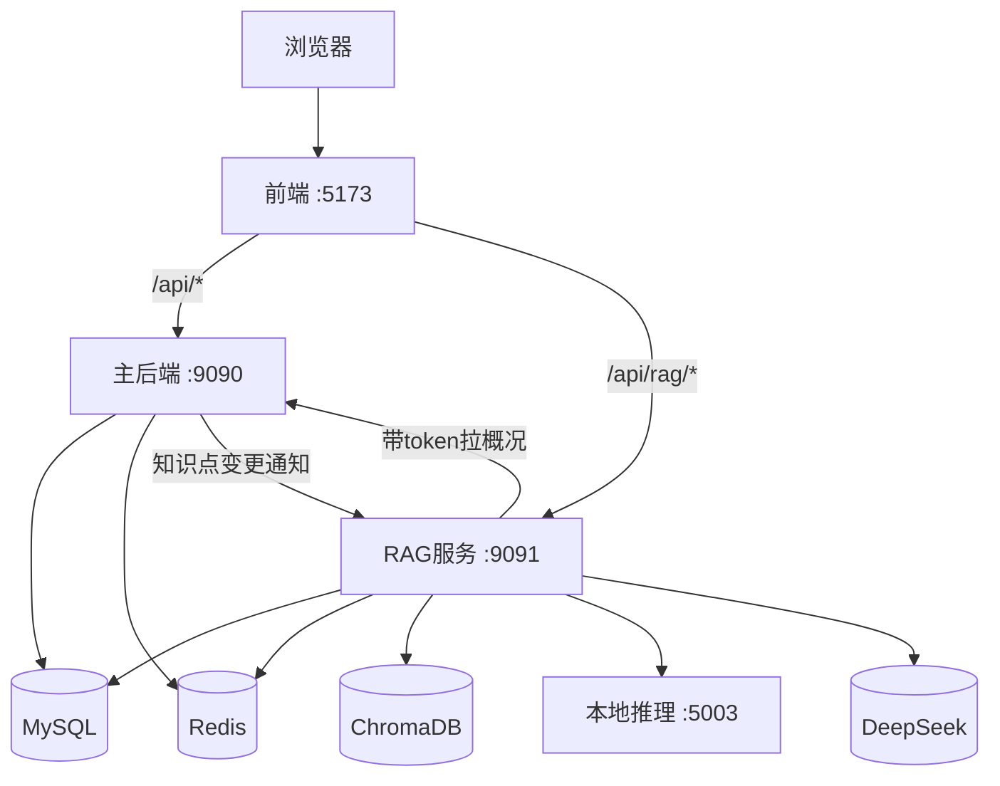
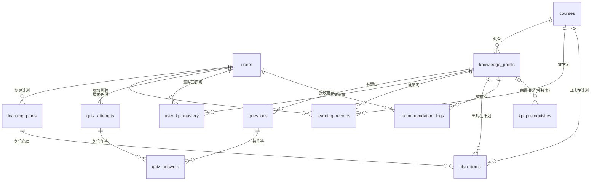

# 智能学习系统 + RAG AI 助教 · 完整项目资料（机制详解版）

> 版本：v3.0 机制详解版（2026-08-12）
> 说明：这份文档不只是"项目是什么"，而是**每个环节的底层原理、数学机制、代码实现**都讲透。
> 建议配合源码阅读：主后端 `backend/src/main/java`，RAG `rag-backend/src/main/java`。

---

## 总目录

- [第零部分 · 阅读指南与路线图](#第零部分--阅读指南与路线图)
- [第一部分 · 概念与机制总览](#第一部分--概念与机制总览)
- [第二部分 · 项目总览](#第二部分--项目总览)
- [第三部分 · 功能清单](#第三部分--功能清单)
- [第四部分 · 核心实现机制详解](#第四部分--核心实现机制详解)
- [第五部分 · 数据模型](#第五部分--数据模型)
- [第六部分 · 性能与评测数据](#第六部分--性能与评测数据)
- [第七部分 · 搭建流程（手把手）](#第七部分--搭建流程手把手)
- [第八部分 · 完整验证清单](#第八部分--完整验证清单)
- [第九部分 · 排错大全](#第九部分--排错大全)
- [第十部分 · 技术决策与备选方案](#第十部分--技术决策与备选方案)
- [第十一部分 · 面试问答](#第十一部分--面试问答)
- [第十二部分 · 简历要点](#第十二部分--简历要点)
- [第十三部分 · 已知不足与未来方向](#第十三部分--已知不足与未来方向)
- [附录 · 读完代码后的自测题](#附录--读完代码后的自测题对应第四部分各小节)
- [附录二 · 开发规范 vs 本项目写法（深度讲解）](#附录二--开发规范-vs-本项目写法深度讲解)
- [附录三 · 常用知识补充（本项目没用，但面试常问）](#附录三--常用知识补充本项目没用但面试常问)

---

# 第零部分 · 阅读指南与路线图

## 0.1 这份文档怎么读

1. **第一遍（半天）**：读第一部分"概念与机制总览"，把每个词背后的机制搞懂；
2. **第二遍（1 天）**：读第四部分"核心实现机制详解"，配合源码逐个文件对照；
3. **第三遍（动手）**：按第七部分搭建流程亲手跑一遍；
4. **面试前**：背第十一部分面试问答 + 必背数字 + 话术。

## 0.2 按剩余时间的路线图

| 还剩多久 | 必读清单 | 目的 |
|----------|---------|------|
| 1 天 | 目录 → 第十一部分面试问答 → 必背数字 → 附录二 A2.22 收尾话术 | 先能"讲出来" |
| 1 周 | 上面全部 + 第一部分概念机制 → 第四部分实现机制 → 第十部分为什么 → 自测题 | 能"讲清原理" |
| 1 个月 | 全部 + 第七部分亲手搭建 → 对照源码 → 附录二规范对比 → 附录三知识广度 | 能"演示 + 接住追问" |

## 0.3 必背数字（面试前背死）

| 数字 | 含义 |
|------|------|
| 97.5% | 混合检索 Top-5 命中率 |
| 87.5% | 混合+重排 Top-1 命中率 |
| 65% → 87.5% | 重排带来的 Top-1 提升 |
| 100% | RAG 回答引用率 |
| 17ms | 热缓存命中延迟（未命中 4-6 秒） |
| 64 / 123 | 知识点数 / 分块数 |
| 35 | 单元+集成测试数 |
| 31.8ms | 本地检索平均延迟 |
| 3.7s | 一次 AI 问答总耗时（95% 是模型生成） |

---

# 第一部分 · 概念与机制总览

> 这一部分不讲"定义"，讲**机制**：每个技术到底是怎么工作的。

## 1.1 Java 程序是怎么跑起来的（JVM 机制）

### Java 代码执行过程

```
源代码(.java) → javac编译 → 字节码(.class) → JVM加载 → 解释执行/JIT编译 → 机器码
```

- **字节码**：与操作系统无关的中间代码，这是"一次编译到处运行"的原因；
- **JIT（即时编译）**：JVM 发现某段代码频繁执行（热点代码），把它编译成本地机器码缓存起来，之后直接跑机器码——这是 Java 不慢于 C 的关键机制；
- **内存分区**：
  - 堆：对象实例（`new` 出来的都在堆上），GC 回收的地方；
  - 栈：每个线程一个栈，存方法调用（局部变量、方法帧）；
  - 方法区/元空间：类信息、常量；
  - 程序计数器：记录当前执行到哪一行。

### 和项目的关系

你项目主后端跑的每个请求 = Tomcat 线程栈里的一次方法调用链：`Controller → Service → Mapper → JDBC → MySQL`。Java 21 的**虚拟线程**（RAG 服务 SSE 用的）是"轻量线程"，几万个也不占资源——这是理解 `executor.execute(...)` 那行代码的前提。

## 1.2 Spring Boot 机制：IoC 和 AOP 到底怎么实现的

### IoC（控制反转）机制

传统写法：`Service service = new Service(new Mapper())`——依赖由自己 new。Spring 反过来：**对象创建和依赖装配交给容器**。

实现机制（分三步）：
1. **扫描**：启动时扫描 `@Component/@Service/@Controller` 注解的类；
2. **注册**：为每个类创建一个 Bean 定义（类名、构造器、依赖清单）；
3. **实例化 + 注入**：按依赖关系创建对象，通过**构造器/字段**把依赖塞进去（依赖注入 DI）。

```
@Service
public class QuizService {
    private final QuestionMapper questionMapper;   // Spring 自动找到并注入
    public QuizService(QuestionMapper m) { this.questionMapper = m; }
}
```

你只需要写构造器参数，Spring 从容器里找到对应 Bean 传进来——这叫**构造器注入**。

### Bean 生命周期（面试必问）

```
实例化 → 属性填充 → Aware回调 → BeanPostProcessor前置 → @PostConstruct
      → InitializingBean → BeanPostProcessor后置 → 就绪 → @PreDestroy → 销毁
```

### AOP（面向切面）机制

**动态代理**是 AOP 的实现基础。Spring 给目标 Bean 生成一个代理对象，调用方拿到的其实是代理；代理在调用前后插入"切面逻辑"。

两种代理机制：
- **JDK 动态代理**：目标类实现了接口，代理实现同一接口（基于 `java.lang.reflect.Proxy`）；
- **CGLIB 代理**：目标类没有接口，代理生成目标类的子类（基于字节码生成）。

```
调用方 → 代理对象 → 【前置逻辑】→ 目标方法 → 【后置逻辑】→ 返回
```

你项目的 `RateLimitAspect`、`RoleCheckAspect`、`LogAspect` 都是这个机制：

```java
@Around("@annotation(rateLimit)")
public Object around(ProceedingJoinPoint jp, RateLimit rl) throws Throwable {
    // 前置：计数、校验
    return jp.proceed();   // 调用目标方法
    // 后置：可处理返回值
}
```

`jp.proceed()` 就是"继续执行目标方法"——切面逻辑在它前后执行。

## 1.3 HTTP 机制：请求-响应的底层

### 一次 HTTP 请求发生了什么

```
浏览器 → DNS解析 → TCP三次握手 → TLS握手(HTTPS) → 发送HTTP请求报文 → 服务器处理 → 返回响应 → TCP四次挥手
```

### 请求报文结构

```
POST /api/auth/login HTTP/1.1
Host: localhost:9090
Content-Type: application/json
Authorization: Bearer eyJhbGciOi...

{"username":"zhangsan","password":"123456"}
```

### HTTP 状态码（语义）

- 2xx：成功；3xx：重定向；4xx：客户端错误（400 参数错、401 未认证、403 无权限、404 不存在、429 限流）；5xx：服务端错误。

你项目里所有接口都遵循这套语义（见 4.2 登录机制和全局异常处理）。

### Cookie / Session / Token

- Cookie：浏览器本地小存储，每次请求自动带上；
- Session：服务器端记录"谁登录了"，靠 sessionId（存 Cookie 里）找到；
- Token（JWT）：把"谁"编码进字符串本身，服务器无状态验签即可。

本项目用 JWT——原因和机制在 4.2 详述。

## 1.4 MySQL 机制：存储引擎、索引、事务

### InnoDB 存储引擎（本项目引擎）

InnoDB 是 MySQL 默认引擎，机制要点：
- **行锁**：支持行级锁（并发好）；
- **事务**：支持 ACID；
- **聚簇索引**：数据本身按主键顺序存在 B+ 树的叶子节点（主键索引即数据）；
- **MVCC**：多版本并发控制（见下）；
- **缓冲池（Buffer Pool）**：内存里缓存数据页，读写先走内存。

### B+ 树索引机制（为什么查询快）

B+ 树是"多路平衡搜索树"，特点：

```
          [10, 30]                    ← 非叶子节点只存"键"，可放下很多
        /    |    \
   [5,8]   [15,20]  [35]              ← 叶子节点存键+数据/指针
    |        |        |
  数据页    数据页    数据页
```

- **非叶子节点只存键** → 一层能容纳几万个键 → 树很矮（3-4 层就能存千万级数据）→ 查询最多读 3-4 个磁盘页；
- **叶子节点有序 + 前后指针** → 范围查询（`BETWEEN`、`>`）只需顺序扫叶子；
- 为什么不用哈希索引？哈希适合等值查询（O(1)），但不支持范围查询和排序；B+ 树两者都支持。

### 索引设计（项目里的实际索引）

```sql
INDEX idx_kp_course_level (course_id, level)   -- 联合索引：按课程查知识点
INDEX idx_q_kp_diff (kp_id, difficulty)        -- 题目按知识点+难度
FULLTEXT INDEX ft_kp_rag_search (name, description, learning_content) WITH PARSER ngram
```

**最左前缀原则**：联合索引 `(course_id, level)` 能命中 `course_id` 或 `course_id+level` 的查询，但不能单独命中 `level`。

### 事务 ACID 机制

- **原子性**：要么全成要么全败——靠 **undo log**（回滚日志）实现；
- **一致性**：约束保证，事务前后的数据都合法；
- **隔离性**：多个事务并发不互相干扰——靠 **锁 + MVCC** 实现；
- **持久性**：提交后不丢——靠 **redo log**（重做日志）实现：先写日志再改数据（WAL 机制）。

### 隔离级别与 MVCC

四种隔离级别（从松到严）：
1. 读未提交：能看到别人没提交的（脏读）；
2. 读已提交：只能看已提交的；
3. **可重复读（MySQL 默认）**：同一事务内多次读结果一致（靠快照）；
4. 串行化：完全互斥，最慢。

**MVCC 机制**：每行数据存"版本"，读的时候读"事务开始时的快照版本"——读不加锁、写加锁，读写不冲突，并发性能好。你项目的"事务与并发控制"知识点、以及 RAG 评测集里"MVCC 原理"那道题，讲的就是这些。

### 锁机制

- 悲观锁：`SELECT ... FOR UPDATE`——查出来就锁住；
- 乐观锁：`UPDATE ... SET version=version+1 WHERE version=?`——版本不对说明被改过，重试；
- 间隙锁/临键锁：解决幻读；
- 死锁：两个事务互相等对方释放锁——检测后回滚一个。

## 1.5 MyBatis 机制：Mapper 是怎么变成 SQL 的

### 原理链条

```
Mapper接口 → MyBatis启动时生成代理对象 → 调用方法 → 解析@Select/@Insert注解
           → 参数绑定(#{}→占位符) → 执行SQL → 结果集映射成Java对象
```

- **`#{}` vs `${}`**：`#{}` 用 `PreparedStatement` 占位符（防 SQL 注入），`${}` 直接拼字符串（危险）。你项目的 SQL 全部用 `#{}`；
- **结果映射**：列名 `user_id` → 属性 `userId`（`map-underscore-to-camel-case: true` 自动转换）；
- **一级缓存**：同一个 SqlSession 内相同查询缓存（默认开）；二级缓存跨 session（需配置）。

## 1.6 Redis 机制：数据结构与单线程模型

### 为什么快

- 数据在**内存**（微秒级，磁盘是毫秒级）；
- **单线程模型**（IO 多路复用）：没有锁竞争、没有上下文切换开销；
- 高性能 IO 多路复用（epoll）监听大量连接。

### 五种基础数据结构及底层实现

| 结构 | 底层机制 | 项目用途 |
|------|---------|---------|
| String | SDS（简单动态字符串） | 缓存、计数（INCR）、分布式锁 |
| List | 双向链表/压缩列表 | 会话记忆（RPUSH/LTRIM） |
| Hash | 哈希表 | （备用） |
| Set | 哈希表/整数集合 | 去重 |
| ZSet | **跳表** + 哈希表 | 热门排行（分数排序） |

### 跳表机制（ZSet 的底层）

跳表 = 多层有序链表：底层全量有序，每上一层"跳过一半"节点。

```
层3:  1 ─────────────── 9
层2:  1 ─── 5 ───────── 9
层1:  1 ─ 3 ─ 5 ─ 7 ─ 9
```

查找从最上层开始，能"跳着走"，平均 O(log N)。为什么 Redis 不用平衡树？跳表实现简单、范围查询方便。

### 缓存三个经典问题（面试必问）

- **穿透**：查不存在的 key，每次都打 DB → 解决：缓存空值 / 布隆过滤器；
- **击穿**：热点 key 过期瞬间大量请求打 DB → 解决：互斥锁重建 / 逻辑过期；
- **雪崩**：大量 key 同时过期 → 解决：过期时间加随机值 / 多级缓存。

你项目的热问题缓存是"简单 Cache-Aside"——没做这三兄弟的防护，面试要说清"为什么当前规模不需要"。

## 1.7 安全机制：哈希、加密、签名

### 哈希 vs 加密 vs 签名

- **哈希**：单向（不可逆），用于存密码、校验完整性；
- **加密**：可逆（有密钥），用于传输保密；
- **签名**：用私钥对内容签名，公钥验证"确实是本人发的、没被改过"。

### JWT 签名机制（HMAC-SHA256）

JWT 由三部分组成：`Header.Payload.Signature`，用 `.` 连接：

```
Header:   {"alg":"HS256","typ":"JWT"}          → base64url 编码
Payload:  {"sub":"2","role":"STUDENT","exp":...}
Signature: HMACSHA256( base64(Header) + "." + base64(Payload), 密钥 )
```

**验签过程**：服务器用同样的密钥重算签名，和 token 里的签名比对。不同 → 被篡改/伪造。所以"服务器没存登录状态"也能确定"这个 token 是谁、有没有过期"。

### BCrypt 机制

BCrypt 生成的是 60 字符的字符串：`$2b$10$<22位盐><31位哈希>`：

```
$2b$10$BWZdinQXCETSGm7rG3NQ0eu0q.OqQcJkDqHNf6QK.5mUJs80PBQIu
││  │  └────────── 22 位盐 ──────────┴────── 31 位哈希 ──────┘
││  └ cost=10（2^10=1024 轮）
└版本
```

- **盐**：每次随机，同样的密码哈希不同；
- **成本因子**：计算要做 2^cost 轮，cost=10 时约 100ms——故意的慢；
- **验证**：从存储的哈希里取出盐，用盐重算并比对（`matches` 方法内部做这件事）。

## 1.8 大模型机制（生成原理）

见第四部分 4.11 的完整机制详解。先记住核心：

```
大模型 = 超大"下一个词预测器"：输入全部token → Transformer → 词表打分 → softmax → 选下一个词 → 循环
```

## 1.9 Embedding 机制（文字怎么变成向量）

见第四部分 4.11。核心链：`分词 → 查表 → Transformer注意力 → 池化 → 对比学习训练`。

## 1.10 向量数据库机制

见第四部分 4.11。核心：ANN 近似最近邻（HNSW 分层图）。

## 1.11 SSE 机制（流式传输）

SSE 基于 HTTP 的 **chunked 传输**：

```
HTTP/1.1 200 OK
Content-Type: text/event-stream
Transfer-Encoding: chunked

event:citations
data:[...]

event:delta
data:根据
...
```

服务器"边生成边写"；浏览器 `fetch` + `getReader()` 一段段读。和 WebSocket 的区别：SSE 是**单向**（服务器→浏览器）、基于 HTTP、自动重连；WebSocket 是双向。

## 1.12 测试机制

- **单测**：测一个类/方法，不依赖外部，毫秒级；
- **Mock（Mockito）**：用假对象替换依赖，只测目标逻辑；
- **集成测试**：起真实/嵌入式环境（DB、Web 容器），测链路；
- **测试金字塔**：单测多、集成少、E2E 极少——保证 CI 秒级反馈。

---

# 第二部分 · 项目总览

## 2.1 一句话定位

**面向大学生的智能学习平台**：学习、自测、记录、推荐 + 一个基于 RAG 的 AI 助教。

## 2.2 三个子系统

| 子系统 | 技术栈 | 职责 | 端口 |
|--------|--------|------|------|
| 主后端 | Spring Boot 3.2 + MyBatis + MySQL 8 + Redis | 认证、课程、知识图谱、计划、记录、自测、推荐 | 9090 |
| RAG 服务 | Spring Boot 3.5 + Spring AI 1.1 + DeepSeek + ChromaDB | AI 助教：检索 + 重排 + 流式问答 | 9091 |
| 前端 | Vue 3 + Vite + Element Plus + Pinia | 页面 + AI 对话 | 5173 |

为什么两个后端？AI 接口慢（秒级）、依赖外部模型，独立进程不拖累业务接口，可单独扩缩容。

## 2.3 用户的一天

登录 → 看课程/知识图谱 → 建学习计划 → 记录学习 → 自测（分数同步掌握度）→ 看推荐 → AI 助教答疑（带引用）→ 问"我的学习进度"（结合个人数据）。

## 2.4 架构图



---

# 第三部分 · 功能清单

## 3.1 主后端

| 模块 | 功能 | 机制要点 |
|------|------|---------|
| 认证 | 注册/登录/登出 | JWT + Redis 黑名单 + BCrypt |
| 课程 | 分页列表/详情/增删改(ADMIN) | 分页 LIMIT OFFSET |
| 知识图谱 | 节点+前置依赖 | 邻接表模型 |
| 学习计划 | CRUD/完成切换 | 事务 |
| 学习记录 | 记录/统计/掌握度 | Redis计数 + 分布式锁 |
| 自测 | 抽题/判分/历史 | AnswerGrader + 事务 |
| 推荐 | 三级优先级+门控 | 规则引擎式算法 |
| 题目管理 | CRUD(ADMIN) | 防答案泄露 |
| AI 上下文 | 聚合学习概况 | 给RAG服务用 |

## 3.2 RAG 服务

| 能力 | 机制 |
|------|------|
| 混合检索 | 向量 + BM25 + RRF |
| 重排 | LLM 打分 / 本地交叉编码器 |
| 流式问答 | SSE |
| 会话记忆 | Redis List |
| 热缓存 | Redis SHA-256 key |
| 限流 | INCR + TTL |
| 个人化 | 透传 token 调主后端 |
| 索引联动 | 异步 HTTP 通知 |

## 3.3 前端

登录、仪表盘、课程、知识图谱、知识点详情、计划、记录、自测、推荐、题目管理（仅 ADMIN）、AI 助教。菜单按角色动态显示。

---

# 第四部分 · 核心实现机制详解

> 这是整份文档的核心：**每个功能 = 原理机制 + 数学/流程 + 代码实现 + 为什么**。
> 读的时候建议打开 IDEA 里的真实源码对照。

## 4.1 Spring Boot 启动机制：一个请求进来发生了什么

### 启动过程

`RagBackendApplication.main` 里一行 `SpringApplication.run(...)`，内部做了：

```
创建 SpringApplication → 推断应用类型 → 加载自动配置类
→ 扫描 @Component → 创建 Bean（IoC容器）→ 内嵌 Tomcat 启动 → 注册 DispatcherServlet
→ 运行 ApplicationRunner → "Started ... in X seconds"
```

### 一次请求的完整调用链（机制）

```
浏览器 → Tomcat(监听9090端口) → 收到HTTP请求 → 交给 Servlet 容器
→ DispatcherServlet 分发 → HandlerInterceptor（JWT拦截器）
→ @RestControllerAdvice（异常处理器可用）→ Controller → Service → Mapper
→ MyBatis → JDBC → MySQL
→ 返回 → 序列化成 JSON → HTTP 响应
```

## 4.2 登录机制：JWT 全流程 + 代码

### 流程机制（7 步）

```
1 用户提交用户名密码
2 后端查用户 → 拿数据库里的 BCrypt 哈希
3 BCrypt.matches 校验（取出哈希里的盐重算比对）
4 生成 JWT：Header.Payload.Signature（HMAC-SHA256 签名）
5 前端存 localStorage，之后请求带 Authorization: Bearer <token>
6 拦截器每请求验签 + 查黑名单 → 通过则把 userId/role 放请求属性
7 登出：token 加入 Redis 黑名单，TTL=剩余有效期
```

### 代码实现

**JwtUtil（生成与验签）**：

```java
public String generateToken(Long userId, String username, String role) {
    Date now = new Date();
    return Jwts.builder()
            .subject(String.valueOf(userId))
            .claim("username", username)
            .claim("role", role)
            .issuedAt(now)
            .expiration(new Date(now.getTime() + expiration))   // 默认24小时
            .signWith(key)                                      // 密钥签名
            .compact();
}

public Claims parseToken(String token) {
    return Jwts.parser().verifyWith(key).build()
            .parseSignedClaims(token).getPayload();             // 验签失败抛异常
}
```

**JwtInterceptor（每请求校验）**：

```java
@Override
public boolean preHandle(HttpServletRequest request, HttpServletResponse response, Object handler) {
    if ("OPTIONS".equalsIgnoreCase(request.getMethod())) return true;   // 跨域预检放行
    String authHeader = request.getHeader("Authorization");
    if (authHeader == null || !authHeader.startsWith("Bearer ")) {
        write401(response, "未登录"); return false;
    }
    String token = authHeader.substring(7);                    // 去掉"Bearer "
    if (blacklistService.isBlacklisted(token)) { write401(response, "token已失效"); return false; }
    if (!jwtUtil.isTokenValid(token))           { write401(response, "token无效或已过期"); return false; }
    request.setAttribute("userId", jwtUtil.getUserId(token));  // 放入请求属性
    request.setAttribute("role", jwtUtil.parseToken(token).get("role"));
    return true;
}
```

**为什么这个设计是对的**：
- 无状态：服务器不存会话，水平扩展容易；
- 黑名单解决"JWT 无法撤销"的痛点；
- 用 token 的 jti 做黑名单 key 更优（本项目用了完整 token，是已知可改进点）。

## 4.3 密码机制：BCrypt 深入 + 代码

### 机制回顾（1.7）

BCrypt = 版本 + cost + 22 位盐 + 31 位哈希；验证时从存储值里取盐重算。

### 代码

```java
// 注册：加密
user.setPassword(passwordEncoder.encode(request.getPassword()));
// 登录：校验（注意不是 equals！）
if (!passwordEncoder.matches(request.getPassword(), user.getPassword())) {
    throw new BusinessException(401, "用户名或密码错误");
}
```

### 为什么"注册强制 STUDENT + 返回脱敏副本"

```java
user.setRole("STUDENT");            // 不接受前端传的角色 → 防角色注入
// 返回脱敏副本，不暴露密码哈希
User response = new User();
response.setId(user.getId());
response.setUsername(user.getUsername());
...
```

原始代码两处漏洞：角色可注入 ADMIN、注册响应带密码哈希——都已修复。

## 4.4 权限机制：AOP 切面如何工作 + 代码

### 机制

`@RequireRole("ADMIN")` 注解标记在方法上；Spring AOP 为 Controller 生成代理；调用方法前，`RoleCheckAspect` 的 `@Before` 逻辑先执行。

```java
@Before("@annotation(requireRole)")
public void checkRole(RequireRole requireRole) {
    HttpServletRequest request = getRequest();
    String role = request != null ? (String) request.getAttribute("role") : null;
    if (role == null || Arrays.stream(requireRole.value()).noneMatch(role::equalsIgnoreCase)) {
        throw new BusinessException(403, "无权限执行该操作");
    }
}
```

### 数据链路

```
JWT里的role → 拦截器 setAttribute("role", ...) → 切面 getAttribute("role") → 校验 → 403/放行
```

两个组件靠"请求属性"传递数据，职责分离：拦截器负责认证（你是谁），切面负责授权（你能干什么）。

## 4.5 MySQL 机制在项目中的落点 + 关键 SQL

### 建表（schema.sql 机制）

```sql
CREATE TABLE IF NOT EXISTS users (
    id BIGINT AUTO_INCREMENT PRIMARY KEY,
    username VARCHAR(50) NOT NULL UNIQUE,
    password VARCHAR(255) NOT NULL,
    role VARCHAR(20) NOT NULL DEFAULT 'STUDENT'
) ENGINE=InnoDB;
```

- `UNIQUE`：数据库层防重复用户名（比应用层判断更可靠——并发下应用层会漏）；
- `ENGINE=InnoDB`：事务 + 行锁 + MVCC；
- 外键 + 索引：`kp_prerequisites` 的 `UNIQUE KEY uk_kp_prereq (kp_id, prerequisite_kp_id)` 防止重复边。

### 全文索引（RAG 关键词检索依赖）

```sql
ALTER TABLE knowledge_points
    ADD FULLTEXT INDEX ft_kp_rag_search (name, description, learning_content)
    WITH PARSER ngram;
```

`ngram` 是中文分词器，把"什么是死锁"切成语素组合，才能做 `MATCH ... AGAINST`。原理是倒排索引：词 → 文档列表。

### 事务在项目里的例子（QuizService）

```java
@Transactional
public Map<String, Object> submitQuiz(...) {
    // 判分 → 存测验 → 存作答 → 完成计划项 → 更新掌握度
    // 任何一个失败，全部回滚
}
```

## 4.6 Redis 机制在项目中的落点（六个场景逐个拆）

### 场景一：热问题缓存

**机制**：Cache-Aside（旁路缓存）——读：先查缓存，未命中查库回填；写：改库后删缓存。

```java
public CachedAnswer get(String question) {
    String raw = redis.opsForValue().get(key(question));
    return raw == null ? null : objectMapper.readValue(raw, CachedAnswer.class);
}
private String key(String question) {
    byte[] hash = MessageDigest.getInstance("SHA-256")
            .digest(question.getBytes(StandardCharsets.UTF_8));
    return "rag:cache:q:" + HexFormat.of().formatHex(hash);   // 问题哈希当key
}
```

**为什么用哈希当 key**：中文问题含特殊字符，直接当 key 不优雅；SHA-256 固定 64 位十六进制，安全且定长。

**关键设计**：带用户 token 的请求**跳过缓存**——防止 A 用户读到 B 用户的个人化回答（串号）。代码里用 `isCacheable(request)` 判断。

### 场景二：会话记忆

**机制**：Redis List 按顺序存每轮对话（JSON），最多保留 10 轮。

```java
redis.opsForList().rightPushAll(key, jsonOf(userTurn), jsonOf(assistantTurn));
Long size = redis.opsForList().size(key);
if (size != null && size > maxTurns * 2) {
    redis.opsForList().trim(key, size - maxTurns * 2, -1);   // 裁掉最旧
}
```

`trim(start, -1)` 是 List 的裁剪命令：保留最后 20 条，前面的删掉。多轮上下文就是这样"有界"地记住的。

### 场景三：分布式锁（掌握度并发保护）

**机制**：`SET key token NX PX` + Lua 原子释放。

```java
Boolean acquired = redis.opsForValue()
        .setIfAbsent(key, token, leaseMs, TimeUnit.MILLISECONDS);
// 释放
String script = "if redis.call('GET', KEYS[1]) == ARGV[1] then " +
                "return redis.call('DEL', KEYS[1]) else return 0 end";
```

**为什么不能直接 DEL**：场景——线程 A 拿到锁，执行超过 10 秒锁过期；线程 B 拿到锁；A 结束直接 DEL，把 B 的锁删了；线程 C 又拿到锁……一片混乱。用 token（随机 UUID）保证"只删自己的锁"，Lua 保证"比对+删除"原子性。

### 场景四：限流

**机制**：固定窗口——INCR 计数，第一次设置 TTL。

```java
Long count = redis.opsForValue().increment(key);
if (count != null && count == 1) redis.expire(key, Duration.ofSeconds(window));
if (count != null && count > limit) throw new RateLimitException("请求过于频繁");
```

**为什么用 Redis 而不是本地计数**：多实例部署时，每个实例的本地计数不共享，Redis 是全局的。

### 场景五：统计计数

**机制**：Redis INCR 原子自增，避免 DB 行级 UPDATE 竞争：

```java
redisUtil.increment("stat:today:" + userId + ":" + today, durationMinutes);
```

### 场景六：ZSet 热门排行

**机制**：ZSet（有序集合，底层跳表）按分数排序：

```java
redisUtil.zIncrementScore("stat:hot:courses", courseId.toString(), 1);
// 取榜：zReverseRangeWithScores(key, 0, topN-1)
```

## 4.7 推荐算法机制（规则引擎式）

### 算法流程

```
输入：用户的掌握度记录 + 全部知识点 + 前置关系
1 已掌握集合 = masteryScore >= 60 的知识点
2 薄弱集合 = masteryScore < 60 的知识点
3 对每个知识点：
   - 已掌握 → 跳过
   - 前置未全部掌握 → 跳过（门控）
   - 薄弱 → priority=1（复习）
   - 有已掌握的前置 → priority=2（下一步）
   - 否则 → priority=3（新领域）
4 排序：priority 升序，再按 level（先学基础）
5 取前 10
```

### N+1 问题的机制

原始代码在循环里逐条查前置关系（64 个知识点 = 64 次查询）。优化：一次性查全部关系组装成 Map：

```java
Map<Long, List<Long>> prereqMap = kpMapper.findAllEdges().stream()
        .collect(Collectors.groupingBy(KpPrerequisite::getKpId,
                Collectors.mapping(KpPrerequisite::getPrerequisiteKpId, Collectors.toList())));
```

一次查询替代 N 次查询——这就是 N+1 问题的标准解法（预加载/批量查询）。

### 掌握度公式

```
学习记录：新掌握度 = 旧 × 0.7 + 本次 × 0.3
测验：     新掌握度 = 旧 × 0.5 + 分数 × 0.5
```

历史权重高 → 掌握度是积累的，不会被单次波动颠覆。

## 4.8 RAG 机制全解（本项目最核心）

### 4.8.1 总流程（10 步）

```
1 读会话记忆（Redis）
2 查热缓存（命中直接返回）
3 带token则拉用户学习概况（调主后端）
4 双路检索：向量（Chroma）+ 关键词（MySQL FULLTEXT）
5 RRF 融合 → Top8
6 LLM 重排
7 组装 Prompt（系统提示词 + 资料 + 概况 + 历史 + 问题）
8 DeepSeek 生成
9 写回记忆
10 无身份问题写热缓存
```

### 4.8.2 Embedding 机制（文字→向量的完整原理）

见第一部分 1.9 的机制链，关键四步：

1. **分词**：`"死锁" → ["死","锁"]`（中文模型多为字/子词级）；
2. **查表**：每个 token 查 Embedding 表得到初始向量；
3. **Transformer**：注意力机制让每个词吸收上下文语义；
4. **池化 + 对比学习训练**：取句子向量，训练让"语义相近的句子向量相近"。

**bge 的查询指令**：检索场景给查询加"为这个句子生成表示以用于检索相关文章："前缀——这是 bge 官方建议，能明显提升召回。代码实现：

```java
public float[] embed(String text) {
    return embedTexts(List.of(text), true).get(0);      // is_query=true → 加指令
}
public float[] embed(Document document) {
    return embedTexts(List.of(getEmbeddingContent(document)), false).get(0);  // 文档不加
}
```

### 4.8.3 检索机制

**向量路**：问题向量化 → Chroma 的 HNSW 找最近 → 返回 TopK。
**关键词路**：MySQL `MATCH(name,description,learning_content) AGAINST (? IN NATURAL LANGUAGE MODE)` → BM25 打分排序。

**为什么混合**：向量懂语义（"怎么避免线程互相等"→"死锁预防"），关键词懂精确词（"B+树"直接命中）。评测：向量 Top-5 95%、关键词 100%、混合 97.5%。

### 4.8.4 RRF 融合机制（数学 + 代码）

公式：`score(d) = Σ 1/(60 + rank(d))`

手算例子：

```
向量路：①A ②B ③C       关键词路：①B ②C ③D
A = 1/61 ≈ 0.0164
B = 1/62 + 1/61 = 0.0325   ← 两路都出现，最高
C = 1/63 + 1/62 = 0.0320
D = 1/63 ≈ 0.0159
排序：B > C > A > D
```

代码：

```java
private double rrfScore(int rank) { return 1.0 / (RRF_K + rank); }   // RRF_K=60
// 两路都命中：fused.merge(kpId, chunk, RankedChunk::merge)
// merge：score 相加、sources 合并为 ["dense","sparse"]
```

### 4.8.5 重排机制（LLM 打分）

让 DeepSeek 对 8 个候选打分：

```java
String response = chatModel.call(new Prompt(promptText)).getResult().getOutput().getText();
List<Integer> scores = parseScores(response);    // 正则提取 {"scores":[9,2,5]}
scored.sort(Comparator.comparingInt(ScoredCandidate::score).reversed());
```

失败回退：try-catch 里调用失败 → 返回原 RRF 顺序，链路不中断。

### 4.8.6 Prompt 组装机制（messages 结构）

```java
messages = [
  SystemMessage("你是一个智能学习助教...只依据下面参考资料回答...必须标注[1][2]..." +
                "参考资料：{context}" + "用户学习概况：{personal_context}"),
  ...历史对话(若有),
  UserMessage("当前问题")
]
```

系统消息管规则、历史消息管上下文、用户消息管问题——这是 OpenAI 兼容接口的标准 messages 结构。

### 4.8.7 防幻觉三层机制

1. **检索为空不调模型**：直接返回"根据现有学习资料，暂时没有找到..."——从源头杜绝编造；
2. **提示词约束**：只依据资料、必须引用、不足就说明；
3. **评测验证**：40 题里 11 题资料未覆盖，模型选择诚实说明（验证过）。

### 4.8.8 建索引机制

```
MySQL 知识点 → 分块(DocumentChunker) → 向量化(LocalEmbeddingModel) → ChromaDB
```

```java
for (int i = 0; i < chunks.size(); i += batchSize) {       // 分批32
    vectorStore.add(chunks.subList(i, Math.min(i + batchSize, chunks.size())));
}
```

确定性块 ID（`kp-{id}-{index}`）→ 重建幂等（覆盖写）。

### 4.8.9 SSE 流式机制（代码）

```java
SseEmitter emitter = new SseEmitter(120_000L);
executor.execute(() -> {                     // 虚拟线程，不阻塞Tomcat线程
    emitter.send(SseEmitter.event().name("citations")
            .data(objectMapper.writeValueAsString(result.citations())));
    result.flux().subscribe(
        delta -> emitter.send(SseEmitter.event().name("delta").data(delta)),
        error -> emitter.completeWithError(error),
        () -> { emitter.send(SseEmitter.event().name("done").data("")); emitter.complete(); }
    );
});
```

事件顺序 `citations → delta... → done`；前端 `getReader()` 逐段读。

## 4.9 分页机制

```java
@Select("... LIMIT #{offset}, #{limit}")
List<Course> findPage(@Param("offset") int offset, @Param("limit") int limit);
```

**OFFSET 机制**：`LIMIT 20, 20` 表示"跳过 20 行取 20 行"。数据量小够用；深翻页（第 10000 页）要扫 20 万行再丢弃——生产大数据用游标分页（WHERE 条件定位上次位置）。

## 4.10 日志与可观测机制

```java
log.info("chat cid={} retrieve={}ms rerank={}ms generate={}ms total={}ms citations={}",
        cid, r, rk, g, total, citations.size());
```

三段耗时分开记录 → 回答慢时一眼定位：检索慢 / 重排慢 / 生成慢。

# 第五部分 · 数据模型

## 5.1 表结构逐个讲

### 5.1.1 users 用户表

| 字段 | 类型 | 约束 | 含义 | 设计理由 |
|------|------|------|------|---------|
| id | BIGINT | PK 自增 | 用户唯一ID | 主键 |
| username | VARCHAR(50) | UNIQUE | 用户名 | 唯一约束：数据库层防重复（应用层并发会漏） |
| password | VARCHAR(255) | NOT NULL | BCrypt 密码哈希 | 255 足够放 60 字符的 BCrypt；存哈希不存明文 |
| real_name | VARCHAR(50) | | 真实姓名 | 展示用 |
| role | VARCHAR(20) | 默认 STUDENT | 角色：STUDENT/ADMIN | 存字符串可读性好 |
| created_at | DATETIME | 默认当前时间 | 创建时间 | 审计 |
| updated_at | DATETIME | 更新时自动改 | 更新时间 | `ON UPDATE CURRENT_TIMESTAMP` |

### 5.1.2 courses 课程表

| 字段 | 类型 | 约束 | 含义 | 设计理由 |
|------|------|------|------|---------|
| id | BIGINT | PK | 课程ID | 主键 |
| name | VARCHAR(100) | NOT NULL | 课程名 | |
| description | TEXT | | 课程简介 | |
| category | VARCHAR(50) | | 分类 | 有索引，支持按分类筛选 |
| cover_url | VARCHAR(255) | | 封面图地址 | |
| created_by | BIGINT | | 创建者用户ID | 课程由管理员创建 |
| created_at / updated_at | DATETIME | | 创建/更新时间 | |

### 5.1.3 knowledge_points 知识点表（RAG 语料源）

| 字段 | 类型 | 约束 | 含义 | 设计理由 |
|------|------|------|------|---------|
| id | BIGINT | PK | 知识点ID | 主键 |
| name | VARCHAR(100) | NOT NULL | 知识点名称 | 检索时当标题 |
| description | TEXT | | 概述 | RAG 分块时并入块头，提升检索 |
| learning_content | MEDIUMTEXT | | 学习内容（全文） | **RAG 的知识库本体**；MEDIUMTEXT 支持长文 |
| course_id | BIGINT | FK→courses | 所属课程 | 课程与知识点一对多 |
| level | INT | 默认 0 | 层级：0基础~3进阶 | 推荐排序"先学基础"用 |
| x_position / y_position | DOUBLE | 默认 0 | 图谱横/纵坐标 | 前端知识图谱画图用（功能驱动设计） |
| created_at | DATETIME | | 创建时间 | |

索引：`idx_kp_course_level (course_id, level)`——按课程查知识点并按层级排序；`FULLTEXT ft_kp_rag_search (name, description, learning_content) WITH PARSER ngram`——RAG 关键词检索。

### 5.1.4 kp_prerequisites 前置依赖表（推荐算法地基）

| 字段 | 类型 | 约束 | 含义 | 设计理由 |
|------|------|------|------|---------|
| id | BIGINT | PK | 关系ID | |
| kp_id | BIGINT | FK→knowledge_points | 当前知识点 | 邻接表一行 = 一条"A 是 B 的前置" |
| prerequisite_kp_id | BIGINT | FK→knowledge_points | 前置知识点 | 自关联（同一张表） |

约束：`UNIQUE (kp_id, prerequisite_kp_id)` 防重复边；`ON DELETE CASCADE` 知识点删除时关系自动删；索引 `idx_kpp_prereq (prerequisite_kp_id)` 支持反查"谁依赖我"。

### 5.1.5 questions 题目表

| 字段 | 类型 | 约束 | 含义 | 设计理由 |
|------|------|------|------|---------|
| id | BIGINT | PK | 题目ID | |
| kp_id | BIGINT | FK→knowledge_points | 所属知识点 | 自测按知识点抽题 |
| question_type | VARCHAR(20) | NOT NULL | 题型 | SINGLE_CHOICE / MULTI_CHOICE / TRUE_FALSE |
| content | TEXT | NOT NULL | 题干 | |
| options | JSON | | 选项 | JSON 灵活：单选2-4个、多选、判断无选项；代价是不能按选项内容查询（本项目不需要） |
| answer | VARCHAR(100) | NOT NULL | 正确答案 | 判分直接读 |
| explanation | TEXT | | 解析 | 答完展示 |
| difficulty | INT | 默认 1 | 难度 1-3 | 抽题可优先中等难度 |

索引：`idx_q_kp_diff (kp_id, difficulty)`、`idx_q_kp_type (kp_id, question_type)`。

### 5.1.6 quiz_attempts 测验记录表

| 字段 | 类型 | 约束 | 含义 |
|------|------|------|------|
| id | BIGINT | PK | 测验ID |
| user_id | BIGINT | FK→users | 谁考的 |
| kp_id | BIGINT | FK→knowledge_points | 考哪个知识点 |
| total_questions | INT | | 总题数 |
| correct_count | INT | | 答对数 |
| score | INT | | 百分制得分 |
| completed_at | DATETIME | | 完成时间 |

### 5.1.7 quiz_answers 逐题作答表

| 字段 | 类型 | 约束 | 含义 |
|------|------|------|------|
| id | BIGINT | PK | 作答ID |
| attempt_id | BIGINT | FK→quiz_attempts | 属于哪次测验 |
| question_id | BIGINT | FK→questions | 哪道题 |
| user_answer | VARCHAR(100) | | 用户答案 |
| is_correct | BOOLEAN | | 是否正确 |

**为什么拆两张表**：一次测验多道题 = 一对多；列表读 attempts、详情读 answers、按题聚合统计正确率都方便。

### 5.1.8 learning_plans 学习计划表

| 字段 | 类型 | 约束 | 含义 |
|------|------|------|------|
| id | BIGINT | PK | 计划ID |
| user_id | BIGINT | FK→users | 谁的计划 |
| title | VARCHAR(100) | | 计划标题 |
| description | TEXT | | 计划描述 |
| start_date / end_date | DATE | | 起止日期 |
| status | VARCHAR(20) | 默认 ACTIVE | ACTIVE/COMPLETED/PAUSED |

### 5.1.9 plan_items 计划项表

| 字段 | 类型 | 约束 | 含义 | 设计理由 |
|------|------|------|------|---------|
| id | BIGINT | PK | 项ID | |
| plan_id | BIGINT | FK→learning_plans | 属于哪个计划 | 一对多 |
| course_id | BIGINT | FK→courses | 关联课程（可选） | |
| kp_id | BIGINT | FK→knowledge_points | 关联知识点 | 计划项落点是知识点 |
| item_type | VARCHAR(20) | | COURSE / KNOWLEDGE_POINT | 计划可放课程或知识点 |
| sort_order | INT | | 排序 | |
| target_date | DATE | | 目标日期 | |
| completed | BOOLEAN | 默认 false | 是否完成 | |
| completed_score | INT | | 完成时的测验分 | **自测通过自动完成计划项**的联动字段 |
| completed_at | DATETIME | | 完成时间 | |

### 5.1.10 learning_records 学习记录表

| 字段 | 类型 | 约束 | 含义 | 设计理由 |
|------|------|------|------|---------|
| id | BIGINT | PK | 记录ID | |
| user_id | BIGINT | FK→users | 谁学的 | |
| course_id | BIGINT | FK→courses | 哪门课 | **反范式冗余**：和 kp_id 并存，查课程时长不用 join |
| kp_id | BIGINT | FK→knowledge_points | 哪个知识点 | 查知识点时长不用 join |
| duration_minutes | INT | | 学习时长（分钟） | 统计的核心 |
| mastery_level | INT | | 本次自评掌握度 | 更新 user_kp_mastery 的输入 |
| notes | TEXT | | 学习笔记 | |
| record_date | DATE | | 记录日期 | 按日/周统计 |
| created_at | DATETIME | | 创建时间 | |

### 5.1.11 user_kp_mastery 掌握度表

| 字段 | 类型 | 约束 | 含义 | 设计理由 |
|------|------|------|------|---------|
| id | BIGINT | PK | ID | |
| user_id | BIGINT | FK→users | 用户 | 与 kp_id 组成唯一键 |
| kp_id | BIGINT | FK→knowledge_points | 知识点 | 交叉数据独立成表 |
| mastery_score | INT | | 掌握度 0-100 | 推荐和薄弱点判定（≥60 算掌握） |
| learn_count | INT | | 学习次数 | 记录学习历史 |
| last_learn_at | DATETIME | | 最近学习时间 | |

更新用 `ON DUPLICATE KEY UPDATE`（upsert），配合分布式锁保证并发安全。

### 5.1.12 recommendation_logs 推荐日志表

| 字段 | 类型 | 约束 | 含义 |
|------|------|------|------|
| id | BIGINT | PK | ID |
| user_id | BIGINT | FK→users | 给谁推荐的 |
| kp_id | BIGINT | FK→knowledge_points | 推荐了哪个知识点 |
| reason | VARCHAR(255) | | 推荐理由 |
| clicked | BOOLEAN | 默认 false | 是否被点击（推荐→点击闭环） |
| created_at | DATETIME | | 推荐时间 |

### 5.1.13 rag_feedback AI 回答反馈表（RAG 服务写、主库存）

| 字段 | 类型 | 约束 | 含义 |
|------|------|------|------|
| id | BIGINT | PK | ID |
| conversation_id | VARCHAR(64) | | 会话ID（定位上下文） |
| question | TEXT | | 用户问题 |
| answer | MEDIUMTEXT | | AI 回答 |
| rating | VARCHAR(8) | | up / down（点赞/点踩） |
| source_kp_ids | VARCHAR(255) | | 回答引用的知识点ID（逗号分隔） |
| created_at | DATETIME | | 反馈时间 |

## 5.2 表之间的关系

### 5.2.1 ER 关系图（Mermaid）



### 5.2.2 关系说明（读图指南）

1. **一对多**（`||--o{`）：一个用户多个计划、一次测验多道作答、一个课程多个知识点；
2. **自关联**：`kp_prerequisites` 两个外键都指向 `knowledge_points`——这是"邻接表"存图的标准方式；
3. **交叉表**：`user_kp_mastery` 是"用户 × 知识点"的交叉数据，`recommendation_logs` 是"用户 × 推荐"的日志；
4. **RAG 的入口**：`knowledge_points.learning_content` 是唯一语料源，`rag_feedback` 是唯一由 RAG 服务写入的表。

## 5.3 Redis key 设计

| key | 用途 |
|-----|------|
| `rag:chat:{会话ID}` | 会话记忆（List） |
| `rag:cache:q:{问题哈希}` | 热问题缓存 |
| `rate_limit:{IP}:{方法}` | 限流计数 |
| `cache:rec:{用户ID}` | 推荐缓存 |
| `cache:kg:*` | 知识图谱缓存 |
| `stat:*` | 学习统计计数 |
| `lock:*` | 分布式锁 |
| `token_blacklist:*` | JWT 黑名单 |

---

# 第六部分 · 性能与评测数据

## 6.1 评测结果（40 道题）

| 检索模式 | 第一名命中 | 前五名命中 |
|---------|-----------:|-----------:|
| 仅向量检索 | 55% | 95% |
| 仅关键词检索 | 87.5% | 100% |
| 混合检索（RRF） | 65% | 97.5% |
| 混合 + LLM 重排 | **87.5%** | 97.5% |

**怎么读**：
- 关键词单路第一名命中反而最高（87.5%），因为评测问题里很多含精确术语；
- 混合后第一名掉到 65%？因为 RRF 融合时被强单路稀释——这暴露了问题；
- 加 LLM 重排后第一名回到 87.5%——这就是重排的价值，被数据证明了。

回答质量：LLM 裁判打分，裸模型（不带资料直接问 DeepSeek）8.8 分，RAG 6.82 分。为什么 RAG 反而低？

因为 40 题里有 11 题**课程资料本身没覆盖**，RAG 诚实回答"资料不足"，裸模型凭自己记忆答全了。这不是缺陷，是"宁可说不知道也不编造"。RAG 的价值在引用率 100%、零编造。

## 6.2 性能结果（本机实测）

| 场景 | 数值 |
|------|------|
| 本地检索（无重排） | 平均 31.8ms |
| 混合 + LLM 重排 | 约 800ms |
| 一次完整 AI 问答 | 2-3.7 秒（95% 是 DeepSeek 生成） |
| 流式首字出现 | 约 2.2 秒 |
| 热缓存命中 | **17ms**（未命中 4-6 秒） |
| 检索并发 | 1/5/10/20 并发时 QPS 32/15/8/4 |

## 6.3 怎么解读

- 本地检索很快（31ms），Java/MySQL/Chroma 没有瓶颈；
- 慢在外部模型（生成 3 秒）和本地 CPU 向量化（并发一高就排队）；
- 所以优化重点：热缓存（已做，17ms）、重排可切换、未来换 GPU/API 向量化。

---

# 第七部分 · 搭建流程（手把手）

> 这一部分每一节都按"**做什么 → 命令 → 命令解释 → 预期结果**"来写。
> 所有命令在 PowerShell 里执行。打开 PowerShell：按 Win 键，输入 powershell，回车。

## 7.1 你要准备什么

| 东西 | 你有吗？ | 没有怎么办 |
|------|---------|-----------|
| 项目代码 | ✅ 在 E:\smart-learning-system | 从 GitHub 克隆 |
| JDK 17+ | ✅ IDEA 自带 JBR21（E:\idea2025.1\jbr） | 装 JDK 17/21 |
| Maven | ✅ IDEA 内置 | 用 IDEA 的 Maven |
| Node.js | ✅ v24 | nodejs.org 下载 |
| Python | ✅ agent\.venv | 用虚拟环境 |
| MySQL | ✅ 本机 3306 | 装 MySQL 8 |
| Redis | ✅ 本机 6379 | 装 Redis |
| DeepSeek API Key | ❓ | https://platform.deepseek.com 注册获取 |

## 7.2 确认基础设施

### 检查 MySQL 和 Redis 是否在运行

```powershell
Get-NetTCPConnection -LocalPort 3306 -State Listen   # 有输出=MySQL 在跑
Get-NetTCPConnection -LocalPort 6379 -State Listen   # 有输出=Redis 在跑
```

**解释**：`Get-NetTCPConnection` 是查端口占用；3306 是 MySQL 默认端口，6379 是 Redis 默认端口。

如果 MySQL 没跑（之前遇到过服务停止）：

```powershell
# 方法一：以管理员运行 PowerShell，启动服务
Start-Service MySQL8

# 方法二：直接启动 mysqld 进程（注意路径有空格，必须加引号）
& "D:\Program Files\MySQL\MySQL Server 8.0\bin\mysqld.exe" --defaults-file="D:\ProgramData\MySQL\MySQL Server 8.0\my.ini"
```

如果 Redis 没跑：

```powershell
Start-Process "E:\Redis\redis-server.exe" -WindowStyle Hidden
```

### 配置 Git 代理（GitHub 连不上时）

```powershell
git config --global http.proxy http://127.0.0.1:7897
git config --global https.proxy http://127.0.0.1:7897
```

**为什么**：你的网络访问 GitHub 需要走代理（系统代理是 127.0.0.1:7897），但 git 默认不走系统代理，要单独配。

## 7.3 主后端

### 构建

```powershell
# 先设置两个环境变量（避免中文乱码，让 Maven 输出英文）
$env:JAVA_HOME="E:\idea2025.1\jbr"
$env:MAVEN_OPTS="-Duser.language=en -Duser.country=US -Dfile.encoding=UTF-8"

cd E:\smart-learning-system\backend

# 跑测试（12 个）
& "E:\idea2025.1\plugins\maven\lib\maven3\bin\mvn.cmd" test

# 打 jar 包（跳过测试）
& "E:\idea2025.1\plugins\maven\lib\maven3\bin\mvn.cmd" -DskipTests package
```

**命令解释**：
- `cd`：进入目录；
- `mvn.cmd`：Maven 的 Windows 启动脚本；`test` 跑测试，`package` 打包；
- 打包成功后会生成 `target\smart-learning-system-1.0.0.jar`。

**预期结果**：看到 `BUILD SUCCESS` 或 `Tests run: 12, Failures: 0`。

### 启动

```powershell
java -jar target\smart-learning-system-1.0.0.jar
```

**解释**：`java -jar` 运行打包好的程序。

**启动时自动做的事**（不要手动操作）：
- 自动创建数据库 `smart_learning` 和所有表（schema.sql）；
- 自动插入种子数据（admin/zhangsan/lisi 账号、8 门课、64 个知识点）（data.sql）。

**预期结果**：日志最后出现 `Started SmartLearningApplication`，端口 9090 开始监听。

## 7.4 Python 推理服务（Embedding + 重排）

### 先确认环境

```powershell
# venv 存在
Test-Path "E:\smart-learning-system\agent\.venv\Scripts\python.exe"

# 关键包已装
& "E:\smart-learning-system\agent\.venv\Scripts\python.exe" -c "import sentence_transformers, fastapi, uvicorn; print('ok')"
```

**解释**：项目里已经建好了一个 Python 虚拟环境（agent\.venv），模型推理就用它，不污染系统 Python。

### 启动

```powershell
cd E:\smart-learning-system\rag-backend
powershell -ExecutionPolicy Bypass -File scripts\start-embedding.ps1
```

等价的手动命令（记住这个，排错要用）：

```powershell
& "E:\smart-learning-system\agent\.venv\Scripts\python.exe" -m uvicorn embedding_server:app `
  --host 127.0.0.1 --port 5003 --workers 2 --app-dir E:\smart-learning-system\rag-backend\scripts
```

**命令解释**：
- `-m uvicorn`：用 Python 跑 uvicorn（Web 服务器）；
- `embedding_server:app`：要启动的 Python 应用（embedding_server.py 里的 app）；
- `--port 5003`：监听端口；
- `--workers 2`：开 2 个进程（能同时处理更多请求）；
- `--app-dir`：告诉 Python 去哪里找这个文件。

**注意**：必须用这种命令行形式。写成脚本里 `uvicorn.run(app, workers=2)` 在 Windows 会崩（踩过的坑，见排错大全）。

**预期结果**：日志出现 `Uvicorn running on http://127.0.0.1:5003`，第一次启动要加载模型（约 20-40 秒）。

### 验证

```powershell
Invoke-RestMethod "http://127.0.0.1:5003/health"
# 预期：{"status":"ok",...}
```

## 7.5 ChromaDB（向量数据库）

```powershell
cd E:\smart-learning-system\rag-backend
powershell -ExecutionPolicy Bypass -File scripts\start-chroma.ps1
```

**解释**：脚本会用 agent 虚拟环境里的 chromadb 启动一个向量数据库服务，数据存在 `rag-backend\data\chroma`，端口 8000。

验证：

```powershell
Invoke-RestMethod "http://127.0.0.1:8000/api/v2/tenants/default_tenant/databases"
```

## 7.6 RAG 后端

### 配置 API Key

复制 `rag-backend\.env.example` 为 `rag-backend\.env`，填入：

```ini
DEEPSEEK_API_KEY=sk-你的密钥
```

**警告**：
- `.env` 是敏感文件，已加入 .gitignore（不会提交到 Git）；
- 读取它必须用 UTF-8（PowerShell 默认编码会出错，见排错大全）。

### 构建

```powershell
$env:JAVA_HOME="E:\idea2025.1\jbr"
$env:MAVEN_OPTS="-Duser.language=en -Duser.country=US -Dfile.encoding=UTF-8"
cd E:\smart-learning-system\rag-backend

& "E:\idea2025.1\plugins\maven\lib\maven3\bin\mvn.cmd" test          # 23 个测试
& "E:\idea2025.1\plugins\maven\lib\maven3\bin\mvn.cmd" -DskipTests package
```

### 启动

**前提**：MySQL、Redis、ChromaDB、Python 推理服务**都在跑**。

```powershell
java -jar target\rag-backend-1.0.0.jar
```

启动时自动：建 MySQL 全文索引、建 rag_feedback 表、创建 Chroma collection。

### 第一次使用：建索引

```powershell
Invoke-WebRequest -Uri "http://localhost:9091/api/rag/index/rebuild" -Method POST -UseBasicParsing
# 预期：{"knowledgePoints":64,"chunks":123,"durationMs":...}
```

**解释**：把 64 个知识点分块、向量化、存进 ChromaDB。之后知识点变了会自动重建（7.6 有说明），但第一次必须手动跑一次。

## 7.7 前端

```powershell
cd E:\smart-learning-system\frontend
npm install      # 装依赖（node_modules 已存在可跳过）
npm run dev      # 启动开发服务器
```

**预期结果**：终端显示 `Local: http://localhost:5173`。

打开浏览器访问 http://localhost:5173，用 `admin/admin123` 或 `zhangsan/123456` 登录。

## 7.8 一键启动（RAG 链路）

```powershell
cd E:\smart-learning-system\rag-backend
powershell -ExecutionPolicy Bypass -File scripts\start-all.ps1
```

这个脚本依次启动：ChromaDB（8000）→ Python 推理（5003）→ RAG 后端（9091）。

## 7.9 Docker 部署

> 本机没装 Docker，这些命令在**有 Docker 的机器**上执行。

```bash
# 只部署 RAG 链路（向量化走 SiliconFlow API，需要 SILICONFLOW_API_KEY）
cd rag-backend
cp .env.example .env
docker compose up -d --build

# 或者部署整套系统
cd smart-learning-system
docker compose up -d --build
```

---

# 第八部分 · 完整验证清单

> 搭建完成后，按这个清单逐项自测。每一项都有"怎么测、预期什么"。

## 主后端

1. **登录**：`POST /api/auth/login`，admin/admin123 → 返回 200 + token；
2. **错误密码**：zhangsan + 错密码 → HTTP 401；
3. **角色注入防护**：注册时传 `role:ADMIN` → 返回的角色还是 STUDENT；
4. **学生访问管理接口**：用学生 token 调 `GET /api/questions` → 403；
5. **管理员管理接口**：用 admin token 调 `GET /api/questions?page=1&pageSize=10` → 200 + 分页结构；
6. **越权防护**：学生 A 查看学生 B 的测验记录 → 403；
7. **个人上下文**：带 token 调 `GET /api/ai/context` → 200 + 统计/薄弱点/推荐。

## RAG 服务

1. **建索引**：`POST /api/rag/index/rebuild` → 64 知识点 / 123 分块；
2. **检索**：`GET /api/rag/retrieve?question=什么是死锁&mode=hybrid&rerank=true` → "死锁"知识点排第一；
3. **问答**：`POST /api/rag/chat` → 回答带 [1] 引用，citations 非空；
4. **缓存**：同样问题连问两次 → 第二次 elapsedMs≈0；
5. **记忆**：同会话第二轮不带历史 → 能回忆起第一轮；
6. **流式**：`POST /api/rag/chat/stream` → 收到 citations/delta/done 三种事件；
7. **个人化**：带 token 问"我的学习进度怎么样？" → 回答包含分钟数；
8. **限流**：连续调 130 次 /retrieve → 大约 120 次 200 + 10 次 429；
9. **索引联动**：管理员改一个知识点描述 → 12 秒后向量检索能搜到新内容。

## 前端

1. 学生登录：侧边栏**没有**"题目管理"；admin 登录：**有**；
2. AI 助教：流式逐字输出 + 引用标签；
3. 重复问题：第二次几乎秒回。

---

# 第九部分 · 排错大全

> 每个错误按"**现象 → 原因 → 解决**"写。

## 9.1 端口被占：`Port 9090 was already in use`

- **原因**：之前启动的实例没关（常见于改代码后忘了停，或 IDEA 和命令行各起了一个）；
- **解决**：
  ```powershell
  Get-NetTCPConnection -LocalPort 9090,9091 -State Listen | ForEach-Object { Stop-Process -Id $_.OwningProcess -Force }
  ```

## 9.2 MySQL 连不上：`Connection reset`

- **原因**：MySQL 服务停了；
- **解决**：先查端口 `Get-NetTCPConnection -LocalPort 3306`，没有就按 7.2 启动。

## 9.3 RAG 起不来：Chroma 相关报错

- **现象**：`invalid URI scheme localhost` 或 `SpringAiCollection ... initializeSchema is set to false`；
- **原因**：Spring AI 1.1 的 Chroma 自动配置有问题（URL 不带协议头、默认租户名不对）；
- **解决**：项目里已用 `VectorStoreConfig` 手动配置绕过。**如果报错，先检查 application.yml 的缩进**——曾经因为把 `app:` 块误插进 `spring:` 里，导致所有 spring 配置失效（本手册编写时踩过）。

## 9.4 PowerShell 编码三连坑

**坑 1：读 .env 读到空**
- 现象：明明填了 Key，应用却说 401 placeholder；
- 原因：PowerShell 5.1 用 GBK 读 UTF-8 文件，中文注释的字节把下一行的换行"吃掉"了；
- 解决：必须用 `[System.IO.File]::ReadAllLines(path, [Text.Encoding]::UTF8)`。

**坑 2：接口返回中文变乱码**
- 原因：PowerShell 把无 charset 的响应按 Latin-1 解码；
- 解决：用原始字节流读：
  ```powershell
  $json = [IO.StreamReader]::new($web.RawContentStream, [Text.Encoding]::UTF8).ReadToEnd()
  ```

**坑 3：脚本里比较中文永远为 False**
- 原因：命令行内联中文被编码弄坏；
- 解决：写成脚本文件（带 BOM）再执行，或用 Unicode 码位构造字符串。

## 9.5 Python 推理服务起不来：`Child process died`

- **原因**：`uvicorn.run(app, workers=2)` 在 Windows 会无限重启子进程；
- **解决**：用命令行形式 `python -m uvicorn embedding_server:app --workers 2 --app-dir ...`（见 7.4）。

## 9.6 前端 AI 对话不显示内容

- **现象**：页面显示用户消息，AI 那栏一直空/一直转圈；
- **原因**：Spring 的 SSE 事件是 `event:citations`（冒号后无空格），前端解析器只认带空格的 `event: citations`；
- **解决**：解析改成兼容两种格式（`line.startsWith('event:')`）。

## 9.7 Spring AI 提示词报 `The template string is not valid`

- **原因**：模板里的字面 `{...}`（比如 JSON 示例）被当成占位符；
- **解决**：模板里不要出现花括号，用文字描述代替（比如"输出一个包含 scores 数组的 JSON"）。

## 9.8 打包失败：`Unable to rename ...jar`

- **原因**：运行中的 java 进程锁住了 jar 文件；
- **解决**：先停掉对应端口进程，再 `mvn package`。

## 9.9 旧账号登录失败

- **原因**：密码从 SHA-256 迁到 BCrypt 后，只有种子账号自动迁移，以前注册的账号哈希对不上；
- **解决**：手动重置密码：
  ```sql
  UPDATE users SET password='$2b$10$BWZdinQXCETSGm7rG3NQ0eu0q.OqQcJkDqHNf6QK.5mUJs80PBQIu' WHERE username='你的账号';
  ```
  （这串是 BCrypt 的"123456"）

## 9.10 GitHub 推送失败

- **现象**：`Recv failure` 或 `Could not connect to server`；
- **原因**：git 没走代理（GitHub 被墙）；
- **解决**：`git config --global http.proxy http://127.0.0.1:7897`（见 7.2）。
- 如果提示"远端有历史、需要 pull"：`git pull origin main --allow-unrelated-histories` 后重新 push。

---

# 第十部分 · 技术决策与备选方案

> 面试官最爱问"为什么不用 X"。这里每个决策都给出：**为什么选这个、备选是什么、为什么放弃、改进方向**。

## 10.1 为什么拆两个后端？

**选**：主后端（业务）+ RAG 服务（AI）分开。
**为什么**：AI 接口慢（秒级）、依赖外部模型，独立进程不拖累业务；可单独扩容。
**备选**：单体全包——更简单，但 AI 异常会影响业务接口。
**改进**：流量大了用消息队列解耦通知。

## 10.2 JWT 还是 Session？

**选**：JWT（无状态）+ Redis 黑名单。
**为什么**：前后端分离多端适用、无需 Session 粘滞；黑名单解决"登出失效"。
**备选**：纯 Session（要粘滞/Redis Session，反而复杂）、纯 JWT（无法主动登出）。
**追问**：黑名单用完整 token 做 key？→ 生产用 jti，这是可改进点。

## 10.3 密码为什么 BCrypt？

**选**：BCrypt（盐 + 慢哈希 + 成本可调）。
**备选**：MD5/SHA-256（秒破）、SHA+盐（不够慢）、PBKDF2（也不错）、scrypt/Argon2（更安全但 Java 生态不普及）。
**话术**："我知道 Argon2 更安全，BCrypt 是工程上最常见、生态最好的折中。"

## 10.4 权限为什么自研注解 + AOP，不用 Spring Security？

**选**：自研 `@RequireRole` + 切面。
**为什么**：项目已有 JWT 链路，自研 30 行、与限流注解风格统一、能讲清原理。
**备选**：Spring Security——生产标准，但引入整套框架成本高。
**话术**："生产我会用 Spring Security，这里自研是为了演示原理和控制体积。"

## 10.5 为什么 MySQL + MyBatis，不用 PostgreSQL/JPA？

**选**：MySQL（生态普及、已装）+ MyBatis（SQL 可控、理解底层）。
**备选**：PostgreSQL（pgvector 向量扩展优雅，但引入新库）；JPA（SQL 自动生成，N+1 问题要额外学）。

## 10.6 分布式锁为什么 SET NX PX + Lua？

**选**：`SET key token NX PX` 加锁，Lua 比对 token 再删除。
**为什么**：防止误删别人锁（经典错误）；Lua 保证原子性。
**备选**：Redisson（功能全）——单机 Redis 不需要；Redlock（有共识争议，了解但不用）。

## 10.7 限流为什么固定窗口？

**选**：Redis INCR + TTL。
**为什么**：简单、语义清晰。
**代价**：窗口边界可能 2 倍突发。
**话术**："生产我会升级为 Redis + Lua 的滑动窗口或令牌桶。"

## 10.8 推荐为什么规则，不用协同过滤？

**选**：三级优先级 + 前置门控。
**为什么**：可解释（每条带理由）、数据量小无冷启动、前置门控是规则独有优势。
**备选**：协同过滤（用户行为数据不够）、深度学习推荐（更没数据）。
**话术**："用户规模上来后可以混合协同过滤。"

## 10.9 Embedding 为什么本地 bge-small-zh？

**选**：本地 sentence-transformers + bge-small-zh（512 维）。
**为什么**：零成本零注册可离线；bge 中文效果好；CPU 上够快。
**备选**：
- SiliconFlow bge-m3 API：精度高并发强，但要注册 + 依赖外部（已做成配置开关）；
- 本地 ONNX 纯 Java：免 Python，但要自己写分词器，工程量大；
- OpenAI embedding：外网付费。

## 10.10 向量库为什么 ChromaDB？

**选**：ChromaDB（轻量、零运维、数据量 123 条够用）。
**备选**：Milvus（分布式，太重）、pgvector（优雅但引入 PostgreSQL）、Redis Stack VSS（本机 Redis 太旧）、ES（重，且全文被 MySQL 替代）。
**话术**："百万级数据会换 Milvus/pgvector。"

## 10.11 关键词检索为什么 MySQL FULLTEXT？

**选**：MySQL `MATCH...AGAINST` + ngram。
**为什么**：知识点就在 MySQL，零新组件；ngram 对中文短文本够用。
**备选**：ES（生产首选但重）、jieba+自建倒排（Python 那边用过，Java 复杂度高）。

## 10.12 融合为什么 RRF？

**选**：RRF（只看排名，Σ 1/(60+rank)）。
**为什么**：两路分数量纲不可比，RRF 零训练零调参。
**备选**：分数加权（要调参、不稳）、LTR 学习排序（要标注数据）。

## 10.13 重排为什么 LLM，不用交叉编码器？

**选**：默认 LLM 重排（hit@1 87.5%），本地 bge-reranker 作离线备选（80%）。
**数据**：不重排 65% → LLM 87.5% → 本地 80%。
**代价**：LLM 重排每次 +800ms 和一次调用；本地零依赖但质量略降。

## 10.14 分块为什么按知识点？

**选**：知识点天然语义完整，标题/描述常驻，超长按段落切 + 重叠窗口。
**备选**：固定长度硬切（会把语义切碎）、语义分块（找断点，复杂）。

## 10.15 会话记忆为什么 Redis？

**选**：Redis List + JSON。
**为什么**：服务端持久化（刷新不丢）、微秒级、有 TTL 能力。
**备选**：MySQL（重）、客户端 localStorage（丢上下文）、向量记忆（超纲）。

## 10.16 流式为什么 SSE 不是 WebSocket？

**选**：SSE。
**为什么**：单向推送（服务端→客户端）、HTTP 兼容、自动重连、简单。
**备选**：WebSocket——双向场景才需要。

## 10.17 为什么 Spring AI？

**选**：Spring AI（官方框架）。
**为什么**：原生集成、自动配置、抽象统一，简历差异化。
**备选**：手写 HTTP（可控但重复造轮子）、LangChain4j（社区小）。

## 10.18 索引联动为什么 HTTP 直调？

**选**：异步 HTTP 调 rebuild，失败记日志。
**为什么**：变更频率极低（管理员手动改），最简单可接受失败。
**备选**：MQ（可靠但引入组件）、Redis Pub/Sub（轻量但易丢）。
**话术**："生产会走 MQ + 增量索引。"

## 10.19 评测为什么 LLM 裁判？

**选**：检索命中率自动算（客观）+ LLM 裁判（回答质量）。
**为什么**：人工标注贵慢、规则匹配不懂语义；裁判规则明确"资料不足时诚实回答不算错误"。
**话术**："LLM 裁判有偏差，所以只做相对比较并保留逐题明细。"

---

# 第十一部分 · 面试问答

## Q1：用 1 分钟介绍项目

> 我做了个面向大学生的智能学习平台：Spring Boot + MyBatis + MySQL + Redis 实现学习闭环（课程、知识图谱、计划、记录、自测、推荐）；推荐基于知识图谱前置依赖和掌握度做三级优先级。第二部分是 AI 助教：Spring AI 接 DeepSeek，完整 RAG 链路（知识点分块、向量化存 ChromaDB、MySQL 全文双路召回、RRF 融合、LLM 重排、流式回答带引用）。自建 40 题评测，混合检索 Top-5 命中 97.5%，重排把 Top-1 从 65% 提到 87.5%；Redis 做会话记忆和热缓存，重复问题 17ms 返回。

## Q2：为什么 RAG 而不是微调？

> 知识更新快（改资料重建索引即可）、可溯源（回答带引用）、成本低（按调用计费不用 GPU 训练）、幻觉可控（答案限定在资料内）。数据支撑：引用率 100%，资料未覆盖时会诚实说"无法回答"。

## Q3：分块策略？

> 数据是知识点表，每个知识点是天然语义单元，默认一块；超长按段落聚合 + 80 字重叠窗口；块 ID 确定性，重建幂等。

## Q4：为什么混合检索？RRF 原理？

> 向量擅长语义、关键词擅长精确术语，互补。RRF 按排名融合（Σ 1/(k+rank)），免疫两套分数体系不可比的问题。评测：向量 Top-5 95%、关键词 100%、混合 97.5%。

## Q5：重排值不值？

> 值。混合 Top-1 只有 65%（RRF 被强单路稀释），LLM 重排后 87.5%，代价约 800ms；本地 bge-reranker 离线备选 80%，配置切换。

## Q6：怎么防幻觉？

> 三层：检索为空不调模型直接兜底；提示词强约束（只依据资料、必须引用、不足就说明）；评测验证（11 题资料未覆盖时模型诚实说明而不是编造）。

## Q7：Redis 用了哪些场景？

> 六个：热问题缓存（17ms）、会话记忆、分布式锁（SET NX PX + Lua）、限流（INCR+TTL）、统计计数、ZSet 热门排行。细节：带 token 的个人化请求跳过热缓存防串号。

## Q8：权限怎么做的？

> JWT 带 role，拦截器写入请求属性；写操作接口加 `@RequireRole("ADMIN")`，AOP 统一校验抛 403。题目接口 ADMIN-only，防止学生查答案。管理员账号 data.sql 幂等初始化。

## Q9：性能优化做了什么？效果？

> 先压测量化（检索 31.8ms/重排 800ms/生成 3s），定位瓶颈在外部模型和本地 CPU 推理。做热缓存（4-6s→17ms，300 倍）；重排 LLM/本地可切换；Embedding 多 worker 实测无效，确认是 CPU 瓶颈，结论是生产换 API/GPU。每步都有数据。

## Q10：评测怎么做？

> 基于真实 64 个知识点构造 40 道 QA，标注期望知识点；跑四种检索模式算 Hit@1/Hit@5；回答质量用 LLM 裁判（公平规则：资料不足诚实回答不算错），保留逐题明细。

## Q11：踩过最大的坑？

> 三个：1) Spring AI Chroma 自动配置 URL 协议头 bug + 租户名不对，手动配置绕过；2) PowerShell 编码导致评测数据乱码、裁判分数不可信，必须 UTF-8 显式解码；3) SSE 格式（Spring 无空格 vs 前端只认带空格）导致流式一直不显示。

## Q12：如果重做会怎么改进？

> 换 bge-m3 + GPU/API 解决 CPU 瓶颈；索引增量更新；会话按用户隔离 + TTL；消息队列解耦 AI 与业务；权限加老师/助教中间角色。

## 面试收尾话术

> "我的方法论是：先想清楚为什么，再动手；每个选择都有备选，并尽量用数据验证。我知道哪些方案生产会换掉（ES、Milvus、Spring Security、MQ、滑动窗口限流），这些是我的改进清单。"

---

# 第十二部分 · 简历要点

- 自建 40 题评测集：混合检索 Top-5 命中率 97.5%，LLM 重排将 Top-1 命中从 65% 提升至 87.5%，回答引用率 100%；
- 热问题缓存 + 会话记忆：重复问题延迟从 4-6s 降至 17ms，多轮上下文服务端持久化；
- Redis 六场景（缓存/分布式锁/限流/计数/排行/记忆）+ JWT 黑名单 + BCrypt + AOP 权限校验；
- 全链路 SSE 流式问答、知识点感知分块、RRF 混合检索、可切换重排；
- 35 个单元/集成测试 + GitHub Actions CI + Docker Compose 一键部署。

---

# 第十三部分 · 已知不足与未来方向

1. **全量重建索引**：知识点变更触发全量重建（约 7s），可优化为增量更新；
2. **Embedding 本地 CPU 推理并发受限**：生产应切 API/GPU；
3. **权限只有两级**：无老师/助教中间角色；
4. **评测集可扩充**：40 题可加 bge-m3 对比、topK 敏感性实验；
5. **会话记忆未按用户隔离 + TTL**：当前按 conversationId 隔离，可加 TTL 过期；
6. **Docker 未在本机实测**：文件已写好，需在装 Docker 的机器验证。

---

> 祝秋招顺利。这份文档会随项目一起维护，有问题随时更新。

---

# 附录二 · 开发规范 vs 本项目写法（深度讲解）

> 这一部分是"师傅带徒弟"式的讲解：每个知识点都按 **规范写法 → 为什么规范 → 本项目写法 → 我为什么这么写 → 差异与改进** 五层展开。
> 目的：让你不仅能看懂代码，还能说清楚"如果让我在真实项目里重写，我会怎么做、为什么"。

## A2.1 密码存储

### 规范写法（生产标准）

```java
// 生产首选：Argon2 或 scrypt（内存难型），Java 生态常用：
// - Spring Security 的 BCryptPasswordEncoder（cost=10~12）
// - 或者 PBKDF2（HMAC-SHA256，迭代 60 万次以上）
String hash = passwordEncoder.encode(rawPassword);
boolean ok = passwordEncoder.matches(rawPassword, storedHash);
```

### 为什么规范这样写

1. 哈希必须是**慢哈希**（故意算得慢）：MD5/SHA-256 一秒钟能算几亿次，GPU 一晚上跑完整个字典；BCrypt cost=10 时一次约 100ms，暴力破解成本提升几个数量级；
2. 必须**带随机盐**：同样的密码不能存出同样的哈希（否则可以批量查表）；
3. 算法要**可升级**：`matches` 接口的存在让你能在登录时检测"旧算法哈希 → 顺手升级"，不用强制所有用户改密码。

### 本项目写法

```java
private final BCryptPasswordEncoder passwordEncoder = new BCryptPasswordEncoder();
// 登录
if (!passwordEncoder.matches(request.getPassword(), user.getPassword())) { ... }
// 注册
user.setPassword(passwordEncoder.encode(request.getPassword()));
```

### 我为什么这么写

- 原项目用的是 SHA-256 无盐——**安全红线**，必须换；
- 为什么选 BCrypt 而不是 Argon2？BCrypt 是 Spring 生态默认、开箱即用、面试最常被问；Argon2 在 Java 里要引 Bouncy Castle，还要自己管理参数；
- 为什么没有做"登录时旧哈希自动升级"？因为项目只有种子用户，`data.sql` 用 `ON DUPLICATE KEY UPDATE` 直接刷掉了——**如果是在线老用户系统，必须做双校验自动升级**。

### 差异与改进

- 改进 1：cost 参数放到配置里（`BCryptPasswordEncoder(强度)`），硬件升级时调整；
- 改进 2：增加登录失败次数限制 + 锁定（配合 Redis）；
- 面试话术："BCrypt 是工程折中，我知道 Argon2 更安全，生产会在密码策略评估后选用。"

---

## A2.2 登录鉴权

### 规范写法（生产标准）

生产上通常是 **JWT（短过期）+ Refresh Token（长过期）双令牌**：

```java
// Access Token：15~30 分钟，客户端每次请求带
// Refresh Token：7~30 天，存 HttpOnly Cookie，只能用来换新 Access Token
// 登录响应：
{ "accessToken": "...", "refreshToken": "...", "expiresIn": 1800 }
```

### 为什么规范这样写

1. Access Token 过期短 → 被偷了损失窗口小；
2. 需要"踢人/登出全端"时，靠 Refresh Token 的**版本号/黑名单**实现，而不是硬撤销 JWT；
3. Refresh Token 放 HttpOnly Cookie → 前端 JS 拿不到，防 XSS 窃取。

### 本项目写法

```java
// 单个 JWT，24 小时过期 + Redis 黑名单实现登出
String token = jwtUtil.generateToken(user.getId(), user.getUsername(), user.getRole());
// 登出：blacklistService.blacklist(token, remainingSeconds);
```

### 我为什么这么写

- 学习项目**没有"被偷"的现实威胁**，双令牌的收益主要体现不出来，还会让前端复杂度翻倍；
- 用 Redis 黑名单实现了"主动登出"这个学生项目里少见的能力，面试有讲头；
- 黑名单的 key 用了完整 token（生产应该用 jti）——这是已知可改进点，面试主动说出来加分。

### 差异与改进

- 改进：Access 30 分钟 + Refresh 7 天 + jti 黑名单 + Cookie 存储；
- 面试话术："我清楚生产会做双令牌，这里单令牌是为了控制复杂度，但登出失效我用了黑名单弥补。"

---

## A2.3 参数校验

### 规范写法

```java
public record LoginRequest(
        @NotBlank(message = "用户名不能为空") String username,
        @NotBlank(message = "密码不能为空")
        @Size(min = 6, max = 64) String password
) {}
// Controller 里：
public ApiResponse<?> login(@Valid @RequestBody LoginRequest request) { ... }
```

### 为什么规范这样写

1. 校验逻辑放在**DTO**上，Controller/Service 不用写一堆 if——一处定义处处生效；
2. 后端必须校验：前端校验只是体验，任何人都能直接调接口；
3. 用独立 DTO 而不是直接接收实体：避免**实体字段注入**（比如注册时传 role）。

### 本项目写法

```java
public record RegisterRequest(
        @NotBlank @Size(min = 3, max = 50) String username,
        @NotBlank @Size(min = 6, max = 64) String password,
        @Size(max = 50) String realName
) {}
```

### 我为什么这么写

- 原项目注册接口直接接收 `User` 实体 → 客户端可以传 `role: ADMIN`（真实漏洞），改成独立 DTO 从源头堵死；
- 校验注解 + `@Valid` + 全局 `MethodArgumentNotValidException` 处理器，一套下来很干净。

### 差异与改进

- 改进：所有写接口都补 `@Valid`（课程/知识点/题目现在还没全加上）；
- 面试话术："实体和 DTO 分离是分层设计的体现，防止实体被直接暴露和注入。"

---

## A2.4 统一异常处理

### 规范写法

```java
@RestControllerAdvice
public class GlobalExceptionHandler {
    @ExceptionHandler(BusinessException.class)
    public ResponseEntity<ApiResponse<?>> handle(BusinessException e) { ... }

    @ExceptionHandler(MethodArgumentNotValidException.class) ... // 400
    @ExceptionHandler(AccessDeniedException.class) ...           // 403
    @ExceptionHandler(Exception.class) ...                        // 500，只记日志不泄内部
}
```

### 为什么规范这样写

1. Controller 不写 try-catch，业务只负责"抛一个有意义的异常"；
2. HTTP 状态码表达结果类别（4xx 客户端错、5xx 服务端错）；
3. 500 绝不返回 `e.getMessage()`（泄露 SQL/路径/堆栈），只记日志。

### 本项目写法

```java
HttpStatus status = switch (e.getCode()) {
    case 401 -> HttpStatus.UNAUTHORIZED;
    case 403 -> HttpStatus.FORBIDDEN;
    case 404 -> HttpStatus.NOT_FOUND;
    case 429 -> HttpStatus.TOO_MANY_REQUESTS;
    default  -> HttpStatus.BAD_REQUEST;
};
```

### 我为什么这么写

原项目业务异常 HTTP 恒 200、code 在 body——前端 401 拦截器永远不触发。我按业务码映射真实状态码，既保留业务码又符合 REST 语义。

### 差异与改进

- 改进：定义业务错误码枚举（`UserError.USER_NOT_FOUND`），而不是魔法数字 401；
- 面试话术："错误码枚举 + 状态码映射 + 全局处理器，是生产标配。"

---

## A2.5 日志

### 规范写法

```java
// 结构化日志（JSON）+ 链路追踪 traceId
log.info("order created", kv("orderId", id), kv("userId", uid));
// 生产：logback 输出 JSON，配合 ELK/Loki 收集；请求入口生成 traceId 贯穿全链路
```

### 为什么规范这样写

1. 明文日志难检索；JSON 日志能被日志平台直接索引；
2. traceId 把一次请求在多个服务里的日志串起来（分布式排查必需）；
3. 日志分级：DEBUG 调试、INFO 业务、WARN 可恢复问题、ERROR 异常。

### 本项目写法

```java
// LogAspect：所有 Controller 请求打上 traceId + 耗时
log.info("[{}] --> {} {} | {}", traceId, method, uri, signature);
log.info("[{}] <-- {} {} OK ({}ms)", traceId, method, uri, elapsed);

// RagChatService：三段耗时
log.info("chat cid={} retrieve={}ms rerank={}ms generate={}ms", cid, r, rk, g);
```

### 我为什么这么写

- AOP 日志让所有接口"自动"有 traceId 和耗时，不用每个 Controller 写；
- RAG 的三段耗时日志是性能排查的核心（回答慢是慢在检索还是模型生成）；
- 没有上 JSON/ELK 是因为单机学习项目，`logback-spring.xml` 控制台够用。

### 差异与改进

- 改进：日志 JSON 化 + 接入 Loki/Grafana；
- 面试话术："日志的目的不是记录，而是**可检索、可追踪、可度量**。"

---

## A2.6 分页

### 规范写法

```java
// 大数据量：游标分页（keyset pagination），避免 OFFSET 深翻页
SELECT * FROM orders
WHERE (created_at, id) < (?, ?)     -- 用上次最后一条的位置
ORDER BY created_at DESC, id DESC
LIMIT 20;
```

### 为什么规范这样写

OFFSET 的问题是：翻到第 10000 页时，数据库要**先扫 20 万行再丢掉**，越来越慢；游标分页直接定位"上次的位置之后"，永远只扫一页，且数据变动时不会重复/遗漏。

### 本项目写法

```java
@Select("... LIMIT #{offset}, #{limit}")
List<Course> findPage(@Param("offset") int offset, @Param("limit") int limit);
```

### 我为什么这么写

项目数据量小（几十到几百条），OFFSET 完全够用，代码直观、前端好对接；`pageSize` 上限 100 防止有人一次拉全表。

### 差异与改进

- 改进：订单/日志这类持续增长的表用游标分页；
- 面试话术："OFFSET 适合中小数据，深分页场景必须换 keyset，这是我了解的边界。"

---

## A2.7 事务

### 规范写法

```java
@Transactional(rollbackFor = Exception.class, timeout = 5)
public void createOrder(...) { ... }
```

### 为什么规范这样写

1. `rollbackFor = Exception.class`：默认只回滚 RuntimeException，**受检异常要显式声明**（常见坑）；
2. `timeout`：防止长事务占锁太久；
3. 事务**只加在写操作**、范围尽量小（读多写少的查询不要事务）；
4. 别在事务里调远程接口（RAG/外部 API）——事务锁着数据库等网络，是大忌。

### 本项目写法

```java
@Transactional
public Map<String, Object> submitQuiz(...) { ... }   // 判分+存记录+更新掌握度
```

### 我为什么这么写

- 提交测验是"多步写操作"的典型事务场景（记录、作答、计划项、掌握度要么全成要么全不）；
- RAG 服务里**没有用事务包住模型调用**——外部 API 绝不能放在事务里，这是有意的设计。

### 差异与改进

- 改进：给事务加 `rollbackFor` 显式声明；
- 面试话术："事务三原则：写才加、范围小、不放远程调用。"

---

## A2.8 MyBatis 注解 vs XML vs JPA

### 规范写法

```java
// 生产大厂：MyBatis 用 XML 管理 SQL（便于 DBA review / 动态 SQL / 复用）
// <select id="findPage"> ... </select>
// 或者 JPA（CRUD 多、领域复杂用）
```

### 为什么规范这样写

- XML：复杂 SQL、动态 SQL（`<if>` `<foreach>`）可读可维护，SQL 与 Java 分离，方便 DBA 审查；
- 注解：适合简单查询，SQL 写死在代码里，复杂了就难读；
- JPA：对象化 CRUD 快，但 N+1、懒加载、复杂查询要花大功夫学。

### 本项目写法

```java
@Select("SELECT qa.*, kp.name as kp_name FROM quiz_attempts qa LEFT JOIN knowledge_points kp ...")
List<QuizAttempt> findByUserId(Long userId);
```

### 我为什么这么写

项目查询都是单表/简单 join，注解足够；少一层 XML 文件，初学者心智负担小。面试要能说"复杂项目我会用 XML 管理 SQL"。

### 差异与改进

- 改进：题目/记录这类查询增多后用 XML + 动态 SQL 重构；
- 面试话术："注解省事、XML 可控，取决于 SQL 复杂度。"

---

## A2.9 Redis 缓存细节（穿透 / 击穿 / 雪崩）

### 规范写法（生产必聊三兄弟）

```java
// 1. 缓存穿透：查不存在的 key → 每次都打到 DB
//    解决：缓存空值（TTL 短）或布隆过滤器
// 2. 缓存击穿：某个热点 key 过期瞬间，大量请求同时打 DB
//    解决：互斥锁重建缓存 或 逻辑过期（value 里存过期时间）
// 3. 缓存雪崩：大量 key 同时过期 → DB 被压垮
//    解决：过期时间加随机值；多级缓存（本地 Caffeine + Redis）
```

### 为什么规范这样写

三兄弟都是"缓存没命中时瞬间涌向数据库"的问题，区别只是触发原因。生产上缓存命中率 90%+ 靠的是这些细节，而不是"加个 Redis"。

### 本项目写法

```java
// Cache-Aside：读缓存→未命中→查库→回填；写后失效
public <T> T getOrSet(String key, long ttlSeconds, Supplier<T> loader) {
    T cached = redisUtil.get(key);
    if (cached != null) return cached;
    T value = loader.get();
    if (value != null) redisUtil.set(key, value, ttlSeconds, TimeUnit.SECONDS);
    return value;
}
```

### 我为什么这么写

- 知识图谱/推荐/课程都是"读多写少、管理员低频改"，Cache-Aside + 写后失效足够；
- 没有做穿透/击穿防护，因为数据都有真实值、访问量小——**不是不知道，是当前规模不需要**（面试要主动说边界）。

### 差异与改进

- 改进：热点数据加互斥锁重建；TTL 加随机抖动；本地 Caffeine 二级缓存；
- 面试话术："缓存三兄弟是缓存面试必考，我理解每个的成因和应对，当前项目规模没到，但方案我清楚。"

---

## A2.10 分布式锁：自研 vs Redisson

### 规范写法

```java
// 生产：直接上 Redisson（官方推荐）
RLock lock = redisson.getLock("lock:mastery:" + userId);
lock.lock(10, TimeUnit.SECONDS);        // 看门狗自动续期
try { ... } finally { lock.unlock(); }
```

### 为什么规范这样写

- 自研 SET NX PX 的问题：锁过期了但业务没跑完 → 别人拿到锁 → 业务交错了（**临界区**）。需要"看门狗"自动续期；
- Redisson 把续期、重入、公平锁都实现好了，还支持 RedLock（多节点）——自研容易在细节上翻车。

### 本项目写法

```java
String token = redis.opsForValue()
        .setIfAbsent(key, token, leaseMs, TimeUnit.MILLISECONDS);  // SET NX PX
// 释放：Lua 比对 token 才删
```

### 我为什么这么写

- 学习项目必须**自己实现一遍**才能讲清原理（面试官最爱问 Lua 那两行）；
- 业务是毫秒级更新，锁 10 秒超时足够，不会触发续期问题；
- 面试要主动说："生产我会用 Redisson，自研是为了理解原理。"

### 差异与改进

- 改进：换 Redisson；多节点场景评估 RedLock 的争议；
- 面试话术："SET NX PX + Lua 是分布式锁的最小正确实现，Redisson 是生产封装。"

---

## A2.11 限流：固定窗口 vs 滑动窗口 vs 令牌桶

### 规范写法

```java
// 生产：Sentinel（阿里）/ Resilience4j，或 Redis + Lua 滑动窗口
// 滑动窗口：ZSet 记录每次请求时间戳，统计窗口内数量
// 令牌桶：以固定速率往桶里放令牌，请求取令牌才放行（允许突发）
```

### 为什么规范这样写

固定窗口的缺陷：**窗口边界突发**——59 秒请求 100 次 + 下一秒再 100 次，两秒内 200 次全放行。滑动窗口/令牌桶让速率平滑。

### 本项目写法

```java
Long count = redis.opsForValue().increment(key);
if (count != null && count == 1) redis.expire(key, Duration.ofSeconds(window));
if (count != null && count > limit) throw new RateLimitException("请求过于频繁");
```

### 我为什么这么写

- 实现 5 行、语义清晰（"60 秒最多 N 次"），演示和防刷够用；
- 面试主动说："我知道固定窗口有边界突刺，生产会换 Redis + Lua 滑动窗口或令牌桶。"

### 差异与改进

- 改进：限流粒度按用户（当前按 IP）；接口级限流参数配置化；接入 Sentinel 做集群限流。

---

## A2.12 权限：自研 vs Spring Security

### 规范写法

```java
// 生产：Spring Security + JWT 过滤器链
//  - SecurityFilterChain 配置哪些路径匿名/认证/授权
//  - @PreAuthorize("hasRole('ADMIN')") 方法级授权
//  - 权限模型：RBAC（用户-角色-权限）或 ABAC（属性规则）
```

### 为什么规范这样写

1. Spring Security 经过多年打磨，过滤链、会话、CSRF、OAuth2 全套；
2. 方法级注解 + SpEL 表达式比自研切面强大（支持条件授权）；
3. 权限模型分层：角色是"权限集合"，权限是"最小操作单元"。

### 本项目写法

```java
@RequireRole("ADMIN")
@PostMapping("/questions")
public ApiResponse<Question> create(...) { ... }
```

### 我为什么这么写

- 项目已有 JWT 拦截器链路，引入 Spring Security 会有一套重复的过滤器链，学习成本高；
- 自研注解 30 行，还能把"AOP 怎么做权限校验"讲成面试亮点；
- **面试必须主动说**："生产我会用 Spring Security + RBAC，这里自研是为了讲原理和控制体积。"

### 差异与改进

- 改进：RBAC（role 表、permission 表、user_role、role_permission）；当前只有 STUDENT/ADMIN 两级，可以加老师/助教；
- 面试话术："自研是教学选择，不是生产替代。"

---

## A2.13 向量库：Chroma vs Milvus vs pgvector

### 规范写法

```java
// 生产选型（按数据规模）：
// - 千~万级：pgvector（复用 PostgreSQL，SQL 里做向量）
// - 百万级：Milvus / Qdrant（分布式、分片、支持过滤加速）
// - 已有 ES 的团队：Elasticsearch dense_vector
```

### 为什么规范这样写

向量检索的核心是 **ANN（近似最近邻）索引**（HNSW/IVF），数据量越大越需要分布式和内存规划；选型要看：数据量、过滤条件复杂度、运维成本、和现有技术栈的契合度。

### 本项目写法

```java
// ChromaDB（本地 HTTP 服务，数据 123 条）
ChromaVectorStore.builder(chromaApi, embeddingModel)
        .tenantName("default_tenant")
        .databaseName("default_database")
        .collectionName("smart_learning_kp")
        .build();
```

### 我为什么这么写

123 条数据用什么分布式向量库都是杀鸡用牛刀；Chroma 轻量、单进程、零运维，开发迭代最快。

### 差异与改进

- 改进：数据量上来换 pgvector（复用 MySQL 生态的 PostgreSQL）或 Milvus；
- 面试话术："向量库选型 = 数据量 × 过滤复杂度 × 运维成本，不是越重越好。"

---

## A2.14 Embedding：本地 vs API vs 微调

### 规范写法

```java
// 生产：托管 Embedding API（OpenAI / Cohere / 阿里 text-embedding-v3 / SiliconFlow bge-m3）
// 特点：GPU 推理、并发高、无需自管模型；离线/隐私场景才本地部署
```

### 为什么规范这样写

Embedding 是"模型推理"，本地 CPU 推理并发一高就排队（本项目的压测正好证明了这点）；托管 API 把算力外包，公司不用买 GPU。

### 本项目写法

```java
// 本地 bge-small-zh-v1.5（sentence-transformers，CPU，512维）
// 已做成开关：rag.embedding.provider = local-python | openai-api
```

### 我为什么这么写

- 零成本零注册可离线（秋招演示不怕断网）；CPU 上单次 30ms 可接受；
- 但压测发现并发是瓶颈——所以保留了 `openai-api` 开关，这是"知道边界、留了后路"的写法。

### 差异与改进

- 改进：切 bge-m3（1024 维，效果更好）+ API/GPU；
- 面试话术："本地是成本选择，API 是性能选择，代码里做开关就是为了平滑迁移。"

---

## A2.15 检索：为什么要混合、RRF 够不够

### 规范写法

```java
// 生产：混合检索（向量 + 关键词）是标配；融合有几种：
// 1. RRF（排名融合，零训练）
// 2. 加权分数融合（需要调权重）
// 3. Learning to Rank（用点击数据训练排序模型，效果上限最高）
```

### 为什么规范这样写

- 单路检索有盲区（向量不懂精确术语、关键词不懂同义改写），混合是"基本盘"；
- 有标注数据后 LTR 能学出"什么特征最重要"，但需要数据管道和持续迭代——大厂才养得起。

### 本项目写法

```java
score = Σ 1/(60 + rank)   // RRF，两路结果按名次融合
```

### 我为什么这么写

RRF 零训练、零调参、对分数尺度鲁棒，40 题评测 Top-5 97.5%；没有用户点击数据，上 LTR 没意义。

### 差异与改进

- 改进：采集推荐点击数据后做 LTR；
- 面试话术："RRF 是强基线，LTR 是数据足够后的上限。"

---

## A2.16 重排：LLM vs 交叉编码器，线上怎么部署

### 规范写法

```java
// 生产：交叉编码器（bge-reranker / Cohere Rerank）独立部署成 Rerank 服务
//  - 线上检索 Top50 → Rerank Top5 → 再送 LLM，三级漏斗
//  - Rerank 服务用 GPU，单次 10ms 级
```

### 为什么规范这样写

重排的本质是"粗排结果太糙，用更强的模型精排"。交叉编码器把问题+文档一起过编码器，精度高、延迟低（毫秒级），适合线上高并发；LLM 重排质量更高但慢且贵，适合离线精排或小流量场景。

### 本项目写法

```java
// 默认：LLM 重排（DeepSeek 打分）——评测 hit@1 87.5%
// 备选：本地 bge-reranker（CrossEncoder）——离线可用，80%
```

### 我为什么这么写

- LLM 重排让评测数字最好看（87.5%），面试讲故事用；
- 本地重排是"没有外网也能演示"的降级方案；
- 生产上我会反过来：**bge-reranker 扛线上流量，LLM 重排做离线精排**。

### 差异与改进

- 改进：检索 50 → 交叉编码器精排 5 → LLM 生成，三级漏斗 + GPU 部署；
- 面试话术："重排不是越强越好，是延迟和质量的平衡。"

---

## A2.17 RAG 编排：错误处理与可观测

### 规范写法

```java
// 生产 RAG 服务必须处理：
// 1. 超时与重试（外部 LLM 不可靠）——Spring AI 自带指数退避重试
// 2. 熔断降级（LLM 挂了 → 返回检索结果或提示语）
// 3. 全链路 traceId + 每阶段耗时指标（检索/重排/生成）
// 4. 成本与 token 计量
```

### 为什么规范这样写

AI 接口是**最不可靠的依赖**：可能超时、限流、返回格式错误。RAG 编排的工程价值就在于"让不可靠的模型变得可靠"。

### 本项目写法

```java
if (chunks.isEmpty() && personalContext == null) {
    return NO_CONTEXT_ANSWER;               // 检索为空不调模型（兜底）
}
// 重排失败回退 RRF；个人上下文失败返回 null 只答知识问题
// 日志：retrieve/rerank/generate 三段耗时
```

### 我为什么这么写

- 三层降级：无资料兜底、重排失败回退、个人上下文失败降级——每个外部依赖都假设它会挂；
- 三段耗时日志是排查"回答为什么慢"的入口；
- 没做熔断/重试是因为 Spring AI 默认带了重试，量级也小。

### 差异与改进

- 改进：接入 Sentinel 熔断、token 用量统计、观测平台；
- 面试话术："RAG 工程的核心是让不可靠的 LLM 变得可靠。"

---

## A2.18 SSE：生产要点

### 规范写法

```java
// 1. 心跳：每 15~30 秒发一个注释行（: keep-alive），防止代理断连
// 2. 断线重连：SSE 规范自带重连，客户端处理 Last-Event-ID
// 3. 代理配置：nginx 必须 proxy_buffering off
// 4. 超时：长回答要分片推送，避免单连接超时
```

### 为什么规范这样写

SSE 长连接会被中间代理"空闲超时"掐断；心跳是防掐断的标准做法；重连是用户体验兜底。

### 本项目写法

```java
SseEmitter emitter = new SseEmitter(120_000L);      // 120秒超时
// 事件：citations → delta（逐段） → done
```

### 我为什么这么写

- 单次回答最多 120 秒，够用；
- 没做心跳：本地演示不会遇到代理空闲超时；**面试要说"生产会加心跳"**；
- 前端解析兼容了无空格事件名（这是踩过的真实坑）。

### 差异与改进

- 改进：心跳 + 重连 + Last-Event-ID + 断点续传；
- 面试话术："SSE 的坑集中在代理和长连接上。"

---

## A2.19 测试：单测 / 集成 / E2E

### 规范写法

```java
// 测试金字塔：大量单测 + 少量集成测试 + 极少量 E2E
// 单测：纯逻辑（判分、分块、RRF）——快、稳定
// 集成：Controller + 数据库（Testcontainers 起真实 MySQL/Redis）
// E2E：Playwright 点页面全流程
```

### 为什么规范这样写

单测测逻辑、集成测链路、E2E 测体验；金字塔保证"跑得快的测试多、跑得慢的测试少"，CI 才能秒级反馈。

### 本项目写法

```java
// 35 个测试：单测（判分/认证/分块/检索/重排/记忆/缓存）+ @WebMvcTest（Controller + SSE）
// 纯逻辑抽成 AnswerGrader / DocumentChunker → 单测成本极低
```

### 我为什么这么写

把无依赖的纯逻辑抽出来是"为可测性设计"；@WebMvcTest 用 mock 覆盖 HTTP 层，不依赖真实数据库（CI 好跑）。

### 差异与改进

- 改进：Testcontainers 做真实集成测试；加覆盖率门槛；
- 面试话术："测试的价值是敢重构，金字塔结构保证反馈速度。"

---

## A2.20 配置管理

### 规范写法

```java
// 生产：配置中心（Nacos / Spring Cloud Config / Vault 管密钥）
// 分环境：application-dev.yml / prod.yml，密钥走环境变量或密钥管理
```

### 为什么规范这样写

配置和代码分开管理：密钥不进仓库、环境差异不进代码、改配置不用重新发布。

### 本项目写法

```yaml
password: ${MYSQL_PASSWORD:123456}     # 环境变量优先，本地默认值兜底
secret:   ${JWT_SECRET:...}
api-key:  ${DEEPSEEK_API_KEY:sk-placeholder}
```

### 我为什么这么写

敏感项全部支持环境变量覆盖（本地有默认值方便启动）；`.env` 被 .gitignore 排除并扫描确认无密钥入库。

### 差异与改进

- 改进：多环境 profile + 配置中心；
- 面试话术："配置三原则：密钥不进仓库、环境差异不进代码、可覆盖有默认。"

---

## A2.21 部署与 CI/CD

### 规范写法

```java
// 生产：Docker 多阶段构建 + 健康检查 + 蓝绿/滚动发布
// CI：push → 单测 → 集成测试 → 镜像构建 → 推送仓库 → 部署
```

### 为什么规范这样写

镜像可复现（构建一次到处跑）、健康检查让负载均衡器只转发给"活着"的实例、CI 在合入前拦截问题。

### 本项目写法

```yaml
# Dockerfile 多阶段：maven 构建 → JRE 运行（镜像更小）
# docker-compose：mysql/redis/backend/chroma/rag-backend/frontend
# CI：GitHub Actions 跑 mvn test + npm build
```

### 我为什么这么写

文件按标准写（多阶段、健康检查、SSE 关缓冲），但**本机没 Docker 没实测**——面试要诚实说明，这是待验证项。

### 差异与改进

- 改进：补 Docker 实测、加镜像仓库与 CD；
- 面试话术："基础设施的代码写好了，实测是下一步，我不会假装跑过。"

---

## A2.22 总结：怎么写代码才像"有经验的开发者"

1. **每个外部依赖都假设它会挂**：重排失败回退、模型超时兜底、Redis 挂了降级；
2. **写前想边界**：密码要加盐慢哈希、分页要限 size、注册要防角色注入、越权要查归属；
3. **用数据说话**：重排值不值、缓存先做哪个——都先压测/评测再下结论；
4. **知道生产会换什么**：Spring Security、Redisson、Milvus、滑动窗口限流、配置中心——自研是教学选择，不是替代；
5. **诚实**：Docker 没实测就说不实测，比被发现更可信。

> 面试官要的不是"你全做对了"，而是"你知道什么是对的、为什么、边界在哪"。

---

# 附录三 · 常用知识补充（本项目没用，但面试常问）

> 这一部分补的是**真实开发里非常常用、但本项目没用到**的知识。
> 每个条目统一格式：**是什么 → 解决什么问题 → 和本项目的关系 → 面试一句话**。
> 目的：面试官问"你了解 X 吗"时，你能说出"是什么、为什么用、我为什么没在这用"，而不是"没听说过"。

## A3.1 微服务与分布式

### A3.1.1 微服务

- **是什么**：把一个系统拆成多个独立部署的小服务，各自管自己的数据，通过 HTTP/gRPC 通信。
- **解决什么问题**：单体应用代码越滚越大、改一处全量发布、某个模块流量大无法单独扩容。
- **和本项目关系**：本项目拆了两个服务（主后端 + RAG），算"轻量微服务"；完整的微服务还包含注册中心、网关、配置中心、熔断等一整套配套。
- **面试一句话**："我理解微服务的本质是独立部署 + 独立扩展 + 故障隔离，代价是分布式带来的通信和一致性复杂度；小项目单体更合适。"

### A3.1.2 注册中心（Nacos / Eureka）

- **是什么**：服务启动时把自己注册到一个"通讯录"，其他服务从这里找到它（服务发现）。
- **解决什么问题**：服务地址动态变化（扩容、重启），不能写死在配置里。
- **和本项目关系**：两个服务地址写死（9090/9091），本地够用。
- **面试一句话**："注册中心解决动态服务发现，配合负载均衡做流量分发。"

### A3.1.3 网关（Spring Cloud Gateway）

- **是什么**：所有请求先进网关，由它做路由、鉴权、限流、灰度，再转发给后端服务。
- **解决什么问题**：鉴权/限流逻辑集中一处，不用每个服务各写一遍。
- **和本项目关系**：前端直接连两个后端；生产上会用网关统一入口（相当于本项目的 nginx 反代的"进阶版"）。
- **面试一句话**："网关是微服务的统一入口，路由+鉴权+限流+灰度都在这一层。"

### A3.1.4 OpenFeign（服务间调用）

- **是什么**：声明式 HTTP 客户端——像调本地方法一样调别的服务。
- **解决什么问题**：手写 HTTP 调用代码重复；集成负载均衡（Ribbon/LoadBalancer）自动选实例。
- **和本项目关系**：RAG 调主后端用的是 RestClient（Spring 的 HTTP 客户端），原理一样；微服务里用 Feign 更省事。
- **面试一句话**："Feign 把服务间调用变成接口定义，配合注册中心自动发现和负载均衡。"

### A3.1.5 熔断与降级（Sentinel / Resilience4j）

- **是什么**：下游服务频繁失败时，快速失败（熔断）而不是一直等；失败时返回兜底结果（降级）。
- **解决什么问题**：防止"一个服务挂了 → 调用方线程池被拖垮 → 雪崩"。
- **和本项目关系**：RAG 对 DeepSeek 的调用做了"失败回退"（降级思想的手工版）；生产用 Sentinel 自动熔断。
- **面试一句话**："熔断是分布式系统的安全阀：快速失败 + 兜底，防止雪崩。"

### A3.1.6 分布式事务（Seata / 2PC / TCC / Saga）

- **是什么**：一个业务跨多个服务/数据库时，保证要么全成功要么全回滚。
- **解决什么问题**：单库事务（@Transactional）管不到多个服务。
- **和本项目关系**：主后端事务都是单库的，用不到；如果"扣库存"和"下单"分属两个服务就需要。
- **面试一句话**："分布式事务是分布式系统最难的问题之一：2PC 简单但阻塞，TCC 灵活但要写补偿逻辑，Saga 适合长流程，实际项目优先用'最终一致性 + 消息'。"

### A3.1.7 分布式定时任务（XXL-Job）

- **是什么**：多台机器上的定时任务框架，保证任务只执行一次、支持分片和失败重试。
- **解决什么问题**：单体 @Scheduled 在集群里会重复执行。
- **和本项目关系**：项目没有定时任务；"RAG 索引每天凌晨重建"这类需求就会用到。
- **面试一句话**："XXL-Job 解决集群定时任务的重复执行和分片问题。"

## A3.2 消息队列

### A3.2.1 为什么用消息队列（MQ）

- **是什么**：RocketMQ / Kafka / RabbitMQ，一个"中间人"：生产者发消息，消费者异步取消息。
- **解决什么问题**：①异步（写日志/发通知不用等）②削峰（大促流量先堆队列再慢慢消费）③解耦（A 发消息，B/C/D 各自消费，互不影响）。
- **和本项目关系**：知识点变更通知 RAG 重建用的 HTTP 直调（简单可接受失败）；生产会换成 MQ 保证可靠。
- **面试一句话**："MQ 三大价值：异步、削峰、解耦；代价是引入一致性问题和运维成本。"

### A3.2.2 消息队列的难点

- **重复消费**：消费端要做幂等（见 A3.4.4）；
- **消息丢失**：生产端确认 + broker 持久化 + 消费端手动 ack；
- **顺序消息**：同一业务的消息要进同一队列；
- **积压**：消费跟不上就告警扩容。
- **面试一句话**："MQ 的坑集中在可靠性和顺序性：至少一次投递 + 消费幂等，是标准解法。"

## A3.3 缓存与存储进阶

### A3.3.1 多级缓存（Caffeine + Redis）

- **是什么**：本地内存缓存（Caffeine，微秒级）放最热数据，Redis 放次热，DB 兜底。
- **解决什么问题**：Redis 也有网络开销（~1ms），本地缓存连网络都省了。
- **和本项目关系**：现在只用 Redis 一层；热点接口（课程列表）可以加 Caffeine。
- **面试一句话**："多级缓存是性能和一致性的平衡：本地快但一致难，Redis 慢一点但共享。"

### A3.3.2 Elasticsearch

- **是什么**：分布式搜索引擎，基于倒排索引，支持全文搜索、分词、聚合分析。
- **解决什么问题**：MySQL 的 LIKE/全文在数据量大、查询复杂时不够用。
- **和本项目关系**：关键词检索用了 MySQL FULLTEXT（数据量小够用）；生产大数据量会迁 ES。
- **面试一句话**："ES 的核心是倒排索引，适合全文检索和分析；代价是要维护一套集群。"

### A3.3.3 分库分表与读写分离

- **是什么**：数据量大了把一个库拆成多个库（分库）、一张表拆成多张（分表）；主库写、从库读。
- **解决什么问题**：单表数据量亿级时，索引、写入、备份都撑不住。
- **和本项目关系**：64 个知识点谈分库分表是开玩笑；但面试必问原理：分片键怎么选、跨片查询怎么办。
- **面试一句话**："分库分表的本质是'把数据切成能管理的大小'，难点在分片键选择和跨片事务，能不分就不分。"

### A3.3.4 数据库连接池

- **是什么**：提前建好一批数据库连接复用（HikariCP/Druid），避免每次请求都建立 TCP 连接。
- **解决什么问题**：建连接耗时（毫秒~十毫秒级）且数据库连接数是有限资源。
- **和本项目关系**：Spring Boot 默认用 HikariCP，项目里已经在用（日志里能看到 HikariPool）。
- **面试一句话**："连接池参数（最大/最小连接数、超时）是性能调优的常见着手点。"

## A3.4 安全进阶

### A3.4.1 OWASP Top 10

- **是什么**：Web 应用最危险的 10 类漏洞清单（SQL 注入、XSS、CSRF、SSRF、越权、敏感信息泄露等）。
- **解决什么问题**：给开发者一个"必须防什么"的清单。
- **和本项目关系**：项目修过其中几类——SQL 注入（#{} 参数化）、越权（IDOR）、敏感信息泄露（密码哈希/500 报错）。
- **面试一句话**："我会按 OWASP Top 10 自检：注入、越权、XSS、CSRF 是最常见的四类。"

### A3.4.2 XSS / CSRF

- **是什么**：XSS=往页面注入脚本偷数据；CSRF=借你已登录的身份发恶意请求。
- **解决**：XSS 用输出转义 + CSP 头；CSRF 用 token 校验 + SameSite Cookie。
- **和本项目关系**：前端 AI 回答用 v-html 渲染（手写转义），有潜在 XSS 风险——这是已知可改进点。
- **面试一句话**："XSS 防输出、CSRF 防请求伪造，一个是信任了输入，一个是信任了身份。"

### A3.4.3 HTTPS / TLS

- **是什么**：HTTP 加密版：证书验证身份 + 对称加密传数据。
- **解决什么问题**：防窃听、防篡改、防中间人。
- **和本项目关系**：本地开发 HTTP 够用；上线必须 HTTPS（浏览器还会拦截非 HTTPS 的部分功能）。
- **面试一句话**："HTTPS = 身份验证（证书）+ 加密传输（TLS），成本是握手耗时。"

### A3.4.4 接口幂等

- **是什么**：同一个请求发两次，结果和发一次一样。
- **解决什么问题**：网络重试/用户重复点击会导致重复下单、重复扣款。
- **和本项目关系**：消息队列重复消费也要幂等；本项目判分/记录接口如果被重复调用会重复插入。
- **面试一句话**："幂等三件套：唯一请求号、数据库唯一约束、状态机校验。"

### A3.4.5 接口签名与防重放

- **是什么**：请求带签名（参数+密钥哈希），服务器验签；防重放加时间戳/随机数。
- **解决什么问题**：开放接口被篡改、被抓包重放。
- **和本项目关系**：内部系统没做；对外支付/开放平台接口必做。
- **面试一句话**："签名防篡改，时间戳+nonce 防重放。"

## A3.5 大模型与 AI 进阶

### A3.5.1 Agent 与 Function Calling

- **是什么**：给模型"工具"（函数），模型判断该调用哪个工具、填好参数，拿到结果再继续回答——这就是 Agent 的基本循环（ReAct：思考→行动→观察）。
- **解决什么问题**：模型只会"想"，不会"做"——查数据库、调 API、发请求这些事靠工具调用完成。
- **和本项目关系**：RAG 是"检索工具 + 生成"的最简 Agent；完整 Agent 是多轮工具编排。
- **面试一句话**："Agent = 模型 + 工具 + 循环；Function Calling 是模型和系统交互的标准方式。"

### A3.5.2 微调（LoRA / QLoRA / DPO）

- **是什么**：在大模型基础上用数据继续训练。LoRA 只训练一小部分低秩参数（省显存），QLoRA 在 4bit 量化上做 LoRA，DPO 用偏好数据对齐。
- **解决什么问题**：让模型学特定格式/风格/领域知识；RAG 学"知识"，微调学"说话方式"。
- **和本项目关系**：没用微调——原因见 Q2（RAG vs 微调）。
- **面试一句话**："RAG 管'知道什么'，微调管'怎么表达'；LoRA 是低成本微调的标准方案。"

### A3.5.3 Prompt 工程技巧

- **是什么**：Few-shot（给几个例子）、CoT（让模型逐步推理）、结构化输出（JSON Schema）、角色设定。
- **解决什么问题**：不换模型也能大幅提升输出质量。
- **和本项目关系**：系统提示词用了角色设定 + 规则约束 + 引用要求；重排用了结构化输出（JSON 分数）。
- **面试一句话**："Prompt 工程 = 把需求翻译成模型能稳定执行的指令，Few-shot 和 CoT 是最常用技巧。"

### A3.5.4 长文本与上下文压缩

- **是什么**：内容太长放不进上下文时：①Map-Reduce（先分块总结再汇总）②摘要压缩 ③检索只取相关片段。
- **解决什么问题**：上下文窗口有限 + 成本随 token 增长。
- **和本项目关系**：RAG 本身就是"用检索解决长文本"的方案。
- **面试一句话**："长文本三招：切块、摘要、检索——RAG 是检索路线的代表。"

### A3.5.5 RAG 进阶技巧

- **是什么**：HyDE（先让模型生成假设答案再去检索）、查询改写（把问题改得更适合检索）、父子分块（小块检索、大块喂模型）、GraphRAG（知识图谱增强检索）。
- **解决什么问题**：基础 RAG 在"问题表达和资料不一致""需要多跳推理"时效果差。
- **和本项目关系**：目前是基础 RAG + 混合检索 + 重排；这些是它的升级方向。
- **面试一句话**："RAG 优化三板斧：检索前（改写/HyDE）、检索中（混合/重排）、检索后（Prompt/引用）。"

### A3.5.6 向量索引原理（HNSW / IVF）

- **是什么**：向量检索不能全量算余弦（太慢），用 ANN 索引加速。HNSW 是多层跳表式图结构，IVF 是先聚类再在最近的桶里搜。
- **解决什么问题**：百万级向量的相似度检索要在毫秒级返回。
- **和本项目关系**：ChromaDB 内部就用了 HNSW，只是项目数据量小感觉不到。
- **面试一句话**："向量检索的加速靠 ANN 索引：HNSW 快但占内存，IVF 省内存但要调参。"

### A3.5.7 模型评测的边界

- **是什么**：离线评测（评测集打分）只能说明"静态能力"，在线评测（A/B、真实用户反馈）才是最终标准。
- **解决什么问题**：防止"评测集刷分、线上翻车"。
- **和本项目关系**：做了离线评测（40 题 + LLM 裁判）；也收集了用户反馈（rag_feedback 表）为在线评估打底。
- **面试一句话**："评测集是标尺，用户反馈是真相，两者要一起看。"

## A3.6 测试与工程实践

### A3.6.1 测试金字塔与覆盖率

- **是什么**：单测多、集成少、E2E 极少；覆盖率是"测了多少代码"的指标（行覆盖/分支覆盖）。
- **解决什么问题**：测试要"快且稳"，金字塔保证 CI 秒级反馈。
- **和本项目关系**：35 个测试集中在单测 + MVC 层，符合金字塔；没做覆盖率门槛。
- **面试一句话**："覆盖率不是目标而是信号，重点测核心逻辑和边界。"

### A3.6.2 TDD

- **是什么**：先写测试（红）→ 写实现（绿）→ 重构。测试驱动设计。
- **解决什么问题**：保证代码"从设计上就可测"，强制想清楚接口。
- **和本项目关系**：AnswerGrader 这类纯逻辑是先有逻辑后补测试；纯逻辑抽取本身是"为可测性设计"。
- **面试一句话**："TDD 的价值是逼你先想清楚行为，纯逻辑函数最适合 TDD。"

### A3.6.3 Git 工作流

- **是什么**：Git Flow / GitHub Flow：分支（feature 分支）、PR（代码评审）、commit 规范（类型+描述）。
- **解决什么问题**：多人协作不冲突、改动可追溯、评审把关质量。
- **和本项目关系**：单人开发、直接推 main；生产团队会走 PR + review。
- **面试一句话**："我会用 feature 分支 + PR + 代码评审，commit message 遵循规范。"

### A3.6.4 设计模式在项目里的体现

- **是什么/在项目哪里**：
  - **模板方法**：Spring 的 JdbcTemplate/MyBatis 帮你固定流程，你只填 SQL；
  - **策略模式**：`Reranker` 接口 + LLM/本地两个实现，配置切换——标准的策略模式；
  - **工厂/单例**：Spring 的 @Component 默认单例，Bean 由容器创建（工厂思想）；
  - **责任链**：JWT 拦截器 → AOP 切面 → 全局异常处理器，就是一条责任链；
  - **观察者**：Spring 事件（@EventListener），知识图谱缓存失效的另一种实现方式。
- **面试一句话**："我不背模式定义，我在项目里指出它们：策略（重排器）、责任链（拦截器+切面）、模板方法（框架）。"

### A3.6.5 SOLID 原则

- **是什么**：单一职责、开闭、里氏替换、接口隔离、依赖倒置。
- **在项目里的例子**：
  - 单一职责：Controller 只接参、Service 只写业务、Mapper 只查库；
  - 开闭原则：新增重排方式 = 新增实现类 + 配置切换，不改现有代码；
  - 依赖倒置：`RagChatService` 依赖 `Reranker` 接口而不是具体类。
- **面试一句话**："SOLID 我最看重单一职责和依赖倒置——它们直接决定代码能不能优雅扩展。"

## A3.7 运维与调优

### A3.7.1 JVM 排查工具

- **是什么**：jps/jstack/jmap/jstat + Arthas（阿里在线诊断神器）。
- **解决什么问题**：查线程死锁（jstack 搜 deadlock）、查堆内存（jmap dump）、查 GC（jstat）。
- **和本项目关系**：知识图谱里"死锁排查"知识点正好提到 jstack——项目代码里就有呼应。
- **面试一句话**："线上问题三板斧：jstack 看线程、jmap 看堆、Arthas 热诊断。"

### A3.7.2 压测工具（JMeter / k6）

- **是什么**：模拟并发请求的工具，出吞吐/延迟/错误率报告。
- **解决什么问题**：上线前知道系统能扛多少 QPS、瓶颈在哪。
- **和本项目关系**：用 Node 脚本压测过（检索 31.8ms、并发 QPS 等），原理和 JMeter 一样。
- **面试一句话**："压测三步：定目标 → 找瓶颈 → 验证优化，每一步都要有数据。"

### A3.7.3 Linux 排查命令

- **是什么**：top（CPU/内存）、free（内存）、df（磁盘）、netstat/ss（端口）、tail -f（日志）、grep（检索）。
- **解决什么问题**：服务器出问题先看这些再定位。
- **和本项目关系**：项目日志在 target/*.log、data/*.log，排查思路一样。
- **面试一句话**："排查顺序：先看资源（top/free/df）再看日志（tail/grep）再定位代码。"

### A3.7.4 Kubernetes（K8s）

- **是什么**：容器编排平台：自动部署、扩缩容、自愈、负载均衡。
- **解决什么问题**：Docker 解决了"打包"，K8s 解决"管理一堆容器"。
- **和本项目关系**：Docker Compose 是单机编排；多机部署用 K8s。
- **面试一句话**："Docker 管容器，K8s 管集群；K8s 的核心概念是 Pod、Deployment、Service。"

## A3.8 数据结构与算法在项目里的落点

| 数据结构 | 用在哪 | 为什么 |
|---------|--------|--------|
| B+ 树 | MySQL 索引 | 范围查询快、树矮 IO 少——项目知识点里就有"为什么用 B+树" |
| 跳表 | Redis ZSet（热门排行） | 有序 + 支持范围查询，实现比平衡树简单 |
| 倒排索引 | MySQL 全文 / ES | 词 → 文档列表，搜索的本质 |
| 哈希表 | Redis key、HashMap | O(1) 读写；热点缓存 key 就用哈希定位 |
| 布隆过滤器 | （改进方向）缓存穿透防护 | 判断"一定不存在"，省内存 |
| LRU | （改进方向）本地缓存淘汰 | 淘汰最久未用的数据 |

- **面试一句话**："数据结构不是背八股，我在项目里能指出它们真实的位置：B+树在索引、跳表在 ZSet、倒排索引在全文检索。"

---

## A3.9 附录三总结

**怎么用这部分的面试策略**：

1. 面试官问"你了解微服务吗"→ 答：了解，单体适合小项目，微服务的价值是独立部署/扩展，代价是分布式复杂度；
2. 问"为什么不用 MQ"→ 答：当前变更频率低，HTTP 直调够用；生产会换 MQ 保证可靠投递，并指出要处理重复消费幂等；
3. 问"RAG 还有什么优化"→ 答：HyDE、查询改写、父子分块、GraphRAG、在线评测——每个一句话讲清解决什么问题；
4. **万能句式**："我了解 X，它在 Y 场景解决 Z 问题；我们项目没用到是因为规模/成本/复杂度不匹配，如果业务到了那个阶段我会引入。"

> 面试官不会要求你用过所有技术，但会要求你**知道它们的存在、解决的问题、以及"为什么这里没用"**——附录三就是为这个准备的。
---

## 附录 · 读完代码后的自测题（对应第四部分各小节）

1. 登录流程中，token 是在哪一步生成的？放在 HTTP 的哪个位置？（4.1）
2. 限流切面和角色校验切面，分别是在方法执行前还是环绕执行？（4.4.x / 4.3.x）
3. RRF 融合时，同一个知识点被两路都召回，分数怎么处理？（4.9.x）
4. 为什么带 token 的请求不进热缓存？（4.6.x）
5. 检索为空时为什么直接返回兜底文案而不是调模型？（4.6.x）
6. 分块的块 ID 为什么是 kp-{id}-{index}？重建索引为什么幂等？（4.8.x）
7. SSE 事件有哪三种？顺序是什么？（4.6.x）
8. 前端解析 SSE 时为什么要处理"半截行"和"无空格事件名"？（4.6.x）
9. 为什么推荐要预加载前置关系而不是循环查库？（4.5.x）
10. 分布式锁释放时为什么用 Lua 而不是直接 DEL？（4.4.x）

> 答不出来的地方，回去翻对应的 4.x 小节。

---

> 祝秋招顺利。这份文档会随项目一起维护，有问题随时更新。
