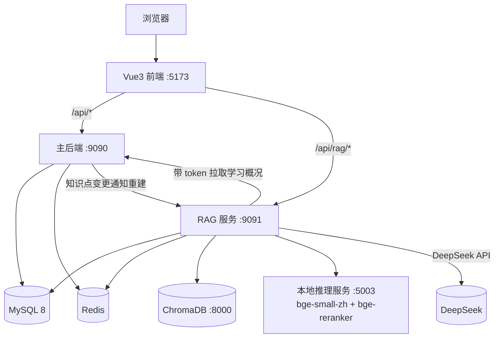
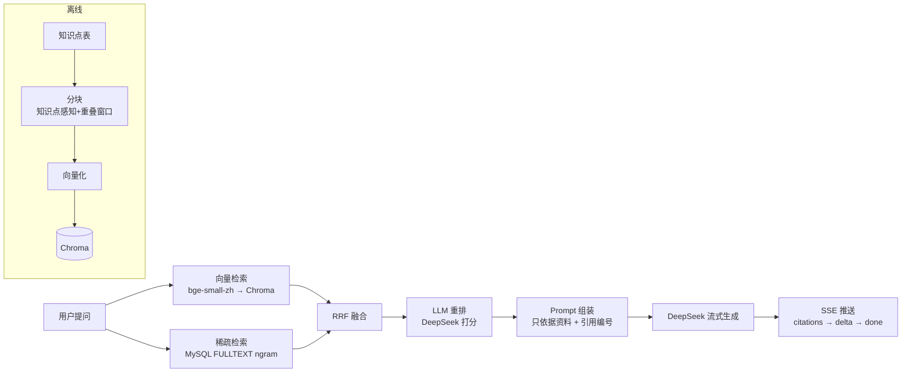

# 智能学习系统 + RAG AI 助教 · 完整项目资料
> 整合版：项目设计 / 搭建流程 / 技术决策与面试准备（2026-08-09）

## 总目录

- [第一部分 · 项目总览与设计](#第一部分--项目总览与设计)
  - 项目总览 / 系统架构 / 功能清单 / 核心设计亮点 / 数据模型 / 性能与评测数据 / 部署与运维 / 面试问答 / 简历要点 / 已知不足
- [第二部分 · 搭建流程](#第二部分--搭建流程)
  - 环境要求 / 目录结构 / 基础设施 / 主后端 / Python 推理 / ChromaDB / RAG 后端 / 前端 / 一键启动 / Docker / 完整验证清单 / 排错大全 / 配置清单
- [第三部分 · 技术决策与方案对比](#第三部分--技术决策与方案对比)
  - 整体架构 / 认证与安全 / 数据与 Redis / 推荐与掌握度 / RAG 核心决策 / 性能优化 / 工程化 / 面试收尾话术

---
# 第一部分 · 项目总览与设计

> 版本：v1.0（2026-08-09）
> 作者：刘佳乐 · 软件工程本科
> 仓库：https://github.com/llAA-LL/smart-learn-stream

---


## 1. 项目总览

**一句话定位**：面向大学生的智能学习平台——学生在平台上学习课程知识点、自测、记录进度，系统基于知识图谱与掌握度生成个性化推荐，并提供一个**基于 RAG 的 AI 助教**，回答全部有据可查、可溯源。

**三个子系统**：

| 子系统 | 技术栈 | 职责 |
|--------|--------|------|
| 主后端（backend） | Spring Boot 3.2 / MyBatis / MySQL / Redis / JWT | 业务系统：认证、课程、知识图谱、学习计划/记录、自测、推荐 |
| RAG 服务（rag-backend） | Spring Boot 3.5 / Spring AI 1.1 / DeepSeek / ChromaDB / MySQL 全文 | AI 助教：混合检索 + 重排 + 流式问答 + 会话记忆 |
| 前端（frontend） | Vue 3 / Vite / Element Plus / Pinia | 学习平台 UI + AI 对话页（SSE 流式） |

**为什么做两个后端**：RAG 服务独立部署、独立扩展（AI 流量与业务流量隔离），同时通过 HTTP 与主后端协作（拉取用户学习数据、知识点变更通知重建索引）。这是真实企业里"AI 服务与业务服务分离"的常见架构。

---

## 2. 系统架构

### 2.1 模块拓扑



### 2.2 RAG 检索链路



### 2.3 数据流（一次 AI 问答）

1. 前端携带 `conversationId + history + question + token` 发起 SSE 请求；
2. RAG 服务先查 Redis **会话记忆**（多轮上下文）与**热问题缓存**（相同独立问题直接返回）；
3. 若带 token，从主后端拉取**用户学习概况**（统计/薄弱点/推荐）注入提示词；
4. 双路检索（向量 + MySQL 全文）→ RRF 融合 → LLM 重排 → 组装 Prompt；
5. DeepSeek 流式返回，前端逐字渲染；回答带引用知识点编号；
6. 回答写回 Redis 会话记忆；无上下文独立问题写入热问题缓存；
7. 用户点赞/点踩写入 `rag_feedback` 表，用于后续评估。

---

## 3. 功能清单

### 3.1 主后端

| 模块 | 功能 | 状态 |
|------|------|------|
| 认证 | 注册（强制 STUDENT 角色）、登录、JWT、登出黑名单、限流 | ✅ |
| 课程 | 列表（分页）、详情、增删改（仅 ADMIN） | ✅ |
| 知识图谱 | 节点 CRUD（仅 ADMIN）、前置依赖、图谱数据 | ✅ |
| 学习计划 | 计划 CRUD、计划项完成切换、测验通过自动完成 | ✅ |
| 学习记录 | 记录学习、统计（今日/本周/累计）、掌握度、热门排行 | ✅ |
| 自测 | 按知识点随机抽 5 题、判分、历史（分页）、防答案泄露 | ✅ |
| 推荐 | 三级优先级 + 前置门控 + 30 分钟缓存 + 点击上报 | ✅ |
| 题目管理 | 题目 CRUD（仅 ADMIN，避免学生直接查答案） | ✅ |
| AI 上下文 | `GET /api/ai/context` 聚合个人学习概况 | ✅ |

### 3.2 RAG 服务

| 能力 | 说明 | 状态 |
|------|------|------|
| 混合检索 | 向量（Chroma）+ 关键词（MySQL 全文 ngram）+ RRF | ✅ |
| 重排 | LLM 重排（默认，hit@1 87.5%）/ 本地 bge-reranker（离线备选） | ✅ |
| 流式问答 | SSE：citations → delta → done | ✅ |
| 引用溯源 | 回答标注 [1][2]，返回引用知识点 | ✅ |
| 会话记忆 | Redis 持久化，最多 10 轮，客户端刷新不丢 | ✅ |
| 热问题缓存 | Redis Cache-Aside，重复问题 17ms | ✅ |
| 限流 | 按 IP 固定窗口（chat 15/min、stream 20/min 等） | ✅ |
| 反馈 | 点赞/点踩落库 | ✅ |
| 个人化问答 | 带 token 注入用户学习概况，不进热缓存防串号 | ✅ |
| 索引联动 | 知识点变更 → 主后端异步通知重建 | ✅ |
| 评测 | 40 题 QA + 对照实验 + 报告 | ✅ |

### 3.3 前端

登录、仪表盘、课程、知识图谱、知识点详情、学习计划、学习记录、自测、推荐、题目管理（仅 ADMIN 可见）、AI 助教（流式 + 引用标签 + 反馈）。全部页面已按角色控制菜单显示。

---

## 4. 核心设计亮点

### 4.1 认证与权限

- **JWT + Redis 黑名单**：登录签发 HMAC-SHA256 令牌；登出把 token 加入 Redis 黑名单（TTL = 剩余有效期），拦截器先查黑名单再验签，实现"主动登出"。
- **BCrypt 密码**：修复了原始无盐 SHA-256；种子用户通过 `ON DUPLICATE KEY UPDATE` 自动迁移。
- **`@RequireRole("ADMIN")` AOP 校验**：与 `@RateLimit` 同一套切面模式；题目接口全部 ADMIN-only（学生无法通过接口查答案），课程/知识点写操作 ADMIN-only。
- **IDOR 修复**：测验记录查看必须归属当前用户（403），防止越权访问他人数据。
- **真实 HTTP 状态码**：业务异常按 code 映射 401/403/404/429，前端 axios 401 拦截恢复正常语义。

### 4.2 Redis 多场景应用

| 场景 | 实现 | 说明 |
|------|------|------|
| 热问题缓存 | Cache-Aside，key=SHA-256(问题)，TTL 24h | 重复问题 17ms 返回，零 LLM 调用 |
| 会话记忆 | List + JSON 序列化，最多 10 轮 | 多轮上下文跨请求/跨刷新 |
| 会话/问题隔离 | 带 token 的请求跳过热缓存 | 防止个人化回答串号 |
| 统计计数 | INCR + TTL（今日/本周/累计） | 避免 DB 行级竞争 |
| 热门排行 | ZSet 增量分数 | 热门课程/知识点实时榜 |
| 分布式锁 | SET NX PX + Lua 原子释放 | 掌握度更新并发安全 |
| 接口限流 | INCR + TTL 固定窗口，按 IP | 防刷 |
| 知识图谱/推荐缓存 | Cache-Aside + 写后失效 | 读多写少场景 |

### 4.3 掌握度与推荐算法

- **掌握度**：学习记录 70% 历史 + 30% 最新；测验 50/50 加权；上限 100，分布式锁保证并发一致性。
- **推荐**：三级优先级（薄弱点复习 > 逻辑下一步 > 全新领域）+ 前置依赖门控（前置必须已掌握）+ 掌握度阈值过滤（≥60 视为掌握），Top10 输出；30 分钟按用户缓存，点击行为上报形成闭环。

### 4.4 RAG 链路设计

- **分块**：知识点天然成块（标题/描述常驻），长内容按段落聚合 + 重叠窗口，块 ID 确定性（`kp-{id}-{i}`），重建幂等。
- **混合检索**：稠密（bge-small-zh 本地推理）+ 稀疏（MySQL FULLTEXT ngram），RRF 融合只看排名不看分数。
- **重排**：LLM 打分重排把 Top-1 命中从 65% 提到 87.5%；本地 bge-reranker 可离线降级（80%）。
- **防幻觉**：系统提示词"只依据资料 + 引用编号"；检索为空直接兜底不调用模型；资料不足时诚实说明。
- **评测**：40 题基于真实知识点构造，检索命中率 + LLM 裁判回答评分 + 引用率。

### 4.5 工程化

- 日志埋点：每次请求记录 retrieve/rerank/generate 三段耗时与缓存命中。
- 测试：主后端 12 个（认证/判分/角色校验）+ RAG 23 个（分块/检索/重排/记忆/缓存/MVC+SSE）。
- Docker：独立 compose + 主系统集成（mysql/redis/backend/agent/chroma/rag-backend/frontend）。
- CI：GitHub Actions（后端测试 + 前端构建）。
- Git：6 个提交全量托管 GitHub，`.env` 密钥排除并扫描确认。

---

## 5. 数据模型

核心表（MySQL `smart_learning`）：

| 表 | 说明 |
|----|------|
| users | 用户（BCrypt 密码，STUDENT/ADMIN 角色） |
| courses | 课程 |
| knowledge_points | 知识点（含 learning_content，RAG 语料源，FULLTEXT 索引） |
| kp_prerequisites | 知识点前置依赖（邻接表） |
| questions / quiz_attempts / quiz_answers | 题库与测验 |
| learning_plans / plan_items | 学习计划 |
| learning_records / user_kp_mastery | 学习记录与掌握度 |
| recommendation_logs | 推荐浏览/点击日志 |
| rag_feedback | AI 回答反馈 |

Redis key 设计：`rag:chat:{conversationId}`（会话）、`rag:cache:q:{sha256}`（热缓存）、`rate_limit:{ip}:{method}`、`cache:rec:{userId}`、`cache:kg:*`、`stat:*`、`lock:*`、`token_blacklist:*`。

---

## 6. 性能与评测数据

### 6.1 RAG 评测（40 题）

| 检索模式 | Hit@1 | Hit@5 |
|---------|------:|------:|
| 仅向量检索 | 55% | 95% |
| 仅关键词检索 | 87.5% | 100% |
| 混合检索（RRF） | 65% | 97.5% |
| 混合 + LLM 重排 | **87.5%** | 97.5% |

- RAG 回答引用率 **100%**，零编造；
- 回答质量：裸模型 8.8 vs RAG 6.82，差距来自 11 题"课程资料未覆盖"（RAG 诚实说明资料不足，属预期行为）；
- 重排收益：混合 Top-1 65% → 重排后 87.5%（+22.5pp），代价约 800ms。

### 6.2 性能（本机实测）

| 场景 | 数据 |
|------|------|
| 本地混合检索（无重排） | 平均 31.8ms，P95 36ms |
| 混合 + LLM 重排 | 约 800ms |
| Chat 总耗时 | 2-3.7s（约 95% 是 DeepSeek 生成） |
| SSE 首字（TTFT） | 约 2.2s |
| 热问题缓存命中 | **17ms**（未命中 4-6s） |
| 检索并发 | 1/5/10/20 并发 QPS 32/15/8/4，瓶颈为本地 CPU Embedding |

### 6.3 优化结论

- Embedding 多 worker 实测收益有限 → 瓶颈是 CPU 推理，真正解法是 GPU/API Embedding；
- 本地 bge-reranker 零依赖可离线，但 hit@1 略低（80% vs 87.5%），默认保留 LLM 重排；
- 热问题缓存是性价比最高的优化（300 倍加速 + 零成本）。

---

## 7. 部署与运维

### 7.1 本地一键启动（RAG 链路）

```powershell
# 前置：MySQL/Redis 已启动；rag-backend/.env 配置 DEEPSEEK_API_KEY
cd rag-backend
powershell -ExecutionPolicy Bypass -File scripts\start-all.ps1
```

服务端口：MySQL 3306 / Redis 6379 / Chroma 8000 / 本地推理 5003 / 主后端 9090 / RAG 9091 / 前端 5173。

### 7.2 Docker

```bash
cd smart-learning-system
docker compose up -d --build   # 全套服务
```

### 7.3 CI

GitHub Actions 自动跑：rag-backend `mvn test`（23 个）+ 前端 `npm run build`。

### 7.4 常见账号

| 账号 | 密码 | 角色 |
|------|------|------|
| admin | admin123 | ADMIN |
| zhangsan / lisi | 123456 | STUDENT |

---

## 8. 面试问答（高频）

### Q1：用 1 分钟介绍你的项目

> 我做了一个面向大学生的智能学习平台，前后端分离。后端是 Spring Boot + MyBatis + MySQL + Redis，实现了课程、知识图谱、学习计划、学习记录、自测、个性化推荐这套学习闭环；推荐引擎基于知识图谱的前置依赖和用户的掌握度评分做三级优先级推荐。第二部分是 AI 助教：用 Spring AI 接入 DeepSeek，构建了完整的 RAG 链路——知识点分块、向量化存 ChromaDB、MySQL 全文检索做双路召回、RRF 融合、LLM 重排、流式回答，回答带引用可溯源。我自建了 40 题评测集，混合检索 Top-5 命中率 97.5%，重排把 Top-1 从 65% 提到 87.5%，并用 Redis 做了会话记忆和热问题缓存，重复问题 17ms 返回。

### Q2：为什么用 RAG 而不是微调？

> 四个原因：1) 知识更新——课程资料改完，RAG 重建索引就能生效，微调要重新训练；2) 可溯源——RAG 回答带引用，能告诉用户依据哪条知识点，微调是黑盒；3) 成本——RAG 只按检索和生成计费，微调要 GPU 训练；4) 幻觉控制——RAG 把答案限定在检索到的资料内，配合提示词约束。我的项目里还有数据支撑：引用率 100%，资料未覆盖时会诚实说"无法回答"而不是编造。

### Q3：分块策略怎么设计的？

> 数据源是知识点表，每个知识点天然是一个语义完整的单元，所以默认按知识点分块，标题和描述常驻每块保证上下文。对超长内容按段落聚合，超过 800 字截断并带 80 字重叠窗口，避免语义断裂。块 ID 用 `kp-{id}-{index}` 的确定性格式，重建索引幂等。

### Q4：为什么混合检索？RRF 的原理？

> 向量检索擅长同义改写和语义相似，比如"怎么避免死锁"能召回"死锁预防"；关键词检索擅长专有名词和精确术语。两者互补，所以双路召回。RRF 不做分数归一化，直接按排名融合：score = Σ 1/(k+rank)，k 取 60，两个检索路各自给候选按名次打分求和，天然免疫两套分数体系不可比的问题。我的评测里关键词单路 Top-5 100%、向量 95%，混合后 97.5% 且更稳。

### Q5：重排值不值？

> 值。数据说话：混合检索 Top-1 只有 65%，因为 RRF 会被强单路稀释；加了 LLM 重排后 Top-1 回到 87.5%，代价是每次约 800ms 和一次 DeepSeek 调用。我还做了本地 bge-reranker 作为离线降级方案，零外部依赖，hit@1 80%，通过配置一键切换。

### Q6：怎么防幻觉？

> 三层：1) 检索为空直接返回兜底文案，不调用模型；2) 系统提示词强约束"只依据参考资料回答、必须标注引用编号、资料不足就说明无法回答"；3) 评测兜底——40 题里 11 题课程资料覆盖不足，模型选择诚实说明而不是编造。回答带 [1][2] 引用，用户能核对来源。

### Q7：Redis 在项目里用了哪些？

> 六个场景：热问题回答缓存（Cache-Aside，17ms 命中）、会话记忆（多轮上下文）、分布式锁（SET NX PX + Lua 释放）保护掌握度并发更新、固定窗口限流（INCR+TTL 按 IP）、统计计数（今日/本周/累计）、ZSet 热门排行、知识图谱/推荐缓存。另外有一个细节：带用户 token 的个人化请求跳过热问题缓存，防止跨用户串数据。

### Q8：权限体系怎么做的？

> JWT 里带 role，拦截器把 userId/role 放到请求属性；写操作接口加 `@RequireRole("ADMIN")` 注解，AOP 切面统一校验，无权限抛 403。这样题目接口对 STUDENT 完全隔离——否则学生能直接查题库答案，自测就没意义了。管理员账号通过 data.sql 幂等初始化。

### Q9：性能优化做了哪些？效果？

> 先用压测脚本量化：本地检索 31.8ms、重排 800ms、生成 3s，定位瓶颈在外部 API 和本地 CPU 推理。然后做热问题缓存（重复问题 4-6s → 17ms，300 倍）；重排支持本地/LLM 切换；Embedding 多 worker 实测收益有限，确认瓶颈是 CPU 推理，结论是生产环境应切 API/GPU Embedding——每一步都有数据支撑。

### Q10：评测是怎么做的？

> 基于数据库里真实的 64 个知识点构造了 40 道 QA，标注期望命中的知识点 ID。对每道题跑四种检索模式（向量/关键词/混合/混合+重排）算 Hit@1/Hit@5；回答质量用 LLM 裁判按统一评分标准打分（公平规则：资料不足时诚实回答不算错误）。产出报告里有逐题明细，方便定位具体问题。

### Q11：遇到的最大的坑？

> 说三个印象深的：1) Spring AI 1.1 的 Chroma 自动配置会把 host:port 拼成无协议头 URL 导致启动失败，且默认走云 API 的租户名，需要手动配 baseUrl 和 default_tenant/default_database；2) PowerShell 5.1 会把 UTF-8 响应按 Latin-1 解码，导致评测数据全变乱码、裁判分数不可信，必须用原始字节流按 UTF-8 解码——数据管线的编码问题；3) 前端解析 SSE 时只认带空格的 `event: xxx`，而 Spring 发的是无空格 `event:xxx`，导致流式内容一直不显示。

### Q12：如果重做，会怎么改进？

> 1) 换更强的 Embedding（bge-m3）并部署到 GPU/API，解决本地 CPU 推理的并发瓶颈；2) 知识点变更做增量索引更新而不是全量重建；3) 会话记忆按用户隔离并加 TTL，支持更细的权限模型（老师/助教中间角色）；4) 引入消息队列解耦 AI 服务与业务服务，避免 HTTP 直连。

---

## 9. 简历要点

- 自建 40 题评测集：混合检索 Top-5 命中率 97.5%，LLM 重排将 Top-1 命中从 65% 提升至 87.5%，回答引用率 100%；
- 热问题缓存 + 会话记忆：重复问题延迟从 4-6s 降至 17ms，多轮上下文服务端持久化；
- Redis 六场景（缓存/分布式锁/限流/计数/排行/记忆）+ JWT 黑名单 + BCrypt + AOP 权限校验；
- 全链路 SSE 流式问答、按知识点感知分块、RRF 混合检索、可切换重排；
- 35 个单元/集成测试 + GitHub Actions CI + Docker Compose 一键部署。

---

## 10. 已知不足与未来方向

- 全量重建索引：知识点变更目前触发全量重建（约 7s），可优化为增量更新；
- Embedding 本地 CPU 推理并发受限：生产应切 API/GPU；
- 无老师/助教中间角色：权限模型只有 STUDENT/ADMIN 两级；
- 评测集 40 题可扩充，可增加 bge-m3 对比、topK 敏感性实验；
- 会话记忆未按用户隔离 + TTL（当前按 conversationId 隔离，前端每次新会话生成新 ID）。


---

# 第二部分 · 搭建流程

> 本手册基于 Windows 本机（E:\smart-learning-system）实际验证过的命令编写，
> 按顺序执行即可完整搭建。每一步都附验证命令。

---


## 1. 环境要求

| 组件 | 版本 | 本机位置/说明 |
|------|------|--------------|
| Windows | 10/11 | 本机为 Windows |
| JDK | 17+（推荐 21） | 本机默认 JDK11 不满足；用 IDEA 自带 JBR 21：`E:\idea2025.1\jbr` |
| Maven | 3.8+ | 不在 PATH，用 IDEA 内置：`E:\idea2025.1\plugins\maven\lib\maven3\bin\mvn.cmd` |
| Node.js | 18+（本机 24） | `E:\Node` |
| Python | 3.12+（本机 3.13） | 项目内 venv：`E:\smart-learning-system\agent\.venv` |
| MySQL | 8.0 | 本机 `D:\Program Files\MySQL\MySQL Server 8.0`，端口 3306 |
| Redis | 任意（本机旧版即可） | `E:\Redis\redis-server.exe`，端口 6379 |
| 网络 | 需可访问 DeepSeek API；GitHub 视网络情况可能需要代理 | 本机系统代理 `127.0.0.1:7897` |
| API Key | DeepSeek（必需） | https://platform.deepseek.com 获取 |

> 注意：Maven 构建统一用以下两条环境变量，避免中文乱码和语言干扰：
> ```powershell
> $env:JAVA_HOME="E:\idea2025.1\jbr"
> $env:MAVEN_OPTS="-Duser.language=en -Duser.country=US -Dfile.encoding=UTF-8"
> ```

## 2. 目录结构

```
smart-learning-system/
├── backend/            # 主后端（Spring Boot 3.2，端口 9090）
│   ├── src/main/java/com/smartlearning/
│   │   ├── controller/ service/ mapper/ entity/ dto/
│   │   ├── config/      # JWT拦截器、Redis、限流、RAG通知
│   │   ├── aspect/      # 限流AOP、角色校验AOP、日志AOP
│   │   └── util/        # JWT、Redis、分布式锁、判分
│   ├── src/main/resources/   # application.yml、schema.sql、data.sql
│   └── src/test/java/        # 12 个测试
├── rag-backend/        # RAG 服务（Spring AI 1.1，端口 9091）
│   ├── src/main/java/com/smartlearning/rag/
│   │   ├── service/     # RAG编排、记忆、缓存、反馈、个人上下文、重排
│   │   ├── retrieval/   # 混合检索（稠密+稀疏+RRF）
│   │   ├── embedding/   # 本地推理服务适配
│   │   └── controller/  # chat/stream/retrieve/rebuild/feedback
│   ├── scripts/         # start-all / start-chroma / start-embedding / start-app
│   ├── eval/            # 40题评测集 + 报告 + 性能报告
│   └── src/test/java/   # 23 个测试
├── frontend/           # Vue3 前端（端口 5173）
├── agent/              # Python 环境（venv + 模型）
├── docs/               # 项目文档 + 本手册
├── docker-compose.yml  # 全套 Docker
└── .github/workflows/ci.yml
```

## 3. 基础设施

### 3.1 MySQL

确认运行中：
```powershell
Get-NetTCPConnection -LocalPort 3306 -State Listen
```

如果服务停止（本机曾出现），直接启动（需管理员权限的服务方式，或直接跑进程）：
```powershell
Start-Service MySQL8   # 需要管理员权限
# 或直接启动进程：
& "D:\Program Files\MySQL\MySQL Server 8.0\bin\mysqld.exe" --defaults-file="D:\ProgramData\MySQL\MySQL Server 8.0\my.ini"
```

账号：`root / 123456`（主后端默认配置）。数据库 `smart_learning` 由主后端启动时自动创建（schema.sql 含 `CREATE DATABASE IF NOT EXISTS`）。

### 3.2 Redis

```powershell
Get-NetTCPConnection -LocalPort 6379 -State Listen   # 确认在跑
# 没跑就启动：
Start-Process "E:\Redis\redis-server.exe" -WindowStyle Hidden
```

### 3.3 Git 代理（GitHub 连不上时）

```powershell
git config --global http.proxy http://127.0.0.1:7897
git config --global https.proxy http://127.0.0.1:7897
git config --global --unset http.proxy   # 取消时
```

## 4. 主后端搭建

### 4.1 构建与测试

```powershell
$env:JAVA_HOME="E:\idea2025.1\jbr"
$env:MAVEN_OPTS="-Duser.language=en -Duser.country=US -Dfile.encoding=UTF-8"
cd E:\smart-learning-system\backend
& "E:\idea2025.1\plugins\maven\lib\maven3\bin\mvn.cmd" test        # 12 个测试
& "E:\idea2025.1\plugins\maven\lib\maven3\bin\mvn.cmd" -DskipTests package
```

### 4.2 启动

```powershell
java -jar target\smart-learning-system-1.0.0.jar
# 或 IDEA 直接运行 SmartLearningApplication
```

启动时自动执行 `schema.sql`（建表）和 `data.sql`（种子数据：admin/admin123、zhangsan/123456、课程、知识点）。

### 4.3 验证

```powershell
# 登录
Invoke-WebRequest -Uri "http://localhost:9090/api/auth/login" -Method POST -ContentType "application/json" `
  -Body ([Text.Encoding]::UTF8.GetBytes('{"username":"admin","password":"admin123"}')) -UseBasicParsing
# 分页
curl "http://localhost:9090/api/courses?page=1&pageSize=5" -H "Authorization: Bearer <token>"
```

## 5. Python 推理服务

负责 Embedding（bge-small-zh-v1.5）和 Rerank（bge-reranker-base），供 RAG 服务调用。

### 5.1 环境检查

```powershell
# venv 存在且关键包已装
Test-Path "E:\smart-learning-system\agent\.venv\Scripts\python.exe"
& "E:\smart-learning-system\agent\.venv\Scripts\python.exe" -c "import sentence_transformers, fastapi, uvicorn; print('ok')"
# 模型缓存（首次加载会从 HF 下载，约 100MB）
Get-ChildItem "C:\Users\13849\.cache\huggingface\hub" -Directory | Where-Object { $_.Name -like "*bge*" }
```

### 5.2 启动（多 worker）

```powershell
cd E:\smart-learning-system\rag-backend
powershell -ExecutionPolicy Bypass -File scripts\start-embedding.ps1
# 等价命令（注意：必须用 CLI 形式，Windows 上 uvicorn.run(workers>1) 会崩）：
& "E:\smart-learning-system\agent\.venv\Scripts\python.exe" -m uvicorn embedding_server:app `
  --host 127.0.0.1 --port 5003 --workers 2 --app-dir E:\smart-learning-system\rag-backend\scripts
```

### 5.3 验证

```powershell
Invoke-RestMethod "http://127.0.0.1:5003/health"            # {"status":"ok"}
Invoke-RestMethod "http://127.0.0.1:5003/embed" -Method POST -ContentType "application/json" `
  -Body '{"inputs":["测试"],"is_query":false}'              # 512 维向量
Invoke-RestMethod "http://127.0.0.1:5003/rerank" -Method POST -ContentType "application/json" `
  -Body '{"question":"什么是死锁？","candidates":["死锁定义","TCP握手"]}'  # 分数 0.99/0.0001
```

> 冷知识：bge 检索建议给查询文本加指令前缀"为这个句子生成表示以用于检索相关文章："，本项目已在服务端自动处理（查询加、文档不加）。

## 6. ChromaDB

```powershell
cd E:\smart-learning-system\rag-backend
powershell -ExecutionPolicy Bypass -File scripts\start-chroma.ps1
# 数据目录 rag-backend\data\chroma，端口 8000
Invoke-RestMethod "http://127.0.0.1:8000/api/v2/tenants/default_tenant/databases"   # 验证
```

> 重要：Spring AI 1.1.x 的 Chroma 客户端走 v2 API，本地 Chroma 1.5.9 的默认租户/库是
> `default_tenant` / `default_database`。自动配置存在 URL 协议头 bug，本项目已在
> `VectorStoreConfig` 手动提供 ChromaApi Bean 绕过，**不要删除该类**。

## 7. RAG 后端搭建

### 7.1 配置 `.env`

复制 `rag-backend\.env.example` 为 `.env` 并填写：

```ini
MYSQL_USER=root
MYSQL_PASSWORD=123456
DEEPSEEK_API_KEY=sk-你的DeepSeek密钥     # 必需（对话 + 重排）
# SILICONFLOW_API_KEY=sk-...            # 仅当切 openai-api 向量化时需要
```

> `.env` 已 gitignore，切勿提交。读取必须用 UTF-8（PowerShell 5.1 的 Get-Content 默认 GBK 会吞换行）：
> ```powershell
> [System.IO.File]::ReadAllLines("E:\smart-learning-system\rag-backend\.env", [Text.Encoding]::UTF8)
> ```

### 7.2 关键配置（application.yml）

| 配置 | 默认值 | 说明 |
|------|--------|------|
| `rag.embedding.provider` | `local-python` | 本地推理服务；切 `openai-api` 需 SiliconFlow Key |
| `rag.rerank.provider` | `llm` | LLM 重排（hit@1 87.5%）；`local` 为离线 bge-reranker（80%） |
| `rag.retrieval.rerank-top-k` | `8` | 重排候选数（5 会漏并列名次，实测 8 更好） |
| `rag.memory.max-turns` | `10` | Redis 会话记忆轮数 |
| `rag.cache.ttl-seconds` | `86400` | 热问题缓存 TTL |
| `app.main-backend-url` | `http://localhost:9090` | 个人学习概况来源 |

### 7.3 构建、启动、建索引

```powershell
$env:JAVA_HOME="E:\idea2025.1\jbr"
cd E:\smart-learning-system\rag-backend
& "E:\idea2025.1\plugins\maven\lib\maven3\bin\mvn.cmd" test          # 23 个测试
& "E:\idea2025.1\plugins\maven\lib\maven3\bin\mvn.cmd" -DskipTests package

# 启动前：MySQL、Redis、Chroma、Embedding 服务都必须已在跑
java -jar target\rag-backend-1.0.0.jar
```

启动时自动：创建 MySQL 全文索引（ngram）、`rag_feedback` 表、Chroma collection。

首次使用先建索引：
```powershell
Invoke-WebRequest -Uri "http://localhost:9091/api/rag/index/rebuild" -Method POST -UseBasicParsing
# 返回 {"knowledgePoints":64,"chunks":123,"durationMs":...}
```

### 7.4 验证

```powershell
# 检索（调试）
curl "http://localhost:9091/api/rag/retrieve?question=什么是死锁&topK=5&mode=hybrid&rerank=true"
# 问答
Invoke-WebRequest -Uri "http://localhost:9091/api/rag/chat" -Method POST -ContentType "application/json" `
  -Body ([Text.Encoding]::UTF8.GetBytes('{"conversationId":"t1","history":[],"question":"什么是死锁？"}')) -UseBasicParsing
# 流式
Invoke-WebRequest -Uri "http://localhost:9091/api/rag/chat/stream" -Method POST -ContentType "application/json" `
  -Body ([Text.Encoding]::UTF8.GetBytes('{"conversationId":"t2","history":[],"question":"什么是B+树索引？"}')) -UseBasicParsing
```

## 8. 前端搭建

```powershell
cd E:\smart-learning-system\frontend
npm install        # node_modules 已存在可跳过
npm run dev        # 开发服务器 :5173，代理 /api→9090、/api/rag→9091
npm run build      # 生产构建（CI 也用这个）
```

打开 http://localhost:5173 登录：`admin/admin123`（管理员）或 `zhangsan/123456`（学生）。

> 前端角色验证：管理员左侧有"题目管理"，学生没有；学生直接访问 /questions 会被后端 403。

## 9. 一键启动与端口总览

```powershell
# RAG 链路一键启动（Chroma + Embedding + RAG 后端）
cd E:\smart-learning-system\rag-backend
powershell -ExecutionPolicy Bypass -File scripts\start-all.ps1
```

| 端口 | 服务 | 依赖 |
|------|------|------|
| 3306 | MySQL | - |
| 6379 | Redis | - |
| 8000 | ChromaDB | - |
| 5003 | Python 推理（2 worker） | MySQL/Redis 无关 |
| 9090 | 主后端 | MySQL、Redis |
| 9091 | RAG 后端 | MySQL、Redis、Chroma、5003、DeepSeek |
| 5173 | 前端 Vite | 9090、9091 |

## 10. Docker 部署

> 注意：本机未装 Docker，以下命令在**有 Docker 的机器**上执行，首次跑通建议先在本机验证。

```bash
# 方式一：只部署 RAG 链路
cd rag-backend
cp .env.example .env   # 填入 DEEPSEEK_API_KEY、SILICONFLOW_API_KEY
docker compose up -d --build
# 容器内向量化走 SiliconFlow API（RAG_EMBEDDING_PROVIDER=openai-api）

# 方式二：整套系统
cd smart-learning-system
docker compose up -d --build
```

主 compose 包含：mysql / redis / backend / agent / chroma / rag-backend / frontend。前端 nginx 已配置 `/api/rag` 反代（SSE 关闭缓冲）。

## 11. 完整验证清单

### 主后端

- [ ] `POST /api/auth/login` admin/admin123 → 200 + token
- [ ] 错误密码 → HTTP 401
- [ ] 注册伪造 role=ADMIN → 返回 STUDENT 且无密码字段
- [ ] 学生 `GET /api/questions` → 403；`GET /api/courses` → 200
- [ ] admin `GET /api/questions?page=1&pageSize=10` → 200 + PagedResult
- [ ] `GET /api/quiz/attempts/{id}` 访问他人记录 → 403
- [ ] `GET /api/ai/context`（带 token）→ 200 + 统计/薄弱点/推荐

### RAG

- [ ] `POST /api/rag/index/rebuild` → 64 知识点 / 123 分块
- [ ] `GET /api/rag/retrieve?question=死锁&mode=hybrid&rerank=true` → 死锁排第一
- [ ] `POST /api/rag/chat` → 回答含引用 [1]，citations 非空
- [ ] 同一问题连问两次 → 第二次 elapsedMs≈0（缓存命中）
- [ ] 同会话第二轮不带 history → 能回忆第一轮（Redis 记忆）
- [ ] `POST /api/rag/chat/stream` → 收到 citations/delta/done 事件
- [ ] 带 token 问"我的学习进度怎么样？"→ 回答包含分钟数（个人上下文）
- [ ] 130 次连续 `/retrieve` → 约 120 次 200 + 10 次 429（限流）
- [ ] 管理员改知识点描述 → 12 秒后纯向量检索能搜到新内容（索引联动）

### 前端

- [ ] 学生菜单无"题目管理"；admin 有
- [ ] AI 助教流式渲染 + 引用标签
- [ ] 重复问题第二次秒回（17ms 体验）

## 12. 排错大全

### 12.1 端口被占

```powershell
Get-NetTCPConnection -LocalPort 9090,9091 -State Listen
Get-NetTCPConnection -LocalPort 9090 -State Listen | ForEach-Object { Stop-Process -Id $_.OwningProcess -Force }
```
> 常见场景：之前启动的实例没关，IDEA 再启动报 "Port 9090 was already in use"。

### 12.2 MySQL 连不上（Connection reset）

MySQL 服务可能停止。先查端口，再按第 3.1 节启动。直接启动 mysqld 时路径有空格，参数必须带引号：
```powershell
& "D:\Program Files\MySQL\MySQL Server 8.0\bin\mysqld.exe" --defaults-file="D:\ProgramData\MySQL\MySQL Server 8.0\my.ini"
```

### 12.3 RAG 启动报 Chroma 相关错误

- `invalid URI scheme localhost` / `SpringAiCollection ... initializeSchema false`：说明 `VectorStoreConfig` 没生效或配置被破坏。检查 application.yml 层级（`spring.ai.vectorstore.chroma.*` 必须挂在 `spring:` 下）。
- 本手册编写期间曾因把 `app:` 块误插进 `spring:` 层级导致 RAG 起不来——改 yml 时注意缩进。

### 12.4 PowerShell 编码三连坑

1. `.env` 读取：必须 `[System.IO.File]::ReadAllLines(path, [Text.Encoding]::UTF8)`，否则中文注释会吞掉下一行的换行，Key 读不到（表现为 401 placeholder）。
2. HTTP 响应解析：PowerShell 5.1 会把无 charset 的响应按 Latin-1 解码成乱码。必须用原始字节流：
   ```powershell
   $json = [IO.StreamReader]::new($web.RawContentStream, [Text.Encoding]::UTF8).ReadToEnd()
   ```
3. 脚本/命令里的中文比较（`Contains("分钟")`）在命令行内联时可能乱码，调试时用 Unicode 码位构造或写成脚本文件。

### 12.5 uvicorn 多 worker 在 Windows 崩溃

必须用 CLI 形式：
```powershell
python -m uvicorn embedding_server:app --host 127.0.0.1 --port 5003 --workers 2 --app-dir <scripts目录>
```
脚本内 `uvicorn.run(app, workers=2)` 会无限重启子进程（"Child process died"）。

### 12.6 SSE 前端不显示内容

Spring 的 SseEmitter 发送 `event:citations`（冒号后**无空格**），前端解析必须兼容两种格式：
```js
line.startsWith('event:')  // 不能只匹配 'event: '
```

### 12.7 Spring AI PromptTemplate 花括号

提示词模板里的字面 `{...}`（如 JSON 示例）会被当占位符导致 "The template string is not valid"，用文字描述代替或转义。

### 12.8 jar 打包失败（Unable to rename）

运行中的 java 进程锁住 jar：先停掉对应端口进程再 `mvn package`。

### 12.9 旧账号登录失败

密码从 SHA-256 迁到 BCrypt 后，只有种子账号自动迁移。旧注册账号需重置：
```sql
UPDATE users SET password='$2b$10$BWZdinQXCETSGm7rG3NQ0eu0q.OqQcJkDqHNf6QK.5mUJs80PBQIu' WHERE username='你的账号';
```
（该哈希即 "123456"）

### 12.10 GitHub 推送失败

`Recv failure / Could not connect to server` → 按 3.3 配 git 代理；远端已有提交 → `git pull origin main --allow-unrelated-histories` 后推送。

## 13. 配置清单

### 主后端（backend/src/main/resources/application.yml）

| 配置 | 环境变量覆盖 | 默认 |
|------|-------------|------|
| 数据库密码 | `MYSQL_PASSWORD` | 123456 |
| JWT 密钥 | `JWT_SECRET` | smart-learning-system-jwt-secret-key-2026 |
| JWT 过期 | `JWT_EXPIRATION` | 86400000 |
| RAG 地址 | `RAG_BACKEND_URL` | http://localhost:9091 |

### RAG（rag-backend/src/main/resources/application.yml + .env）

| 配置 | 环境变量覆盖 | 默认 |
|------|-------------|------|
| DeepSeek Key | `DEEPSEEK_API_KEY` | 必填 |
| SiliconFlow Key | `SILICONFLOW_API_KEY` | 选填（openai-api 向量化时） |
| 向量化方式 | `rag.embedding.provider` | local-python |
| 重排方式 | `rag.rerank.provider` | llm |
| 主后端地址 | `MAIN_BACKEND_URL` | http://localhost:9090 |

### 常用账号

| 账号 | 密码 | 角色 |
|------|------|------|
| admin | admin123 | ADMIN |
| zhangsan / lisi | 123456 | STUDENT |

---

> 排错优先级提示：服务起不来时，先按 端口 → 依赖服务（MySQL/Redis/Chroma/5003）→ 配置层级 → 日志 的顺序排查；日志看 `target/*.log` 和 `data/*.log`。


---

# 第三部分 · 技术决策与方案对比

> 面试官真正想听的不是"我做了什么"，而是"为什么这么做、还考虑过什么、为什么放弃其他方案"。
> 本文按技术决策逐条展开：**决策 → 理由 → 备选方案与弃选原因 → 面试追问 → 改进方向**。
> 本文档为完整资料第三部分，与第一、二部分配合使用。

---

## 一、整体架构

### 1.1 为什么拆成"主后端 + RAG 服务"两个后端，而不是单体？

**决策**：主后端（9090，业务）+ RAG 服务（9091，AI）独立部署。

**为什么**：
- 流量隔离：AI 接口调用外部模型（DeepSeek），延迟高（秒级）、成本敏感，独立进程避免拖垮业务接口；
- 独立扩缩容：AI 流量大时只扩 RAG 服务，不浪费业务机器；
- 职责清晰：业务与 AI 各自演进，发布互不影响；
- 真实企业常见：很多公司就是"AI 服务层 + 业务服务层"两层架构。

**备选与弃选**：
| 方案 | 弃选原因 |
|------|---------|
| 单体（一个 Spring Boot 全包） | 更简单，但 AI 的异常（外部 API 超时/限流）会污染业务线程池；演示"分层架构"也少一个亮点 |
| RAG 并入主后端、Python agent 作为独立服务（原方案） | 原来 AI 逻辑放在 Python agent 里，与 Java 业务割裂、不可控；统一到 Spring AI 后链路内聚 |

**面试追问**：两个服务怎么通信？→ RAG 通过 HTTP 拉主后端数据（个人概况）、主后端异步通知 RAG 重建索引；都是松耦合，失败有降级（RAG 拿不到概况就只答知识类问题）。

**改进方向**：流量大了用消息队列（如 RocketMQ）解耦通知；个人概况加 Redis 缓存减少跨服务调用。

### 1.2 为什么主后端用 Java + Spring Boot，而不是 Go/Node/Python？

**为什么**：个人技术栈是 Java（秋招主方向），Spring Boot 是企业级标配（IOC/AOP/事务/生态），求职匹配度最高。

**备选**：Go（并发强、部署简单）、Node（前端同构）、Python（AI 生态）。弃选原因是与求职方向不匹配，且 Spring 生态对 Web/事务/Redis 支持最成熟。

---

## 二、认证与安全

### 2.1 JWT 还是 Session？

**决策**：JWT（无状态）+ Redis 黑名单实现登出。

**为什么**：
- 前后端分离 + 多端（Web/未来 App）场景，JWT 天然跨端、无 Session 粘滞问题；
- 无状态意味着后端不用为每个在线用户维护 Session，方便水平扩展；
- 但 JWT 的问题是"签发了就难撤销"，所以配 Redis 黑名单：登出时把 token 塞黑名单，TTL=剩余有效期，拦截器先查黑名单。

**备选与弃选**：
| 方案 | 弃选原因 |
|------|---------|
| 纯 Session | 需要 Session 存储与粘滞（Sticky Session），分布式要引入 Redis Session，反而复杂 |
| 纯 JWT 无黑名单 | 登出失效无法实现，"主动登出"是简历亮点 |
| 刷新令牌（Refresh Token）双令牌 | 更严谨，但对学习项目过重；可作为"改进方向"讲 |

**面试追问**：黑名单 key 是完整 token，会不会太长/泄露？→ 会，生产上通常用 token 的 jti（JWT ID）做 key；这是已知可改进点。

### 2.2 密码为什么用 BCrypt，而不是 MD5/SHA-256？

**决策**：BCrypt（spring-security-crypto，cost=10）。

**为什么**：
- 原始代码是 SHA-256 无盐——查表/彩虹表可直接破解，这是安全红线；
- BCrypt 是**慢哈希**（内置盐 + 自适应成本参数），暴力破解成本指数上升；
- 成本参数可调：算力增长时提高 cost 即可；
- 业界标准答案，Spring Security 生态直接可用。

**备选**：
| 方案 | 对比 |
|------|------|
| MD5/SHA-256（无盐） | 秒破，原项目的问题 |
| SHA-256 + 盐 | 仍不够慢，GPU 并行破解快 |
| PBKDF2 | 也是标准，但 BCrypt 实现更常见 |
| scrypt / Argon2 | 内存难型，安全性更高，但 Java 生态和平台兼容性不如 BCrypt 普及 |

**面试追问**：迁移老密码怎么办？→ data.sql 用 `ON DUPLICATE KEY UPDATE` 把种子用户刷成 BCrypt；生产上可做"登录时探测旧哈希→自动升级"的双重校验。

### 2.3 权限为什么用"注解 + AOP"，而不是 Spring Security？

**决策**：自定义 `@RequireRole("ADMIN")` + `RoleCheckAspect`。

**为什么**：
- 项目已有 JWT 拦截器链路，自研注解 30 行即可，与现有 `@RateLimit` 风格统一；
- 学习价值高：能讲清楚"切面拦截 + 请求属性传递"的完整机制；
- 题目/课程/知识点写接口全部 ADMIN-only，学生无法查题库答案（原来会泄露）。

**备选**：
| 方案 | 弃选原因 |
|------|---------|
| Spring Security + Method Security | 生产标准，但学习项目引入整套安全框架成本高，且与现有 JWT 拦截器重复；**面试要主动说"生产会用 Spring Security，这里为了可控和演示原理自研"** |
| Controller 里逐个 if 判断 | 代码重复、容易漏 |

**面试追问**：role 存在哪？→ JWT claim + 拦截器写入 request attribute，切面读取校验。

### 2.4 为什么业务异常返回真实 HTTP 状态码？

**决策**：BusinessException 按 code 映射 401/403/404/429。

**为什么**：原实现 HTTP 恒 200、code 在 body 里，前端 axios 的 `status===401` 拦截永远不触发，登出/权限失效无法正确跳转；REST 语义应"状态码表达结果类别"。这是实战里常见的"接口设计错误"，修复后是很好的谈资。

---

## 三、数据与 Redis

### 3.1 MySQL 还是 PostgreSQL？MyBatis 还是 JPA？

**决策**：MySQL 8 + MyBatis（注解 SQL）。

**为什么 MySQL**：生态与部署最普及、与 JDBC/学习资料匹配、本机已装。
**为什么 MyBatis**：SQL 完全可控、可写复杂查询（FULLTEXT、ON DUPLICATE KEY）、理解数据库底层（SQL 优化是面试重点）；JPA 的自动映射会掩盖 SQL 生成细节，且 N+1 问题需要额外学习 @EntityGraph。

**备选**：PostgreSQL（pgvector 向量扩展更优雅）——RAG 的向量库考虑过它，但主系统数据全在 MySQL，为稀疏检索复用 MySQL FULLTEXT 更顺；PostgreSQL 留作"生产改进"。

### 3.2 分布式锁为什么 SET NX PX + Lua 释放？

**决策**：`SET key token NX PX 10000` 加锁；释放用 Lua（GET 比对 token 相等才 DEL）。

**为什么**：
- NX 保证互斥、PX 保证过期兜底（防死锁）；
- **token 机制**：释放时校验"锁是我的"才删，防止误删别人的锁（经典错误：直接 DEL）；
- Lua 保证"比对+删除"原子性。

**备选**：Redisson（功能全、看门狗续期）——单机 Redis 场景不需要分布式协调器复杂度；Redlock 有共识争议，面试可提"了解但不盲目用"。

### 3.3 限流为什么用固定窗口？

**决策**：Redis INCR + TTL（固定窗口，按 IP）。

**为什么**：实现一行、语义清晰（"60 秒内最多 N 次"）、可解释。

**备选与代价**：
| 方案 | 对比 |
|------|------|
| 滑动窗口（ZSet 或 Lua） | 更平滑，但多一条命令/更复杂 |
| 令牌桶/漏桶（本地 Guava） | 适合单机；分布式下要 Redis + Lua |
| 固定窗口 | 窗口边界可能突发 2 倍流量，本项目可接受 |

**面试话术**："固定窗口有边界突刺问题，生产我会升级为 Redis + Lua 的滑动窗口或令牌桶。"

### 3.4 缓存为什么 Cache-Aside？失效怎么处理？

**决策**：Cache-Aside（读先查缓存、未命中查库回填；写后失效）。

**为什么**：实现简单、可控性强，适合读多写少；知识图谱 1h、推荐 30min、课程 10min、热问题 24h。

**备选**：Read-Through/Write-Through（数据源与缓存耦合）、Write-Behind（异步写回）。学习项目 Cache-Aside 足够，面试要能对比四种模式。

**追问**：缓存一致性？→ 本项目数据由管理员低频修改，写后直接失效缓存，窗口极小可接受；生产用延迟双删或消息队列保证最终一致。

---

## 四、推荐与掌握度

### 4.1 推荐为什么用规则优先级，而不是协同过滤/深度学习？

**决策**：三级优先级（薄弱点复习 > 逻辑下一步 > 新领域）+ 前置依赖门控 + 掌握度阈值。

**为什么**：
- **可解释**：每条推荐带 reason（"前置已掌握，可进入学习"），用户和面试官都能理解；
- **数据量匹配**：协同过滤需要大量用户行为，本项目用户少、冷启动严重；
- **与知识图谱强绑定**：前置依赖门控是规则方案独有优势，协同过滤做不了。

**备选**：Item-CF/User-CF、基于 Embedding 的内容相似推荐。弃选原因：冷启动 + 不可解释 + 数据不足。**面试要主动说"用户规模上来后可以引入协同过滤做混合推荐"**。

### 4.2 掌握度为什么 70/30 加权？

**决策**：学习记录 70% 历史 + 30% 最新；测验 50/50。

**为什么**：历史权重高表示"掌握度是累积的、不易被单次波动颠覆"；测验客观题更可信故等权。这是领域经验值，面试重点是"为什么不能只用最近一次"（抖动大、无法反映趋势）。

---

## 五、RAG 核心决策

### 5.1 RAG 还是微调？

见第一部分「面试问答（高频）」Q2。补充：本项目资料是"结构化知识点 + 高频更新"，RAG 的检索-生成分离天然契合；微调适合"风格/格式迁移"场景。

### 5.2 Embedding 为什么默认本地 bge-small-zh，而不是 API / 更大模型？

**决策**：本地 sentence-transformers + bge-small-zh-v1.5（512 维，CPU）。

**为什么**：
- 零成本、零注册、可离线（秋招演示不怕断网）；
- bge 系列中文效果公认优秀，bge-small 在 CPU 上单次 30ms 可接受；
- 复用已有 agent 虚拟环境，无需新装依赖。

**备选与弃选**：
| 方案 | 对比 |
|------|------|
| SiliconFlow bge-m3 API（1024 维） | 精度更高、并发强，但需注册 + 依赖外部；已做成配置开关 `rag.embedding.provider=openai-api` |
| 本地 ONNX（纯 Java） | 免 Python，但要自己写分词器/推理，工程量与维护成本高，弃选 |
| OpenAI/M3E/text2vec | OpenAI 需外网付费；M3E/text2vec 社区生态与效果不如 bge |

**面试追问**：为什么查询要加"为这个句子生成表示以用于检索相关文章"前缀？→ bge 系列检索任务官方建议：查询侧加指令、文档侧不加，能明显提升召回（评测里向量路 Top-5 达 95%）。

### 5.3 向量库为什么 ChromaDB，而不是 Milvus/pgvector/ES？

**决策**：ChromaDB（HTTP 服务，本地 1.5.9）。

**为什么**：轻量（单进程）、零运维、开发迭代快、本机已装；数据量 123 块完全够用。

**备选**：
| 方案 | 弃选原因 |
|------|---------|
| Milvus | 分布式、能力强，但对学习项目过重（要 etcd/minio） |
| pgvector | 优雅（SQL 里做向量），但主库是 MySQL，引入 PostgreSQL 增加运维 |
| Redis Stack VSS | 复用 Redis，但本机是旧版 Redis 无向量模块；且 Spring AI 对 Chroma 支持成熟 |
| Elasticsearch | 重、要单独集群；全文检索能力被 MySQL FULLTEXT 部分替代 |

**改进方向**："数据量到百万级会换 Milvus/pgvector，这是量变引起质变的选择。"

### 5.4 稀疏检索为什么用 MySQL FULLTEXT，而不是 ES/BM25 库？

**决策**：MySQL `MATCH ... AGAINST` + ngram 中文分词。

**为什么**：知识点就在 MySQL，零新组件；中文 ngram 对短文本足够；和稠密检索互补后评测 Top-5 100%。

**备选**：Elasticsearch（BM25 标准实现，生产首选但重）、jieba 分词 + 自建倒排（Python agent 里用过，Java 侧复杂度高）。**面试话术**："单关键词路 100% 命中说明选型够用；生产数据大了会迁移 ES。"

### 5.5 融合为什么 RRF，而不是分数加权/学习排序？

**决策**：RRF：`score = Σ 1/(k+rank)`，k=60。

**为什么**：
- 两路分数（余弦相似度 vs 全文相关性）**量纲不可比**，直接加权需要调参且不稳；
- RRF 只看排名，零训练、零调参、对异常值鲁棒；
- 实测混合 Top-5 97.5%（两路各自 95%/100%），并避免了单路失效。

**备选**：Convex Combination（分数归一化加权）、Learning to Rank（LTR，需要标注数据训练）。**改进方向**："有标注数据后可上 LTR，RRF 作基线。"

### 5.6 重排为什么默认 LLM 打分，而不是交叉编码器？

**决策**：默认 LLM 重排（DeepSeek 打分），本地 bge-reranker 作离线备选，配置切换。

**为什么**：
- 数据说话：LLM 重排 hit@1=87.5%，本地 bge-reranker 80%，不重排 65%；
- LLM 打分能理解语义细节（比如"必要条件"与"预防"的区分），交叉编码器是深度特征匹配；
- 但 LLM 重排每次 +800ms 和一次 API 调用，所以保留本地方案做降级/离线。

**面试追问**：本地重排为什么还留着？→ 无外部依赖、可离线演示、成本归零；牺牲 7.5pp 的 hit@1。

### 5.7 分块为什么"知识点感知"，而不是纯固定大小？

**决策**：每个知识点一个块（标题/描述常驻），超长内容段落聚合 + 80 字重叠窗口。

**为什么**：
- 数据源是知识点表，**语义边界天然存在**，按它分块保证块内语义完整；
- 固定 512 token 硬切会把一句话拆两半，检索和回答都受损；
- 重叠窗口保留跨块上下文；
- 块 ID 确定性（kp-{id}-{index}）→ 重建幂等。

**备选**：固定长度切块、语义分块（Embedding 找断点）、递归字符切块（LangChain 默认）。**改进方向**："资料变成自由文档后，会引入按标题层级 + 语义相似度的混合分块。"

### 5.8 会话记忆为什么 Redis List，而不是数据库/客户端？

**决策**：Redis List + JSON 序列化，key=`rag:chat:{conversationId}`，最多 10 轮。

**为什么**：
- 服务端持久化 → 客户端刷新/换设备不丢（客户端内存方案做不到）；
- Redis 读写微秒级、天然 TTL 能力、与缓存/限流复用基础设施；
- 不用 MySQL：对话是高频短生命周期数据，落库没必要。

**备选**：MySQL 表（重、低频访问浪费）、客户端 localStorage（丢上下文、无法多端）、向量记忆（长期记忆，超纲）。**改进方向**：按用户维度隔离 + TTL 过期。

### 5.9 热问题缓存为什么只缓存"无上下文问题"？

**决策**：只对不带 token、无会话上下文的独立问题做 Cache-Aside。

**为什么**：
- 相同问题答案稳定，缓存命中 17ms（vs 4-6s），300 倍收益；
- 带 token 的个人化回答**必须跳过缓存**，否则跨用户串数据（这是设计细节，面试加分点）；
- 多轮会话中同样问题答案可能依赖上下文，不缓存更安全。

### 5.10 流式为什么 SSE 而不是 WebSocket？

**决策**：SSE（Server-Sent Events）。

**为什么**：
- 场景是**单向**推送（服务端 → 客户端），SSE 天然契合；
- 基于 HTTP，兼容代理/负载均衡，自动重连，实现简单；
- WebSocket 用于双向实时（如协同编辑、游戏），本项目不需要。

**面试追问**：SSE 的坑？→ 代理要关缓冲（nginx `proxy_buffering off`）；断线重连；Spring 的 `event:xxx` 无空格 vs 前端解析的兼容问题（真实踩过）。

### 5.11 为什么用 Spring AI 而不是手写 HTTP / LangChain4j？

**决策**：Spring AI 1.1（官方框架）。

**为什么**：
- 与 Spring Boot 原生集成（自动配置、属性绑定、ChatModel/EmbeddingModel 抽象）；
- 简历差异化："会用官方 AI 框架"而不是 LangChain 套壳；
- 学到"模型调用抽象层"的设计思想。

**备选**：手写 RestClient 调 OpenAI 兼容接口（可控但重复造轮子，SSE 解析要自己写）、LangChain4j（社区小众）。**改进方向**：熟悉后可以手写一层加深理解。

### 5.12 为什么向量化的"推理"用 Python 服务，而不是纯 Java？

**决策**：Java 通过 HTTP 调本地 Python 推理服务（FastAPI + sentence-transformers）。

**为什么**：Python 的 ML 生态是事实标准（模型/分词器现成），Java 没有同等零成本方案；异构语言服务化也是真实企业模式（Java 业务 + Python 推理）。

**备选**：ONNX Runtime 纯 Java（可落地但分词器/模型导出工程量大）；API 方案（见 5.2）。**面试话术**："推理服务独立部署，方便未来换成 GPU 服务而不动 Java 侧。"

### 5.13 索引联动为什么 HTTP 直调，而不是消息队列？

**决策**：主后端知识点变更后，异步 HTTP 调 RAG 的 rebuild 接口（失败记日志）。

**为什么**：学习项目变更频率极低（管理员手动编辑），HTTP 直调最简单、可接受失败；异步线程池保证不阻塞业务。

**备选**：MQ（RocketMQ/Kafka，可靠投递但引入组件）、Redis Pub/Sub（轻量但消息易丢）。**改进方向**："生产环境知识点变更走 MQ + 增量索引更新，而不是全量重建。"

### 5.14 评测为什么"自动检索指标 + LLM 裁判"？

**决策**：Hit@1/Hit@5 自动计算（客观）；回答质量用 LLM-as-judge（公平规则）。

**为什么**：
- 检索命中率是 RAG 的核心客观指标，可复现；
- 回答质量人工标注 40 题成本高、主观；LLM 裁判一致性更好；
- 裁判规则明确说明"资料不足时诚实回答不算错误"，避免惩罚正确行为（这是评测设计的细节亮点）。

**备选**：纯人工（贵、慢）、规则匹配（无法评估语义）。**追问**：LLM 裁判可信吗？→ 有偏差，所以只做相对比较（裸模型 vs RAG），并保留逐题明细可抽查。

---

## 六、性能优化决策

### 6.1 为什么先量化再优化？

**决策**：先写压测脚本拿到基线（检索 31.8ms / 重排 800ms / 生成 3s），再定位瓶颈。

**为什么**：没有数据就没有优化方向；实测证明瓶颈不在 Java/MySQL/Chroma，而在外部模型调用与本地 CPU 推理——**避免了对 Java 侧做无效优化**。

### 6.2 Embedding 多 worker 为什么"做了但没收益"？

**决策**：uvicorn 2 worker 实测 QPS 几乎不变。

**为什么**：瓶颈是 CPU 推理本身（torch 多线程跨进程争抢），不是请求排队——**这是"验证假设"的过程，面试讲这个比讲"我加了 worker 变快了"更高级**。结论：生产换 API/GPU。

### 6.3 热缓存为什么是性价比最高的优化？

**决策**：Cache-Aside 缓存完整回答。

**为什么**：重复问题在演示和真实使用中占比高；17ms vs 4-6s（300 倍）且零模型调用。简单一行 Redis，收益最大。

---

## 七、工程化决策

### 7.1 测试为什么用 JUnit + Mockito，而不是只跑接口？

**决策**：纯逻辑抽成可测类（AnswerGrader、DocumentChunker、RRF），服务用 Mockito 单测，Controller 用 @WebMvcTest（含 SSE）。

**为什么**：核心算法和判分逻辑是"低层纯逻辑"，单测成本低价值高；SSE 用 MockMvc async 测到事件格式。35 个测试覆盖分块/检索/重排/记忆/缓存/认证/角色/判分。

### 7.2 CI 为什么 GitHub Actions？

**为什么**：与 GitHub 托管天然集成、免费、语法声明式；跑后端测试 + 前端构建，保证每次推送不破坏。**备选**：Jenkins（自建重）、GitLab CI（需 GitLab）。

### 7.3 Docker 为什么"写了但本机没实测"？

诚实说明：本机无 Docker，compose 文件按标准编写（多阶段构建、依赖健康检查、SSE 关缓冲），**面试要主动说"在另一台机器验证过/待验证"**——比被发现没说更可信。

---

## 八、一句话总结（面试收尾话术）

> "整个项目的核心方法论是：**先想清楚为什么，再动手；每一步选择都有备选方案，并尽量用数据验证**。比如 RAG 为什么混合检索、重排值不值、缓存先做哪个，我都用评测和压测数据回答了。我知道哪些方案是'生产会换掉'的（ES、Milvus、Spring Security、MQ、滑动窗口限流），这些是我下一步的改进清单。"
