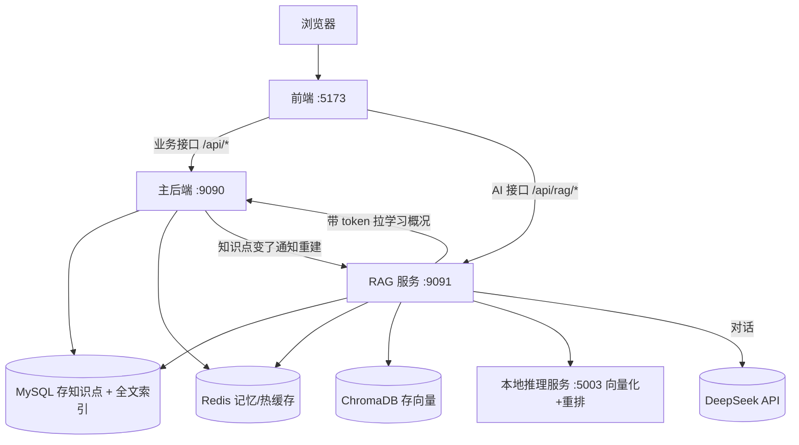

# 智能学习系统 + RAG AI 助教 · 完整项目资料（初学者版）

> 版本：v2.0 初学者版（2026-08-09）
> 作者：刘佳乐 · 软件工程本科
> 说明：这份文档**假设你是一个刚学完 Java 基础、第一次接触完整项目的初学者**。
> 每个概念都会先解释"是什么、为什么"，每个命令都会说明"在做什么、会看到什么"。
> 就算某个词你没听过，也能顺着读下去。

---

## 目录

- [第零部分 · 阅读指南](#第零部分--阅读指南)
- [第一部分 · 概念扫盲](#第一部分--概念扫盲)
- [第二部分 · 项目总览](#第二部分--项目总览)
- [第三部分 · 功能清单](#第三部分--功能清单)
- [第四部分 · 核心设计原理](#第四部分--核心设计原理)
- [第五部分 · 数据模型](#第五部分--数据模型)
- [第六部分 · 性能与评测数据](#第六部分--性能与评测数据)
- [第七部分 · 搭建流程（手把手）](#第七部分--搭建流程手把手)
- [第八部分 · 完整验证清单](#第八部分--完整验证清单)
- [第九部分 · 排错大全](#第九部分--排错大全)
- [第十部分 · 技术决策与备选方案](#第十部分--技术决策与备选方案)
- [第十一部分 · 面试问答](#第十一部分--面试问答)
- [第十二部分 · 简历要点](#第十二部分--简历要点)
- [第十三部分 · 已知不足与未来方向](#第十三部分--已知不足与未来方向)

---

# 第零部分 · 阅读指南

这份文档很长，**不要一次性读完**。按下面的顺序读：

1. **第一次读**：只看"第一部分 概念扫盲"和"第二部分 项目总览"，搞清楚这个项目是什么。
2. **第二次读**：看"第四部分 核心设计原理"，跟着每一步流程走一遍（登录、RAG 问答）。
3. **要动手搭建时**：打开"第七部分 搭建流程"，照着命令敲，卡住就看"第九部分 排错大全"。
4. **面试前**：重点背"第十一部分 面试问答"，配合"第十部分 为什么"理解背后逻辑。

**三个阅读小技巧**：

- 遇到不懂的词，先在"第一部分"找有没有解释；
- 所有命令都在 PowerShell（Windows 的黑色命令行窗口）里执行；
- 文档里所有 `E:\smart-learning-system` 是项目所在目录，别敲错。

---

# 第一部分 · 概念扫盲

> 这一部分没有代码，只有概念。全部搞懂后，后面的内容会非常顺畅。

## 1.1 这个项目是做什么的？（大白话）

想象你是一个大学生，学习一门课（比如 Java）。你现在的方式可能是：看视频 → 记笔记 → 不知道学得怎么样。

这个项目做了一个**学习平台**，帮你解决三个问题：

1. **知道自己学了什么、学得怎么样**：记录学习时长，给知识点打分（掌握度）；
2. **知道自己接下来该学什么**：根据知识图谱（哪些知识点是另一个知识点的基础）和你的掌握度，系统推荐"下一步学这个"；
3. **有个 AI 助教能答疑**：你问"什么是死锁？"，AI 基于**你们课程自己的知识点资料**回答，而不是瞎编。

第 3 点里"基于自己的资料回答"的技术，就叫 **RAG**（下面会讲）。

## 1.2 前后端分离是什么？

一个网站分两部分：

- **前端**：你在浏览器里看到的页面、按钮、输入框（本项目用 Vue 3 写）；
- **后端**：在服务器上运行的逻辑，负责存数据、算数据、返回结果（本项目用 Java + Spring Boot 写）。

前端和后端通过 **HTTP 接口**（URL 地址）通信。比如前端要登录，就向后端发一个请求：

```
POST http://localhost:9090/api/auth/login
内容：{"username":"zhangsan","password":"123456"}
```

后端验证完，返回一个令牌（token），前端以后每次请求都带上它，证明"我是谁"。

## 1.3 后端技术逐个讲

### Spring Boot

Java 写后端的一个"脚手架"框架。它帮你把繁琐的配置（服务器、数据库连接、HTTP 处理）都封装好，你只需要写业务代码。类比：盖房子用预制板，不用每块砖都自己烧。

### MyBatis

操作数据库（MySQL）的工具。你在 Java 里写方法，MyBatis 帮你把方法翻译成 SQL 语句去数据库执行。它让你**自己控制 SQL**（后面会解释为什么这是优点）。

### MySQL

数据库软件，用"表"存数据，就像 Excel 表格。本项目所有业务数据（用户、课程、知识点、成绩）都存在 MySQL 里。

### Redis

一种**内存数据库**——数据存在内存里，读写极快（微秒级），但断电会丢（所以只放"丢了也无所谓、或者能从数据库重建"的数据）。本项目用它做缓存、会话记忆、限流、排行榜、分布式锁。

类比：MySQL 是仓库（东西多但取货慢），Redis 是柜台（东西少但秒取）。

### JWT（JSON Web Token）

登录后发给客户端的"身份凭证"，是一串加密的字符串，里面包含用户 ID、用户名、角色（STUDENT/ADMIN）和过期时间。服务器不用存"谁登录了"（所以叫无状态），只要验一下签名就知道是谁。

类比：游乐园的盖章手环——入园时盖个章，玩项目时举起来看一眼就行，不用每次查名单。

### BCrypt

把密码加密（哈希）的算法。特点：**慢**（故意慢），加了随机盐。这样即使数据库泄露，黑客也很难反推出密码。

### AOP（面向切面编程）

Spring 的一种能力：在不改业务代码的情况下，给某些方法"加一层处理"。本项目用它做三件事：限流（每秒最多几次）、角色校验（是不是管理员）、日志（记录每次请求花了多久）。

类比：商场安检门——每个人进门前自动过一遍安检，不用每个店自己查。

### 分布式锁

当多个请求同时修改同一份数据（比如"掌握度"）时，需要保证一次只有一个请求在改。Redis 分布式锁就是"谁先抢到锁谁改，改完释放"。类似厕所门锁：一个人进去锁门，出来解锁，别人才能进。

### 接口限流

限制"同一个 IP 一分钟内最多调几次接口"，防止有人刷接口把服务器打挂。本项目用 Redis 计数实现。

## 1.4 AI 概念逐个讲

### 大模型（LLM）

像 ChatGPT 那样的人工智能模型，能读懂文字、生成文字。本项目用的是 DeepSeek 的 deepseek-chat 模型（通过 API 调用，不用自己部署）。

### Token

大模型理解文本的最小单位。中文大概 1 个汉字 ≈ 1~2 个 token。模型按 token 计费。

### Prompt（提示词）

你给模型的一段指令文字。模型的回答质量很大程度上取决于你怎么写 Prompt。本项目有一套精心设计的系统提示词（在 `rag-backend/src/main/resources/prompts/system-prompt.txt`）。

### 上下文窗口

模型一次能"看到"的最大文本长度。超出就放不下。

### 幻觉（Hallucination）

模型一本正经地胡说八道——回答得很流畅，但内容是编的。这是大模型的通病，RAG 的一个重要目的就是防幻觉。

### RAG（Retrieval-Augmented Generation，检索增强生成）

核心思路：**回答问题前，先从你的资料库里"检索"相关片段，再把片段连同问题一起给模型，让模型"看着资料回答"**。

流程：
```
用户问"什么是死锁？"
  → 从资料库检索到"死锁"相关知识点
  → 把知识点 + 问题一起发给模型
  → 模型基于知识点回答，并标注来源
```

好处：答案有依据（可溯源）、资料更新了检索结果就更新、不需要训练模型。

### Embedding（向量化/嵌入）

把一段文字变成一串数字（向量），让"意思相近的文字，数字也相近"。

比如：
- "什么是死锁？" → [0.12, 0.87, ...]
- "死锁的定义" → [0.11, 0.88, ...]（和上面的向量很接近）
- "今天天气不错" → [0.95, 0.02, ...]（和上面差很远）

这样计算机就能用数学判断"两段话相不相似"。

### 向量与余弦相似度

向量就是一串数字。判断两个向量像不像，常用**余弦相似度**：夹角越小越相似（值越接近 1）。

### 向量数据库

专门存向量、支持"按相似度查找"的数据库。本项目用 ChromaDB，存了 123 个知识点分块的向量。

### 关键词检索与全文索引

像搜索引擎那样，按"字词匹配"找资料。MySQL 的 FULLTEXT 索引就是干这个的；中文需要 ngram 分词（把"什么是死锁"切成"什么/是/死锁"）。

### 混合检索

**向量检索**（懂语义）+ **关键词检索**（懂精确词）同时跑，再把结果合并。因为两者互补。

### RRF（Reciprocal Rank Fusion）

合并两个检索结果的算法。不看分数，只看**排名**：在两个结果里排名都靠前的，最终排名就靠前。公式：`分数 = Σ 1 / (60 + 排名)`。

### 重排（Rerank）

检索出 8 个候选后，再用更精细的手段重新排序，把最相关的放最前面。本项目用 LLM 打分（每次问模型"这个片段对回答该问题有多大帮助？0-10 分"）。

### 流式输出与 SSE

正常接口是"等全部生成完再返回"（要等好几秒）；流式是"生成一点推一点"，用户马上能看到字往外蹦。SSE（Server-Sent Events）是 HTTP 上实现流式的标准方式。

### 引用（Citation）

回答里标注 [1][2]，对应检索到的知识点编号。用户能核对"这段答案的依据是什么"。

## 1.5 评测概念

### Hit@1 / Hit@5

评测时，每个问题都知道"正确答案在哪个知识点"。看检索结果：
- Hit@1：正确答案是不是排在第 1 名；
- Hit@5：正确答案在不在前 5 名里。

### LLM 裁判

让一个模型给另一个模型的回答打分（0-10）。用模型评模型，速度快、一致性好。

### 引用率

回答里带 [1][2] 引用的比例。100% 说明"每个回答都有依据"。

### QPS 与延迟

- QPS：每秒能处理多少请求（吞吐量）；
- 延迟：一个请求从发出到返回花了多久（毫秒/秒）。

---

# 第二部分 · 项目总览

## 2.1 一句话定位

**面向大学生的智能学习平台**：学习、自测、记录、推荐 + 一个基于 RAG 的 AI 助教。

## 2.2 三个子系统

| 子系统 | 用什么技术 | 干什么 | 端口 |
|--------|-----------|--------|------|
| 主后端 | Spring Boot 3.2 + MyBatis + MySQL + Redis | 登录、课程、知识图谱、计划、记录、自测、推荐 | 9090 |
| RAG 服务 | Spring Boot 3.5 + Spring AI + DeepSeek + ChromaDB | AI 助教：检索 + 生成 + 流式回答 | 9091 |
| 前端 | Vue 3 + Vite + Element Plus | 网页界面 + AI 对话页 | 5173 |

为什么要两个后端？因为 AI 接口调用外部模型，慢（几秒）、可能失败，独立进程不拖累业务接口；将来 AI 流量大可以单独扩容。

## 2.3 用户的一天（走一遍流程）

1. 打开网页，登录（admin 或 zhangsan）；
2. 在"课程"里看课程，点进"知识图谱"看知识点之间的依赖关系；
3. 在"学习计划"里创建计划（比如"两周学完 Java 基础"）；
4. 学习后到"学习记录"里记一笔（学了 30 分钟，掌握度 60 分）；
5. 到"自测"选一个知识点做题，交卷后系统判分，分数同步更新掌握度；
6. 到"推荐"看系统建议下一步学什么（基于前置依赖 + 掌握度）；
7. 遇到不懂的，到"AI 助教"问它："什么是死锁？"——它基于课程知识点回答，还带引用；
8. 再问"我的学习进度怎么样？"——它能结合你的学习记录回答（个人化）。

## 2.4 系统架构图 + 讲解



**怎么读这张图**：浏览器只和两个后端通信；两个后端各连自己的数据存储；RAG 和主后端之间也有合作（拉学习概况、通知重建索引）。

---

# 第三部分 · 功能清单

## 3.1 主后端功能（每个是干什么的）

| 模块 | 功能 | 面向谁 |
|------|------|--------|
| 认证 | 注册、登录、退出登录（JWT + 黑名单） | 所有人 |
| 课程 | 课程列表（分页）、详情；管理员才能增删改 | 所有人看，管理员管 |
| 知识图谱 | 知识点节点 + 前置依赖关系；管理员才能改 | 所有人看，管理员管 |
| 学习计划 | 建计划、往计划里加知识点、标记完成 | 学生 |
| 学习记录 | 记学习时长、看统计（今日/本周/累计）、掌握度 | 学生 |
| 自测 | 按知识点随机抽 5 题、判分、看历史 | 学生 |
| 推荐 | 根据掌握度 + 前置依赖推荐下一步学什么 | 学生 |
| 题目管理 | 题库增删改查（仅管理员，防止学生看到答案） | 管理员 |
| AI 上下文 | 给 RAG 服务提供"用户学习概况"接口 | RAG 服务 |

## 3.2 RAG 服务功能

| 能力 | 说明 |
|------|------|
| 混合检索 | 向量 + 关键词双路召回，RRF 融合 |
| 重排 | LLM 打分（默认）或本地模型（离线） |
| 流式问答 | 逐字输出，带引用 |
| 会话记忆 | Redis 记住多轮对话，刷新不丢 |
| 热问题缓存 | 相同问题第二次秒回（17ms） |
| 限流 | 防止接口被刷 |
| 反馈 | 点赞/点踩，为后续优化收集数据 |
| 个人化问答 | 结合用户学习记录回答 |
| 索引联动 | 知识点改了，自动重建检索索引 |

## 3.3 前端页面

登录、仪表盘、课程、知识图谱、知识点详情、学习计划、学习记录、自测、推荐、题目管理（仅管理员显示）、AI 助教。

---

# 第四部分 · 核心设计原理（从零讲透）

## 4.1 登录流程逐步走（JWT）

1. 用户在登录页输入用户名密码，前端发给后端；
2. 后端去 MySQL 查这个用户，用 BCrypt 比对密码；
3. 密码对了，后端生成 JWT（里面包含 userId、username、role、过期时间，用密钥签名）；
4. 前端把 token 存到浏览器 localStorage；
5. 之后每次请求，前端在请求头带上 `Authorization: Bearer <token>`；
6. 后端有个拦截器（JwtInterceptor）检查每个请求：
   - 没带 token → 返回 401；
   - token 在黑名单（登出过）→ 返回 401；
   - token 过期或签名不对 → 返回 401；
   - 通过 → 把 userId 和 role 放到请求里，业务接口直接用。
7. 登出时，后端把这个 token 加进 Redis 黑名单（TTL = token 剩余有效期），token 立刻失效。

### 4.1.x 登录相关代码（读完 4.1 后看这里）

**① 统一返回格式 `dto/ApiResponse.java`**

```java
public class ApiResponse<T> {
    private int code;
    private String message;
    private T data;

    public static <T> ApiResponse<T> ok(T data) {
        return new ApiResponse<>(200, "success", data);
    }
    public static <T> ApiResponse<T> fail(int code, String message) {
        return new ApiResponse<>(code, message, null);
    }
}
```

**解释**：所有接口返回 `{code, message, data}` 固定格式；`ok()` 成功、`fail()` 失败，前端不用每个接口单独判断结构。

**② 生成 token `util/JwtUtil.java`**

```java
public String generateToken(Long userId, String username, String role) {
    Date now = new Date();
    return Jwts.builder()
            .subject(String.valueOf(userId))          // 用户ID
            .claim("username", username)              // 用户名
            .claim("role", role)                      // 角色（权限校验用）
            .issuedAt(now)
            .expiration(new Date(now.getTime() + expiration))   // 24小时过期
            .signWith(key)                            // 密钥签名，防伪造
            .compact();
}

public Claims parseToken(String token) {
    return Jwts.parser().verifyWith(key).build()
            .parseSignedClaims(token).getPayload();   // 验签，失败抛异常
}
```

**解释**：`signWith(key)` 是安全关键——没有密钥的人签不出有效 token，所以防伪造；服务器不存会话（无状态），每次验签即可。

**③ 登录校验拦截器 `config/JwtInterceptor.java`**

```java
@Override
public boolean preHandle(HttpServletRequest request, HttpServletResponse response, Object handler) {
    if ("OPTIONS".equalsIgnoreCase(request.getMethod())) return true;   // 跨域预检放行
    String authHeader = request.getHeader("Authorization");
    if (authHeader == null || !authHeader.startsWith("Bearer ")) {
        write401(response, "未登录"); return false;
    }
    String token = authHeader.substring(7);
    if (blacklistService.isBlacklisted(token)) { write401(response, "token已失效"); return false; }
    if (!jwtUtil.isTokenValid(token))           { write401(response, "token无效或已过期"); return false; }
    request.setAttribute("userId", jwtUtil.getUserId(token));   // 放进请求，业务直接用
    request.setAttribute("role", jwtUtil.parseToken(token).get("role"));
    return true;
}
```

**解释**：三个拦截判断（没带 token / 黑名单 / 无效过期）→ 401；通过后把 userId 和 role 放进请求属性，Controller 用 `@RequestAttribute("userId")` 直接取。

**④ 登录/注册业务 `service/UserService.java`**

```java
public LoginResponse login(LoginRequest request) {
    User user = userMapper.findByUsername(request.getUsername());
    if (user == null) throw new BusinessException(401, "用户名或密码错误");
    if (!passwordEncoder.matches(request.getPassword(), user.getPassword())) {
        throw new BusinessException(401, "用户名或密码错误");
    }
    String token = jwtUtil.generateToken(user.getId(), user.getUsername(), user.getRole());
    return new LoginResponse(token, user.getId(), user.getUsername(), user.getRealName(), user.getRole());
}
```

**解释**：`matches(明文, 哈希)` 是 BCrypt 校验（不是把明文再哈希然后 equals，因为 BCrypt 带盐）；登录失败统一说"用户名或密码错误"，不暴露"用户是否存在"。

**⑤ 统一异常处理 `exception/GlobalExceptionHandler.java`**

```java
@ExceptionHandler(BusinessException.class)
public ResponseEntity<ApiResponse<?>> handleBusinessException(BusinessException e) {
    HttpStatus status = switch (e.getCode()) {
        case 401 -> HttpStatus.UNAUTHORIZED;
        case 403 -> HttpStatus.FORBIDDEN;
        case 404 -> HttpStatus.NOT_FOUND;
        case 429 -> HttpStatus.TOO_MANY_REQUESTS;
        default  -> HttpStatus.BAD_REQUEST;
    };
    return new ResponseEntity<>(ApiResponse.fail(e.getCode(), e.getMessage()), status);
}
```

**解释**：业务码映射成**真实 HTTP 状态码**。原始代码 HTTP 恒 200，前端 axios 的 401 拦截永远不触发——这是修复过的真实问题。

**⑥ 前端自动带 token + 401 跳登录 `frontend/src/api/index.js`**

```javascript
api.interceptors.request.use(config => {
  const token = localStorage.getItem('token')
  if (token) config.headers.Authorization = `Bearer ${token}`   // 自动带token
  return config
})
api.interceptors.response.use(
  response => response,
  error => {
    if (error.response?.status === 401) {                       // 依赖后端返回真实401
      localStorage.removeItem('token')
      window.location.href = '/login'
    }
    return Promise.reject(error)
  }
)
```

---

## 4.2 密码为什么这样存

原始代码用 SHA-256（无盐）存密码——同一密码哈希永远一样，黑客可以查表破解。改成了 BCrypt：

- 每个密码自动加**随机盐**（同样的密码存出来不一样）；
- 故意算得慢（暴力破解成本高）；
- 成本参数可调（未来电脑变快，把参数调大就行）。

### 4.2.x 密码相关代码

**注册逻辑（强制学生角色 + 脱敏返回）`service/UserService.java`**

```java
public User register(RegisterRequest request) {
    User exist = userMapper.findByUsername(request.getUsername());
    if (exist != null) throw new BusinessException(400, "用户名已存在");

    User user = new User();
    user.setUsername(request.getUsername());
    user.setPassword(passwordEncoder.encode(request.getPassword()));  // BCrypt加密
    user.setRole("STUDENT");                                          // 强制学生角色
    user.setRealName(request.getRealName());
    userMapper.insert(user);

    // 返回脱敏副本，不暴露密码哈希
    User response = new User();
    response.setId(user.getId());
    response.setUsername(user.getUsername());
    response.setRealName(user.getRealName());
    response.setRole(user.getRole());
    return response;
}
```

**解释**：原始代码接受前端传的 role（能注册成 ADMIN，真实漏洞）且直接返回含密码哈希的对象；这里两处都修复了。

**种子用户密码迁移 `backend/src/main/resources/data.sql`**

```sql
INSERT INTO users (id, username, password, real_name, role) VALUES
(1, 'admin', '$2b$10$Cec...', '系统管理员', 'ADMIN'),
(2, 'zhangsan', '$2b$10$BWZ...', '张三', 'STUDENT')
ON DUPLICATE KEY UPDATE password = VALUES(password);
```

**解释**：`ON DUPLICATE KEY UPDATE` 让语句每次启动都执行——已存在的用户把密码刷成 BCrypt 版本（用于把历史 SHA-256 迁移过来），不存在则插入。

---

## 4.3 权限怎么控制

系统有两种角色：STUDENT（学生）、ADMIN（管理员）。

做法：
1. 登录时把角色写进 JWT；
2. 拦截器把角色放到请求属性；
3. 需要管理员才能调用的接口（如题目管理、课程增删改）上加 `@RequireRole("ADMIN")` 注解；
4. AOP 切面自动检查：角色不是 ADMIN 就抛 403。

为什么题目接口必须只给管理员？因为接口返回正确答案，学生能查到就没法自测了（这个漏洞真实存在过，已修复）。

### 4.3.x 权限相关代码

**角色校验切面 `aspect/RoleCheckAspect.java`**

```java
@Before("@annotation(requireRole)")
public void checkRole(RequireRole requireRole) {
    HttpServletRequest request = getRequest();
    String role = request != null ? (String) request.getAttribute("role") : null;
    if (role == null || Arrays.stream(requireRole.value()).noneMatch(role::equalsIgnoreCase)) {
        throw new BusinessException(403, "无权限执行该操作");
    }
}
```

**注解定义 `annotation/RequireRole.java`**

```java
@Target(ElementType.METHOD)
@Retention(RetentionPolicy.RUNTIME)
public @interface RequireRole {
    String[] value();     // 允许的角色，如 "ADMIN"
}
```

**使用方式（Controller 上）**

```java
@GetMapping("/questions")
@RequireRole("ADMIN")
public ApiResponse<PagedResult<Question>> list(...) { ... }
```

**解释**：切面读到的 `role` 是 JwtInterceptor 在第 4.1.x 放进请求属性的；接口只写一个注解，切面统一校验——和限流注解同一套模式。

---

## 4.4 Redis 六个场景（每个：做什么、为什么、流程）

### 场景一：热问题缓存

**做什么**：用户问过的、没有上下文依赖的问题，把完整回答缓存 24 小时。
**为什么**：重复问题占不少比例，缓存后从 4-6 秒变成 17 毫秒，还省 DeepSeek 的钱。
**流程**：请求来 → 算问题哈希 → 查缓存 → 有就直接返回 → 没有就正常回答并写缓存。
**细节**：带用户 token 的个人化问题**不缓存**，防止 A 用户看到 B 用户的回答。

### 场景二：会话记忆

**做什么**：把多轮对话存到 Redis（key = `rag:chat:{会话ID}`），最多保留 10 轮。
**为什么**：AI 要能记住前文（"我刚才说我正在学什么？"），客户端刷新页面也不丢。
**细节**：存成 JSON 列表，写满 20 条就裁掉最旧的。

### 场景三：分布式锁

**做什么**：保证"掌握度"这种数据同一时刻只有一个请求在改。
**为什么**：两个请求同时读 60 分、各加 10 分，都写 70 分就丢了 10 分。
**做法**：`SET lock:xxx 令牌 NX PX 10000` 抢锁；释放时用 Lua 脚本比对令牌一致才删（防止删掉别人的锁）。

### 场景四：限流

**做什么**：每个 IP 每分钟最多调 N 次（登录 10 次、AI 对话 15 次等）。
**为什么**：防刷接口、防攻击。
**做法**：Redis `INCR` 计数，第一次设置 60 秒过期；超过阈值返回 429。

### 场景五：统计计数

**做什么**：今日/本周/累计学习分钟数。
**为什么**：每次记录都 UPDATE 数据库太慢，Redis INCR 原子加一，定期同步。

### 场景六：热门排行

**做什么**：热门课程/知识点排行榜。
**为什么**：Redis ZSet（有序集合）天然支持"分数+排序"，每次学习 +1 分。

### 4.4.x Redis 场景对应代码

**① 热问题缓存 `rag-backend/.../service/AnswerCacheService.java`**

```java
public CachedAnswer get(String question) {
    String raw = redis.opsForValue().get(key(question));
    return raw == null ? null : objectMapper.readValue(raw, CachedAnswer.class);
}

private String key(String question) {
    byte[] hash = MessageDigest.getInstance("SHA-256")
            .digest(question.getBytes(StandardCharsets.UTF_8));
    return "rag:cache:q:" + HexFormat.of().formatHex(hash);   // 问题哈希当key
}
```

**解释**：问题哈希当 key（中文也能安全做 key）；写入时带 TTL 24 小时自动过期；Redis 挂了 catch 住记日志，不影响主链路。

**② 会话记忆 `rag-backend/.../service/ChatMemoryService.java`**

```java
public void append(String conversationId, ChatTurn userTurn, ChatTurn assistantTurn) {
    String key = "rag:chat:" + conversationId;
    redis.opsForList().rightPushAll(key,
            objectMapper.writeValueAsString(userTurn),
            objectMapper.writeValueAsString(assistantTurn));
    Long size = redis.opsForList().size(key);
    if (size != null && size > maxTurns * 2) {
        redis.opsForList().trim(key, size - maxTurns * 2, -1);   // 裁掉最旧
    }
}
```

**解释**：Redis List 按顺序存每轮消息，超过 10 轮用 trim 裁掉最旧的，防止无限增长。

**③ 分布式锁 `util/DistributedLock.java`**

```java
Boolean acquired = redis.opsForValue()
        .setIfAbsent(key, token, leaseMs, TimeUnit.MILLISECONDS);   // SET NX PX
// 释放：Lua 保证"判断是我的锁才删"是原子的
String script = "if redis.call('GET', KEYS[1]) == ARGV[1] then " +
                "return redis.call('DEL', KEYS[1]) else return 0 end";
```

**解释**：`token` 是随机 UUID（锁的身份证），释放时凭它确认"锁是我的"才删，防止误删别人的锁；Lua 保证判断+删除两步原子。

**④ 限流 `aspect/RateLimitAspect.java`**

```java
Long count = redis.opsForValue().increment(key);            // 原子自增
if (count != null && count == 1) {
    redis.expire(key, Duration.ofSeconds(rateLimit.window()));  // 第一次设过期
}
if (count != null && count > rateLimit.value()) {
    throw new RateLimitException("请求过于频繁，请稍后再试");     // 超限→429
}
```

**解释**：INCR 计数，第一次设置窗口过期；超过上限抛异常转 429。为什么用 Redis 而不是 JVM 内存？多实例部署时共享计数。

---

## 4.5 掌握度与推荐（手算一个例子）

### 掌握度

规则：学习记录按"70% 历史 + 30% 最新"更新。

例子：你学过两次"死锁"知识点，第一次掌握度 50，第二次 80：
```
新掌握度 = 50 × 0.7 + 80 × 0.3 = 35 + 24 = 59
```

历史权重高，说明"掌握度是积累的"，不会被单次表现彻底推翻。

### 推荐

三步：
1. 找出你掌握度 < 60 的知识点 → 标记"需要复习"（优先级 1）；
2. 找出"前置依赖已掌握、自己还没学"的知识点 → 标记"可以学"（优先级 2）；
3. 其他新领域 → 优先级 3。

排序：优先级 → 层级（先学基础的）。输出前 10 条，带推荐理由。

### 4.5.x 掌握度与推荐代码

**判分纯逻辑 `util/AnswerGrader.java`**（抽出来方便单测）

```java
public static boolean grade(Question question, String userAnswer) {
    if (userAnswer == null || question.getAnswer() == null) return false;
    if ("TRUE_FALSE".equals(type) || "SHORT_ANSWER".equals(type)) {
        return userAnswer.trim().equalsIgnoreCase(question.getAnswer().trim());
    }
    return normalizeKeys(userAnswer).equals(normalizeKeys(question.getAnswer())); // 多选题忽略顺序
}
```

**提交测验（事务 + 联动）`service/QuizService.java`**

```java
@Transactional
public Map<String, Object> submitQuiz(Long userId, QuizSubmitRequest request) {
    boolean isCorrect = AnswerGrader.grade(question, entry.getUserAnswer());  // 判分
    int score = Math.round((float) correctCount * 100 / totalQuestions);
    quizMapper.insertAttempt(attempt);        // 存记录
    updatePlanItems(userId, kpId, score);     // 通过→自动完成计划项
    updateMastery(userId, kpId, score);       // 更新掌握度（内部有分布式锁）
}
```

**解释**：`@Transactional` 保证要么全成功要么全回滚；掌握度更新在锁保护下"读旧值→算新值→写回"，避免并发丢更新。

**推荐算法（预加载前置关系，避免 N+1）`service/RecommendationService.java`**

```java
Map<Long, List<Long>> prereqMap = kpMapper.findAllEdges().stream()
        .collect(Collectors.groupingBy(KpPrerequisite::getKpId,
                Collectors.mapping(KpPrerequisite::getPrerequisiteKpId, Collectors.toList())));

for (KnowledgePoint kp : allKps) {
    if (masteredKpIds.contains(kp.getId())) continue;                 // 已掌握跳过
    List<Long> prereqs = prereqMap.getOrDefault(kp.getId(), List.of());
    boolean satisfied = prereqs.isEmpty() || masteredKpIds.containsAll(prereqs);
    if (!satisfied) continue;                                          // 前置没学完不推
    if (weakKpIds.contains(kp.getId()))      priority = 1;            // 复习
    else if (prereqs.stream().anyMatch(masteredKpIds::contains)) priority = 2;  // 下一步
    else                                     priority = 3;            // 新领域
}
```

**解释**：一次性查全部前置关系组装成 Map，避免循环里逐条查库（N+1 查询，这是优化过的）；核心逻辑是"前置依赖必须已掌握 + 三级优先级"。

---

## 4.6 RAG 一次问答的完整旅程（逐步）

用户问："什么是死锁？产生死锁的四个必要条件是什么？"

1. 前端发 SSE 请求到 RAG 服务，带上会话 ID、历史、问题、token；
2. RAG 服务查 Redis：这个会话有没有历史？（多轮上下文）这个问题是不是缓存过？
3. 如果带 token，RAG 调主后端"学习概况"接口，拿到用户统计；
4. **检索**：
   - 向量路：把问题向量化，去 ChromaDB 找最像的 10 个知识点；
   - 关键词路：去 MySQL 全文索引找含"死锁""必要条件"的 10 个；
5. **融合**：两路结果用 RRF 合并，取前 8 名；
6. **重排**：让 DeepSeek 对 8 个候选打分（0-10），重新排序；
7. **组装 Prompt**：系统提示词（规则）+ 参考资料（检索到的知识点）+ 用户问题；
8. **生成**：DeepSeek 流式输出答案，回答里带 [1][2] 引用编号；
9. 前端逐字显示，下方展示"参考知识点"标签；
10. 回答写回 Redis 记忆；如果问题无上下文依赖，写入热缓存。

### 4.6.x RAG 编排代码（这是最重要的一个文件）

**总指挥 `rag-backend/.../service/RagChatService.java`**

```java
public ChatResponse chat(ChatRequest request) {
    boolean cacheable = isCacheable(request);                    // 带token不缓存（防串号）
    List<ChatTurn> turns = loadTurns(request);                   // 1. 读会话记忆
    if (cacheable) {
        CachedAnswer cached = cacheService.get(request.question());  // 2. 查热缓存
        if (cached != null) return ...;                          // 命中直接返回（17ms来源）
    } else {
        personalContext = personalContextService.fetch(request.token()); // 3. 拉个人概况
    }
    List<RankedChunk> fused = retrievalService.retrieve(question, topK); // 4. 双路检索+RRF
    List<RankedChunk> chunks = rerankService.rerank(question, fused);    // 5. 重排
    if (chunks.isEmpty() && personalContext == null) {           // 6. 没资料没概况→兜底
        remember(request, NO_CONTEXT_ANSWER);
        return ...;
    }
    List<Message> messages = buildMessages(request, chunks, turns, personalContext); // 7. 组Prompt
    String answer = chatModel.call(new Prompt(messages)).getResult().getOutput().getText(); // 8. 生成
    remember(request, answer);                                   // 9. 写回记忆
    if (cacheable) cacheService.put(request.question(), answer, citations, elapsed); // 10. 写缓存
    return new ChatResponse(...);
}
```

**解释（10 步骨架）**：先查缓存/记忆 → 拉个人概况 → 检索 → 重排 → 没资料就兜底（不调模型）→ 组 Prompt → 生成 → 写回记忆和缓存。**面试就把这 10 步背下来讲。**

**个人上下文 `rag-backend/.../service/PersonalContextService.java`**

```java
ApiResponse resp = restClient.get()
        .uri("/api/ai/context")
        .header("Authorization", "Bearer " + token)      // 用用户token调主后端
        .retrieve().body(ApiResponse.class);
// 把统计/薄弱点/推荐拼成一段文字塞进提示词
return "学习统计：今日 X 分钟…薄弱知识点：…当前推荐学习：…";
```

**解释**：RAG 不存用户数据，靠透传 Bearer token 调主后端拿概况；主后端挂了返回 null，AI 只答知识类问题，不阻塞。

**SSE 流式接口 `rag-backend/.../controller/RagChatController.java`**

```java
@PostMapping("/chat/stream")
@RateLimit(value = 20, window = 60)
public SseEmitter stream(@Valid @RequestBody ChatRequest request) {
    SseEmitter emitter = new SseEmitter(120_000L);
    executor.execute(() -> {
        RagChatService.ChatStream result = ragChatService.stream(request);
        emitter.send(SseEmitter.event().name("citations")
                .data(objectMapper.writeValueAsString(result.citations())));
        result.flux().subscribe(
            delta -> emitter.send(SseEmitter.event().name("delta").data(delta)),
            error -> emitter.completeWithError(error),
            () -> { emitter.send(SseEmitter.event().name("done").data("")); emitter.complete(); }
        );
    });
    return emitter;
}
```

**解释**：事件顺序 `citations → delta → done`；注意事件名格式 `event:citations`（冒号后无空格），前端解析必须兼容。

**前端 SSE 解析 `frontend/src/views/AgentChat.vue`**

```javascript
const reader = resp.body.getReader()
const decoder = new TextDecoder()
let buffer = ''
while (true) {
  const { done, value } = await reader.read()
  if (done) break
  buffer += decoder.decode(value, { stream: true })   // 中文可能跨分包
  const lines = buffer.split('\n')
  buffer = lines.pop() || ''                          // 最后半截留到下一轮
  for (const line of lines) {
    if (line.startsWith('event:')) {                  // 兼容无空格格式
      eventType = line.slice(6).trim()
    } else if (line.startsWith('data:')) {
      const data = line.slice(5).replace(/^ /, '')
      if (eventType === 'delta') messages.value[msgIdx].content += data
    }
  }
}
```

**解释**：原来只认带空格的 `event: xxx`，Spring 发的是无空格 `event:xxx`，导致流式一直不显示——改成 `startsWith('event:')` 兼容两种。

---

## 4.7 离线建索引流程

第一次使用（或知识点更新后）需要把知识点变成可检索的形式：

1. 从 MySQL 读取全部知识点（64 个）；
2. 每个知识点**分块**（超过 800 字的切小，带重叠）；
3. 每块用本地模型**向量化**；
4. 向量存进 ChromaDB（123 条）；
5. 关键词路不用建：MySQL 全文索引在数据库里现成。

### 4.7.x 建索引相关代码

**建索引 `rag-backend/.../service/KnowledgeIndexService.java`**

```java
public IndexResult rebuild() {
    List<KnowledgePoint> points = repository.findAll();       // 1. 读全部知识点
    List<Document> chunks = new ArrayList<>();
    for (KnowledgePoint point : points) {
        chunks.addAll(chunker.chunk(point));                  // 2. 分块
    }
    for (int i = 0; i < chunks.size(); i += batchSize) {      // 3. 分批（每批32）
        vectorStore.add(chunks.subList(i, Math.min(i + batchSize, chunks.size()))); // 4. 向量化+存Chroma
    }
}
```

**解释**：分批防止打爆模型服务；块 ID 确定性（见 4.8），重复执行幂等。

**Chroma 连接配置 `config/VectorStoreConfig.java`**（绕过框架 bug）

```java
String baseUrl = "http://" + host + ":" + port;               // 手动补协议头
return new ChromaApi(baseUrl, restClientBuilder, objectMapper);

return ChromaVectorStore.builder(chromaApi, embeddingModel)
        .tenantName("default_tenant")                          // 本地Chroma默认租户
        .databaseName("default_database")
        .collectionName(collectionName)
        .initializeSchema(true)                                // 自动建集合
        .build();
```

**解释**：Spring AI 1.1 自动配置两个坑：URL 不带 `http://`（JDK 客户端报错）、默认租户是给云服务的；手动配置修复。

**本地向量化适配 `embedding/LocalEmbeddingModel.java`**

```java
@Override
public float[] embed(String text) {
    return embedTexts(List.of(text), true).get(0);      // 查询侧：加bge检索指令
}
@Override
public float[] embed(Document document) {
    return embedTexts(List.of(getEmbeddingContent(document)), false).get(0);  // 文档侧：不加
}
```

**解释**：实现 Spring AI 的 `EmbeddingModel` 接口，内部 HTTP 调 Python 推理服务；查询加指令、文档不加是 bge 官方建议，能提升召回。

---

## 4.8 分块原理

为什么不能直接把整个知识点丢给模型？因为模型上下文窗口有限，而且"一大坨"不好检索。

本项目策略：
- 每个知识点默认一个块：标题 + 描述 + 学习内容；
- 内容超过 800 字：按段落聚合，超了就切，带 80 字重叠窗口（防止一句话被拦腰切断）；
- 每个块有固定的 ID（`kp-知识点ID-序号`），重建索引时幂等（重复跑不会重复存）。

### 4.8.x 分块代码

文件：`rag-backend/.../service/chunking/DocumentChunker.java`

```java
public List<Document> chunk(KnowledgePoint kp) {
    String header = "【知识点】" + kp.name();            // 标题常驻每块
    if (kp.description() != null) header += "\n【描述】" + kp.description();

    for (String raw : body.split("\\n+")) {              // 按段落切
        if (paragraph.length() > chunkSize) {            // 单段超长：硬切+重叠
            for (String part : splitBySize(paragraph, chunkSize, chunkOverlap)) {
                docs.add(buildDocument(kp, header, part, index++));
            }
            continue;
        }
        if (buffer.length() + paragraph.length() + 1 > chunkSize) {   // 缓冲满了
            docs.add(buildDocument(kp, header, buffer.toString().trim(), index++));
            // 把上一块末尾片段带进下一块，保持上下文衔接
            String overlap = flushed.length() <= chunkOverlap ? flushed
                    : flushed.substring(flushed.length() - chunkOverlap);
            buffer.append(overlap).append("\n");
        }
        buffer.append(paragraph).append("\n");
    }
}

private Document buildDocument(KnowledgePoint kp, String header, String body, int index) {
    String text = body.isBlank() ? header : header + "\n" + body;
    Map<String, Object> metadata = Map.of("kpId", kp.id(), "kpName", kp.name(), ...);
    return new Document("kp-" + kp.id() + "-" + index, text, metadata);  // 确定性ID
}
```

**解释**：标题/描述每块都带（块单独看也知道属于谁）；超过 800 字按段落切、带 80 字重叠窗口（防句子被切断）；块 ID `kp-1-0` 确定性 → 重建幂等。

---

## 4.9 混合检索 + RRF

两个检索路各有优点：

| 路 | 擅长 | 例子 |
|----|------|------|
| 向量检索 | 语义相似、同义改写 | "怎么避免死锁"能匹配"死锁预防" |
| 关键词检索 | 精确术语、专有名词 | "B+树"直接命中 |

RRF 合并：给每个结果按排名打分（第 1 名 1/61，第 2 名 1/62...），两路分数相加排序。

### 4.9.x 检索代码

**双路检索 + RRF 融合 `rag-backend/.../service/retrieval/HybridRetrievalService.java`**

```java
public List<RankedChunk> retrieve(String question, int limit, RetrievalMode mode) {
    Map<Long, RankedChunk> fused = new LinkedHashMap<>();

    if (mode == DENSE || mode == HYBRID) {               // 稠密路：向量
        List<Document> denseDocs = vectorStore.similaritySearch(SearchRequest.builder()
                .query(question).topK(denseTopK).build());
        for (int i = 0; i < denseDocs.size(); i++) {
            fused.merge(kpId, new RankedChunk(..., rrfScore(i + 1), List.of("dense")),
                    RankedChunk::merge);
        }
    }
    if (mode == SPARSE || mode == HYBRID) {              // 稀疏路：MySQL全文
        List<SparseHit> hits = repository.sparseSearch(question, sparseTopK);
        for (int i = 0; i < hits.size(); i++) {
            fused.merge(hit.id(), new RankedChunk(..., rrfScore(i + 1), List.of("sparse")),
                    RankedChunk::merge);
        }
    }
    return fused.values().stream()
            .sorted(Comparator.comparingDouble(RankedChunk::score).reversed())
            .limit(limit).toList();
}

private double rrfScore(int rank) {
    return 1.0 / (RRF_K + rank);        // RRF_K = 60
}
```

**解释**：两路各按排名打分（第 1 名 1/61、第 2 名 1/62…）；同一个知识点两路都命中时 merge 分数相加、来源合并为 `dense,sparse`；最后按总分排序。`RetrievalMode` 是评测用的（可单独跑一路）。

**关键词检索依赖的全文索引 `rag-backend/src/main/resources/sql/init-rag.sql`**

```sql
ALTER TABLE knowledge_points
    ADD FULLTEXT INDEX ft_kp_rag_search (name, description, learning_content)
    WITH PARSER ngram;
```

**解释**：`ngram` 是中文分词器，没有它 MySQL 全文对中文基本失效。

---

## 4.10 重排

RRF 融合后还是"粗排"，重排是"精排"：

让 DeepSeek 看一遍 8 个候选片段和问题，给每个打分（0-10），重新排序。实测把"第一名是否命中正确答案"从 65% 提到 87.5%。

代价：每次多花约 800ms 和一次模型调用。所以也保留了本地重排（bge-reranker）作为离线备选。

### 4.10.x 重排代码

文件：`rag-backend/.../service/rerank/LlmRerankService.java`

```java
public List<RankedChunk> rerank(String question, List<RankedChunk> candidates) {
    String promptText = template.add("question", question)
            .add("candidates", buildCandidateList(candidates)).render();
    String response = chatModel.call(new Prompt(promptText)).getResult().getOutput().getText();
    List<Integer> scores = parseScores(response);       // 从 {"scores": [9, 2, 5]} 提取
    scored.sort(Comparator.comparingInt(ScoredCandidate::score).reversed());
    return scored.stream().map(ScoredCandidate::chunk).toList();
}
```

**解释**：让 DeepSeek 对候选打分（0-10），按分数重排；`parseScores` 用正则提取数字数组（兼容模型输出带代码块）；整个方法包在 try-catch 里——**模型调用失败就回退到 RRF 原顺序**，链路不中断。

---

## 4.11 防幻觉的三层防护

1. **检索为空直接兜底**：没找到资料就不调用模型，直接返回"根据现有学习资料，暂时没有找到与这个问题相关的知识点"；
2. **提示词强约束**：系统提示词明确要求"只依据参考资料回答、必须标注引用编号、资料不足就说明无法回答"；
3. **评测验证**：40 道题的评测集里，11 道题课程资料本身没覆盖，模型选择诚实说"资料不足"而不是编造——这正是想要的行为。

## 4.12 会话记忆与热缓存（再强调一遍区别）

- **会话记忆**：按会话 ID 存，供多轮对话用（"我刚才说了什么？"）；
- **热缓存**：按问题哈希存，供"相同问题秒回"用；
- 记忆会随会话增长，缓存不区分会话；
- 带 token 的个人化问题只走记忆、不走缓存。

## 4.13 分页 / 限流 / 日志

- **分页**：课程、题目、记录、测验历史都支持 `page` + `pageSize`，返回 `{list, total, page, pageSize, totalPages}`。为什么需要？数据多了全量返回会卡。
- **限流**：见 4.4 场景四。
- **日志埋点**：每次 AI 问答记录 `retrieve=几毫秒 rerank=几毫秒 generate=几毫秒`，出了问题能立刻看出慢在哪。

---

### 4.13.x 分页与日志代码

**通用分页结果 `backend/.../dto/PagedResult.java`**

```java
@Data
@NoArgsConstructor
@AllArgsConstructor
public class PagedResult<T> {
    private List<T> list;      // 当前页数据
    private long total;        // 总条数
    private int page;          // 当前页码
    private int pageSize;      // 每页条数

    public long getTotalPages() {
        return pageSize > 0 ? (total + pageSize - 1) / pageSize : 0;   // 总页数
    }
}
```

**控制器里的用法（课程分页）`controller/CourseController.java`**

```java
@GetMapping
public ApiResponse<PagedResult<Course>> list(
        @RequestParam(defaultValue = "1") int page,
        @RequestParam(defaultValue = "20") int pageSize) {
    return ApiResponse.ok(courseService.page(Math.max(page, 1), Math.min(pageSize, 100)));
}
```

**解释**：`page` 从 1 开始；`pageSize` 上限 100（防止一次拉全表）；MyBatis 用 `LIMIT offset, size` 实现。

**AI 问答日志埋点（每次请求记录三段耗时）`RagChatService`**

```java
log.info("chat cid={} cache=MISS retrieve={}ms rerank={}ms generate={}ms total={}ms citations={}",
        request.conversationId(), t2 - t1, t3 - t2, t4 - t3,
        System.currentTimeMillis() - start, citations.size());
```

**解释**：`retrieve`（检索）、`rerank`（重排）、`generate`（生成）三段耗时分开记录——出了问题看日志就知道慢在哪。

---

# 第五部分 · 数据模型

## 5.1 表结构逐个讲

| 表 | 存什么 | 关键字段 |
|----|--------|---------|
| users | 用户 | username、password(BCrypt)、role |
| courses | 课程 | name、description、category |
| knowledge_points | 知识点 | name、description、learning_content、course_id、level |
| kp_prerequisites | 知识点前置依赖 | kp_id、prerequisite_kp_id（谁是谁的前置） |
| questions | 题目 | kp_id、question_type、content、options、answer |
| quiz_attempts | 测验记录 | user_id、kp_id、score、correct_count |
| quiz_answers | 每道题的作答 | attempt_id、question_id、user_answer、is_correct |
| learning_plans | 学习计划 | user_id、title、start/end |
| plan_items | 计划里的条目 | plan_id、kp_id、completed、completed_score |
| learning_records | 学习记录 | user_id、course_id、kp_id、duration_minutes、mastery_level |
| user_kp_mastery | 知识点掌握度 | user_id、kp_id、mastery_score、learn_count |
| recommendation_logs | 推荐浏览/点击 | user_id、kp_id、reason、clicked |
| rag_feedback | AI 回答反馈 | question、answer、rating、source_kp_ids |

## 5.2 表之间的关系

```
courses 1 ── * knowledge_points 1 ── * questions
                        │
                        ├── * kp_prerequisites（自关联：前置依赖）
                        └── * user_kp_mastery（按用户记录掌握度）
users 1 ── * learning_plans 1 ── * plan_items ── * knowledge_points
users 1 ── * learning_records ── * courses / knowledge_points
users 1 ── * quiz_attempts 1 ── * quiz_answers ── * questions
```

## 5.3 Redis key 设计

| key | 用途 |
|-----|------|
| `rag:chat:{会话ID}` | 会话记忆（List） |
| `rag:cache:q:{问题哈希}` | 热问题缓存 |
| `rate_limit:{IP}:{方法}` | 限流计数 |
| `cache:rec:{用户ID}` | 推荐缓存 |
| `cache:kg:*` | 知识图谱缓存 |
| `stat:*` | 学习统计计数 |
| `lock:*` | 分布式锁 |
| `token_blacklist:*` | JWT 黑名单 |

---

# 第六部分 · 性能与评测数据

## 6.1 评测结果（40 道题）

| 检索模式 | 第一名命中 | 前五名命中 |
|---------|-----------:|-----------:|
| 仅向量检索 | 55% | 95% |
| 仅关键词检索 | 87.5% | 100% |
| 混合检索（RRF） | 65% | 97.5% |
| 混合 + LLM 重排 | **87.5%** | 97.5% |

**怎么读**：
- 关键词单路第一名命中反而最高（87.5%），因为评测问题里很多含精确术语；
- 混合后第一名掉到 65%？因为 RRF 融合时被强单路稀释——这暴露了问题；
- 加 LLM 重排后第一名回到 87.5%——这就是重排的价值，被数据证明了。

回答质量：LLM 裁判打分，裸模型（不带资料直接问 DeepSeek）8.8 分，RAG 6.82 分。为什么 RAG 反而低？

因为 40 题里有 11 题**课程资料本身没覆盖**，RAG 诚实回答"资料不足"，裸模型凭自己记忆答全了。这不是缺陷，是"宁可说不知道也不编造"。RAG 的价值在引用率 100%、零编造。

## 6.2 性能结果（本机实测）

| 场景 | 数值 |
|------|------|
| 本地检索（无重排） | 平均 31.8ms |
| 混合 + LLM 重排 | 约 800ms |
| 一次完整 AI 问答 | 2-3.7 秒（95% 是 DeepSeek 生成） |
| 流式首字出现 | 约 2.2 秒 |
| 热缓存命中 | **17ms**（未命中 4-6 秒） |
| 检索并发 | 1/5/10/20 并发时 QPS 32/15/8/4 |

## 6.3 怎么解读

- 本地检索很快（31ms），Java/MySQL/Chroma 没有瓶颈；
- 慢在外部模型（生成 3 秒）和本地 CPU 向量化（并发一高就排队）；
- 所以优化重点：热缓存（已做，17ms）、重排可切换、未来换 GPU/API 向量化。

---

# 第七部分 · 搭建流程（手把手）

> 这一部分每一节都按"**做什么 → 命令 → 命令解释 → 预期结果**"来写。
> 所有命令在 PowerShell 里执行。打开 PowerShell：按 Win 键，输入 powershell，回车。

## 7.1 你要准备什么

| 东西 | 你有吗？ | 没有怎么办 |
|------|---------|-----------|
| 项目代码 | ✅ 在 E:\smart-learning-system | 从 GitHub 克隆 |
| JDK 17+ | ✅ IDEA 自带 JBR21（E:\idea2025.1\jbr） | 装 JDK 17/21 |
| Maven | ✅ IDEA 内置 | 用 IDEA 的 Maven |
| Node.js | ✅ v24 | nodejs.org 下载 |
| Python | ✅ agent\.venv | 用虚拟环境 |
| MySQL | ✅ 本机 3306 | 装 MySQL 8 |
| Redis | ✅ 本机 6379 | 装 Redis |
| DeepSeek API Key | ❓ | https://platform.deepseek.com 注册获取 |

## 7.2 确认基础设施

### 检查 MySQL 和 Redis 是否在运行

```powershell
Get-NetTCPConnection -LocalPort 3306 -State Listen   # 有输出=MySQL 在跑
Get-NetTCPConnection -LocalPort 6379 -State Listen   # 有输出=Redis 在跑
```

**解释**：`Get-NetTCPConnection` 是查端口占用；3306 是 MySQL 默认端口，6379 是 Redis 默认端口。

如果 MySQL 没跑（之前遇到过服务停止）：

```powershell
# 方法一：以管理员运行 PowerShell，启动服务
Start-Service MySQL8

# 方法二：直接启动 mysqld 进程（注意路径有空格，必须加引号）
& "D:\Program Files\MySQL\MySQL Server 8.0\bin\mysqld.exe" --defaults-file="D:\ProgramData\MySQL\MySQL Server 8.0\my.ini"
```

如果 Redis 没跑：

```powershell
Start-Process "E:\Redis\redis-server.exe" -WindowStyle Hidden
```

### 配置 Git 代理（GitHub 连不上时）

```powershell
git config --global http.proxy http://127.0.0.1:7897
git config --global https.proxy http://127.0.0.1:7897
```

**为什么**：你的网络访问 GitHub 需要走代理（系统代理是 127.0.0.1:7897），但 git 默认不走系统代理，要单独配。

## 7.3 主后端

### 构建

```powershell
# 先设置两个环境变量（避免中文乱码，让 Maven 输出英文）
$env:JAVA_HOME="E:\idea2025.1\jbr"
$env:MAVEN_OPTS="-Duser.language=en -Duser.country=US -Dfile.encoding=UTF-8"

cd E:\smart-learning-system\backend

# 跑测试（12 个）
& "E:\idea2025.1\plugins\maven\lib\maven3\bin\mvn.cmd" test

# 打 jar 包（跳过测试）
& "E:\idea2025.1\plugins\maven\lib\maven3\bin\mvn.cmd" -DskipTests package
```

**命令解释**：
- `cd`：进入目录；
- `mvn.cmd`：Maven 的 Windows 启动脚本；`test` 跑测试，`package` 打包；
- 打包成功后会生成 `target\smart-learning-system-1.0.0.jar`。

**预期结果**：看到 `BUILD SUCCESS` 或 `Tests run: 12, Failures: 0`。

### 启动

```powershell
java -jar target\smart-learning-system-1.0.0.jar
```

**解释**：`java -jar` 运行打包好的程序。

**启动时自动做的事**（不要手动操作）：
- 自动创建数据库 `smart_learning` 和所有表（schema.sql）；
- 自动插入种子数据（admin/zhangsan/lisi 账号、8 门课、64 个知识点）（data.sql）。

**预期结果**：日志最后出现 `Started SmartLearningApplication`，端口 9090 开始监听。

## 7.4 Python 推理服务（Embedding + 重排）

### 先确认环境

```powershell
# venv 存在
Test-Path "E:\smart-learning-system\agent\.venv\Scripts\python.exe"

# 关键包已装
& "E:\smart-learning-system\agent\.venv\Scripts\python.exe" -c "import sentence_transformers, fastapi, uvicorn; print('ok')"
```

**解释**：项目里已经建好了一个 Python 虚拟环境（agent\.venv），模型推理就用它，不污染系统 Python。

### 启动

```powershell
cd E:\smart-learning-system\rag-backend
powershell -ExecutionPolicy Bypass -File scripts\start-embedding.ps1
```

等价的手动命令（记住这个，排错要用）：

```powershell
& "E:\smart-learning-system\agent\.venv\Scripts\python.exe" -m uvicorn embedding_server:app `
  --host 127.0.0.1 --port 5003 --workers 2 --app-dir E:\smart-learning-system\rag-backend\scripts
```

**命令解释**：
- `-m uvicorn`：用 Python 跑 uvicorn（Web 服务器）；
- `embedding_server:app`：要启动的 Python 应用（embedding_server.py 里的 app）；
- `--port 5003`：监听端口；
- `--workers 2`：开 2 个进程（能同时处理更多请求）；
- `--app-dir`：告诉 Python 去哪里找这个文件。

**注意**：必须用这种命令行形式。写成脚本里 `uvicorn.run(app, workers=2)` 在 Windows 会崩（踩过的坑，见排错大全）。

**预期结果**：日志出现 `Uvicorn running on http://127.0.0.1:5003`，第一次启动要加载模型（约 20-40 秒）。

### 验证

```powershell
Invoke-RestMethod "http://127.0.0.1:5003/health"
# 预期：{"status":"ok",...}
```

## 7.5 ChromaDB（向量数据库）

```powershell
cd E:\smart-learning-system\rag-backend
powershell -ExecutionPolicy Bypass -File scripts\start-chroma.ps1
```

**解释**：脚本会用 agent 虚拟环境里的 chromadb 启动一个向量数据库服务，数据存在 `rag-backend\data\chroma`，端口 8000。

验证：

```powershell
Invoke-RestMethod "http://127.0.0.1:8000/api/v2/tenants/default_tenant/databases"
```

## 7.6 RAG 后端

### 配置 API Key

复制 `rag-backend\.env.example` 为 `rag-backend\.env`，填入：

```ini
DEEPSEEK_API_KEY=sk-你的密钥
```

**警告**：
- `.env` 是敏感文件，已加入 .gitignore（不会提交到 Git）；
- 读取它必须用 UTF-8（PowerShell 默认编码会出错，见排错大全）。

### 构建

```powershell
$env:JAVA_HOME="E:\idea2025.1\jbr"
$env:MAVEN_OPTS="-Duser.language=en -Duser.country=US -Dfile.encoding=UTF-8"
cd E:\smart-learning-system\rag-backend

& "E:\idea2025.1\plugins\maven\lib\maven3\bin\mvn.cmd" test          # 23 个测试
& "E:\idea2025.1\plugins\maven\lib\maven3\bin\mvn.cmd" -DskipTests package
```

### 启动

**前提**：MySQL、Redis、ChromaDB、Python 推理服务**都在跑**。

```powershell
java -jar target\rag-backend-1.0.0.jar
```

启动时自动：建 MySQL 全文索引、建 rag_feedback 表、创建 Chroma collection。

### 第一次使用：建索引

```powershell
Invoke-WebRequest -Uri "http://localhost:9091/api/rag/index/rebuild" -Method POST -UseBasicParsing
# 预期：{"knowledgePoints":64,"chunks":123,"durationMs":...}
```

**解释**：把 64 个知识点分块、向量化、存进 ChromaDB。之后知识点变了会自动重建（7.6 有说明），但第一次必须手动跑一次。

## 7.7 前端

```powershell
cd E:\smart-learning-system\frontend
npm install      # 装依赖（node_modules 已存在可跳过）
npm run dev      # 启动开发服务器
```

**预期结果**：终端显示 `Local: http://localhost:5173`。

打开浏览器访问 http://localhost:5173，用 `admin/admin123` 或 `zhangsan/123456` 登录。

## 7.8 一键启动（RAG 链路）

```powershell
cd E:\smart-learning-system\rag-backend
powershell -ExecutionPolicy Bypass -File scripts\start-all.ps1
```

这个脚本依次启动：ChromaDB（8000）→ Python 推理（5003）→ RAG 后端（9091）。

## 7.9 Docker 部署

> 本机没装 Docker，这些命令在**有 Docker 的机器**上执行。

```bash
# 只部署 RAG 链路（向量化走 SiliconFlow API，需要 SILICONFLOW_API_KEY）
cd rag-backend
cp .env.example .env
docker compose up -d --build

# 或者部署整套系统
cd smart-learning-system
docker compose up -d --build
```

---

# 第八部分 · 完整验证清单

> 搭建完成后，按这个清单逐项自测。每一项都有"怎么测、预期什么"。

## 主后端

1. **登录**：`POST /api/auth/login`，admin/admin123 → 返回 200 + token；
2. **错误密码**：zhangsan + 错密码 → HTTP 401；
3. **角色注入防护**：注册时传 `role:ADMIN` → 返回的角色还是 STUDENT；
4. **学生访问管理接口**：用学生 token 调 `GET /api/questions` → 403；
5. **管理员管理接口**：用 admin token 调 `GET /api/questions?page=1&pageSize=10` → 200 + 分页结构；
6. **越权防护**：学生 A 查看学生 B 的测验记录 → 403；
7. **个人上下文**：带 token 调 `GET /api/ai/context` → 200 + 统计/薄弱点/推荐。

## RAG 服务

1. **建索引**：`POST /api/rag/index/rebuild` → 64 知识点 / 123 分块；
2. **检索**：`GET /api/rag/retrieve?question=什么是死锁&mode=hybrid&rerank=true` → "死锁"知识点排第一；
3. **问答**：`POST /api/rag/chat` → 回答带 [1] 引用，citations 非空；
4. **缓存**：同样问题连问两次 → 第二次 elapsedMs≈0；
5. **记忆**：同会话第二轮不带历史 → 能回忆起第一轮；
6. **流式**：`POST /api/rag/chat/stream` → 收到 citations/delta/done 三种事件；
7. **个人化**：带 token 问"我的学习进度怎么样？" → 回答包含分钟数；
8. **限流**：连续调 130 次 /retrieve → 大约 120 次 200 + 10 次 429；
9. **索引联动**：管理员改一个知识点描述 → 12 秒后向量检索能搜到新内容。

## 前端

1. 学生登录：侧边栏**没有**"题目管理"；admin 登录：**有**；
2. AI 助教：流式逐字输出 + 引用标签；
3. 重复问题：第二次几乎秒回。

---

# 第九部分 · 排错大全

> 每个错误按"**现象 → 原因 → 解决**"写。

## 9.1 端口被占：`Port 9090 was already in use`

- **原因**：之前启动的实例没关（常见于改代码后忘了停，或 IDEA 和命令行各起了一个）；
- **解决**：
  ```powershell
  Get-NetTCPConnection -LocalPort 9090,9091 -State Listen | ForEach-Object { Stop-Process -Id $_.OwningProcess -Force }
  ```

## 9.2 MySQL 连不上：`Connection reset`

- **原因**：MySQL 服务停了；
- **解决**：先查端口 `Get-NetTCPConnection -LocalPort 3306`，没有就按 7.2 启动。

## 9.3 RAG 起不来：Chroma 相关报错

- **现象**：`invalid URI scheme localhost` 或 `SpringAiCollection ... initializeSchema is set to false`；
- **原因**：Spring AI 1.1 的 Chroma 自动配置有问题（URL 不带协议头、默认租户名不对）；
- **解决**：项目里已用 `VectorStoreConfig` 手动配置绕过。**如果报错，先检查 application.yml 的缩进**——曾经因为把 `app:` 块误插进 `spring:` 里，导致所有 spring 配置失效（本手册编写时踩过）。

## 9.4 PowerShell 编码三连坑

**坑 1：读 .env 读到空**
- 现象：明明填了 Key，应用却说 401 placeholder；
- 原因：PowerShell 5.1 用 GBK 读 UTF-8 文件，中文注释的字节把下一行的换行"吃掉"了；
- 解决：必须用 `[System.IO.File]::ReadAllLines(path, [Text.Encoding]::UTF8)`。

**坑 2：接口返回中文变乱码**
- 原因：PowerShell 把无 charset 的响应按 Latin-1 解码；
- 解决：用原始字节流读：
  ```powershell
  $json = [IO.StreamReader]::new($web.RawContentStream, [Text.Encoding]::UTF8).ReadToEnd()
  ```

**坑 3：脚本里比较中文永远为 False**
- 原因：命令行内联中文被编码弄坏；
- 解决：写成脚本文件（带 BOM）再执行，或用 Unicode 码位构造字符串。

## 9.5 Python 推理服务起不来：`Child process died`

- **原因**：`uvicorn.run(app, workers=2)` 在 Windows 会无限重启子进程；
- **解决**：用命令行形式 `python -m uvicorn embedding_server:app --workers 2 --app-dir ...`（见 7.4）。

## 9.6 前端 AI 对话不显示内容

- **现象**：页面显示用户消息，AI 那栏一直空/一直转圈；
- **原因**：Spring 的 SSE 事件是 `event:citations`（冒号后无空格），前端解析器只认带空格的 `event: citations`；
- **解决**：解析改成兼容两种格式（`line.startsWith('event:')`）。

## 9.7 Spring AI 提示词报 `The template string is not valid`

- **原因**：模板里的字面 `{...}`（比如 JSON 示例）被当成占位符；
- **解决**：模板里不要出现花括号，用文字描述代替（比如"输出一个包含 scores 数组的 JSON"）。

## 9.8 打包失败：`Unable to rename ...jar`

- **原因**：运行中的 java 进程锁住了 jar 文件；
- **解决**：先停掉对应端口进程，再 `mvn package`。

## 9.9 旧账号登录失败

- **原因**：密码从 SHA-256 迁到 BCrypt 后，只有种子账号自动迁移，以前注册的账号哈希对不上；
- **解决**：手动重置密码：
  ```sql
  UPDATE users SET password='$2b$10$BWZdinQXCETSGm7rG3NQ0eu0q.OqQcJkDqHNf6QK.5mUJs80PBQIu' WHERE username='你的账号';
  ```
  （这串是 BCrypt 的"123456"）

## 9.10 GitHub 推送失败

- **现象**：`Recv failure` 或 `Could not connect to server`；
- **原因**：git 没走代理（GitHub 被墙）；
- **解决**：`git config --global http.proxy http://127.0.0.1:7897`（见 7.2）。
- 如果提示"远端有历史、需要 pull"：`git pull origin main --allow-unrelated-histories` 后重新 push。

---

# 第十部分 · 技术决策与备选方案

> 面试官最爱问"为什么不用 X"。这里每个决策都给出：**为什么选这个、备选是什么、为什么放弃、改进方向**。

## 10.1 为什么拆两个后端？

**选**：主后端（业务）+ RAG 服务（AI）分开。
**为什么**：AI 接口慢（秒级）、依赖外部模型，独立进程不拖累业务；可单独扩容。
**备选**：单体全包——更简单，但 AI 异常会影响业务接口。
**改进**：流量大了用消息队列解耦通知。

## 10.2 JWT 还是 Session？

**选**：JWT（无状态）+ Redis 黑名单。
**为什么**：前后端分离多端适用、无需 Session 粘滞；黑名单解决"登出失效"。
**备选**：纯 Session（要粘滞/Redis Session，反而复杂）、纯 JWT（无法主动登出）。
**追问**：黑名单用完整 token 做 key？→ 生产用 jti，这是可改进点。

## 10.3 密码为什么 BCrypt？

**选**：BCrypt（盐 + 慢哈希 + 成本可调）。
**备选**：MD5/SHA-256（秒破）、SHA+盐（不够慢）、PBKDF2（也不错）、scrypt/Argon2（更安全但 Java 生态不普及）。
**话术**："我知道 Argon2 更安全，BCrypt 是工程上最常见、生态最好的折中。"

## 10.4 权限为什么自研注解 + AOP，不用 Spring Security？

**选**：自研 `@RequireRole` + 切面。
**为什么**：项目已有 JWT 链路，自研 30 行、与限流注解风格统一、能讲清原理。
**备选**：Spring Security——生产标准，但引入整套框架成本高。
**话术**："生产我会用 Spring Security，这里自研是为了演示原理和控制体积。"

## 10.5 为什么 MySQL + MyBatis，不用 PostgreSQL/JPA？

**选**：MySQL（生态普及、已装）+ MyBatis（SQL 可控、理解底层）。
**备选**：PostgreSQL（pgvector 向量扩展优雅，但引入新库）；JPA（SQL 自动生成，N+1 问题要额外学）。

## 10.6 分布式锁为什么 SET NX PX + Lua？

**选**：`SET key token NX PX` 加锁，Lua 比对 token 再删除。
**为什么**：防止误删别人锁（经典错误）；Lua 保证原子性。
**备选**：Redisson（功能全）——单机 Redis 不需要；Redlock（有共识争议，了解但不用）。

## 10.7 限流为什么固定窗口？

**选**：Redis INCR + TTL。
**为什么**：简单、语义清晰。
**代价**：窗口边界可能 2 倍突发。
**话术**："生产我会升级为 Redis + Lua 的滑动窗口或令牌桶。"

## 10.8 推荐为什么规则，不用协同过滤？

**选**：三级优先级 + 前置门控。
**为什么**：可解释（每条带理由）、数据量小无冷启动、前置门控是规则独有优势。
**备选**：协同过滤（用户行为数据不够）、深度学习推荐（更没数据）。
**话术**："用户规模上来后可以混合协同过滤。"

## 10.9 Embedding 为什么本地 bge-small-zh？

**选**：本地 sentence-transformers + bge-small-zh（512 维）。
**为什么**：零成本零注册可离线；bge 中文效果好；CPU 上够快。
**备选**：
- SiliconFlow bge-m3 API：精度高并发强，但要注册 + 依赖外部（已做成配置开关）；
- 本地 ONNX 纯 Java：免 Python，但要自己写分词器，工程量大；
- OpenAI embedding：外网付费。

## 10.10 向量库为什么 ChromaDB？

**选**：ChromaDB（轻量、零运维、数据量 123 条够用）。
**备选**：Milvus（分布式，太重）、pgvector（优雅但引入 PostgreSQL）、Redis Stack VSS（本机 Redis 太旧）、ES（重，且全文被 MySQL 替代）。
**话术**："百万级数据会换 Milvus/pgvector。"

## 10.11 关键词检索为什么 MySQL FULLTEXT？

**选**：MySQL `MATCH...AGAINST` + ngram。
**为什么**：知识点就在 MySQL，零新组件；ngram 对中文短文本够用。
**备选**：ES（生产首选但重）、jieba+自建倒排（Python 那边用过，Java 复杂度高）。

## 10.12 融合为什么 RRF？

**选**：RRF（只看排名，Σ 1/(60+rank)）。
**为什么**：两路分数量纲不可比，RRF 零训练零调参。
**备选**：分数加权（要调参、不稳）、LTR 学习排序（要标注数据）。

## 10.13 重排为什么 LLM，不用交叉编码器？

**选**：默认 LLM 重排（hit@1 87.5%），本地 bge-reranker 作离线备选（80%）。
**数据**：不重排 65% → LLM 87.5% → 本地 80%。
**代价**：LLM 重排每次 +800ms 和一次调用；本地零依赖但质量略降。

## 10.14 分块为什么按知识点？

**选**：知识点天然语义完整，标题/描述常驻，超长按段落切 + 重叠窗口。
**备选**：固定长度硬切（会把语义切碎）、语义分块（找断点，复杂）。

## 10.15 会话记忆为什么 Redis？

**选**：Redis List + JSON。
**为什么**：服务端持久化（刷新不丢）、微秒级、有 TTL 能力。
**备选**：MySQL（重）、客户端 localStorage（丢上下文）、向量记忆（超纲）。

## 10.16 流式为什么 SSE 不是 WebSocket？

**选**：SSE。
**为什么**：单向推送（服务端→客户端）、HTTP 兼容、自动重连、简单。
**备选**：WebSocket——双向场景才需要。

## 10.17 为什么 Spring AI？

**选**：Spring AI（官方框架）。
**为什么**：原生集成、自动配置、抽象统一，简历差异化。
**备选**：手写 HTTP（可控但重复造轮子）、LangChain4j（社区小）。

## 10.18 索引联动为什么 HTTP 直调？

**选**：异步 HTTP 调 rebuild，失败记日志。
**为什么**：变更频率极低（管理员手动改），最简单可接受失败。
**备选**：MQ（可靠但引入组件）、Redis Pub/Sub（轻量但易丢）。
**话术**："生产会走 MQ + 增量索引。"

## 10.19 评测为什么 LLM 裁判？

**选**：检索命中率自动算（客观）+ LLM 裁判（回答质量）。
**为什么**：人工标注贵慢、规则匹配不懂语义；裁判规则明确"资料不足时诚实回答不算错误"。
**话术**："LLM 裁判有偏差，所以只做相对比较并保留逐题明细。"

---

# 第十一部分 · 面试问答

## Q1：用 1 分钟介绍项目

> 我做了个面向大学生的智能学习平台：Spring Boot + MyBatis + MySQL + Redis 实现学习闭环（课程、知识图谱、计划、记录、自测、推荐）；推荐基于知识图谱前置依赖和掌握度做三级优先级。第二部分是 AI 助教：Spring AI 接 DeepSeek，完整 RAG 链路（知识点分块、向量化存 ChromaDB、MySQL 全文双路召回、RRF 融合、LLM 重排、流式回答带引用）。自建 40 题评测，混合检索 Top-5 命中 97.5%，重排把 Top-1 从 65% 提到 87.5%；Redis 做会话记忆和热缓存，重复问题 17ms 返回。

## Q2：为什么 RAG 而不是微调？

> 知识更新快（改资料重建索引即可）、可溯源（回答带引用）、成本低（按调用计费不用 GPU 训练）、幻觉可控（答案限定在资料内）。数据支撑：引用率 100%，资料未覆盖时会诚实说"无法回答"。

## Q3：分块策略？

> 数据是知识点表，每个知识点是天然语义单元，默认一块；超长按段落聚合 + 80 字重叠窗口；块 ID 确定性，重建幂等。

## Q4：为什么混合检索？RRF 原理？

> 向量擅长语义、关键词擅长精确术语，互补。RRF 按排名融合（Σ 1/(k+rank)），免疫两套分数体系不可比的问题。评测：向量 Top-5 95%、关键词 100%、混合 97.5%。

## Q5：重排值不值？

> 值。混合 Top-1 只有 65%（RRF 被强单路稀释），LLM 重排后 87.5%，代价约 800ms；本地 bge-reranker 离线备选 80%，配置切换。

## Q6：怎么防幻觉？

> 三层：检索为空不调模型直接兜底；提示词强约束（只依据资料、必须引用、不足就说明）；评测验证（11 题资料未覆盖时模型诚实说明而不是编造）。

## Q7：Redis 用了哪些场景？

> 六个：热问题缓存（17ms）、会话记忆、分布式锁（SET NX PX + Lua）、限流（INCR+TTL）、统计计数、ZSet 热门排行。细节：带 token 的个人化请求跳过热缓存防串号。

## Q8：权限怎么做的？

> JWT 带 role，拦截器写入请求属性；写操作接口加 `@RequireRole("ADMIN")`，AOP 统一校验抛 403。题目接口 ADMIN-only，防止学生查答案。管理员账号 data.sql 幂等初始化。

## Q9：性能优化做了什么？效果？

> 先压测量化（检索 31.8ms/重排 800ms/生成 3s），定位瓶颈在外部模型和本地 CPU 推理。做热缓存（4-6s→17ms，300 倍）；重排 LLM/本地可切换；Embedding 多 worker 实测无效，确认是 CPU 瓶颈，结论是生产换 API/GPU。每步都有数据。

## Q10：评测怎么做？

> 基于真实 64 个知识点构造 40 道 QA，标注期望知识点；跑四种检索模式算 Hit@1/Hit@5；回答质量用 LLM 裁判（公平规则：资料不足诚实回答不算错），保留逐题明细。

## Q11：踩过最大的坑？

> 三个：1) Spring AI Chroma 自动配置 URL 协议头 bug + 租户名不对，手动配置绕过；2) PowerShell 编码导致评测数据乱码、裁判分数不可信，必须 UTF-8 显式解码；3) SSE 格式（Spring 无空格 vs 前端只认带空格）导致流式一直不显示。

## Q12：如果重做会怎么改进？

> 换 bge-m3 + GPU/API 解决 CPU 瓶颈；索引增量更新；会话按用户隔离 + TTL；消息队列解耦 AI 与业务；权限加老师/助教中间角色。

## 面试收尾话术

> "我的方法论是：先想清楚为什么，再动手；每个选择都有备选，并尽量用数据验证。我知道哪些方案生产会换掉（ES、Milvus、Spring Security、MQ、滑动窗口限流），这些是我的改进清单。"

---

# 第十二部分 · 简历要点

- 自建 40 题评测集：混合检索 Top-5 命中率 97.5%，LLM 重排将 Top-1 命中从 65% 提升至 87.5%，回答引用率 100%；
- 热问题缓存 + 会话记忆：重复问题延迟从 4-6s 降至 17ms，多轮上下文服务端持久化；
- Redis 六场景（缓存/分布式锁/限流/计数/排行/记忆）+ JWT 黑名单 + BCrypt + AOP 权限校验；
- 全链路 SSE 流式问答、知识点感知分块、RRF 混合检索、可切换重排；
- 35 个单元/集成测试 + GitHub Actions CI + Docker Compose 一键部署。

---

# 第十三部分 · 已知不足与未来方向

1. **全量重建索引**：知识点变更触发全量重建（约 7s），可优化为增量更新；
2. **Embedding 本地 CPU 推理并发受限**：生产应切 API/GPU；
3. **权限只有两级**：无老师/助教中间角色；
4. **评测集可扩充**：40 题可加 bge-m3 对比、topK 敏感性实验；
5. **会话记忆未按用户隔离 + TTL**：当前按 conversationId 隔离，可加 TTL 过期；
6. **Docker 未在本机实测**：文件已写好，需在装 Docker 的机器验证。

---

> 祝秋招顺利。这份文档会随项目一起维护，有问题随时更新。
---

## 附录 · 读完代码后的自测题（对应第四部分各小节）

1. 登录流程中，token 是在哪一步生成的？放在 HTTP 的哪个位置？（4.1）
2. 限流切面和角色校验切面，分别是在方法执行前还是环绕执行？（4.4.x / 4.3.x）
3. RRF 融合时，同一个知识点被两路都召回，分数怎么处理？（4.9.x）
4. 为什么带 token 的请求不进热缓存？（4.6.x）
5. 检索为空时为什么直接返回兜底文案而不是调模型？（4.6.x）
6. 分块的块 ID 为什么是 kp-{id}-{index}？重建索引为什么幂等？（4.8.x）
7. SSE 事件有哪三种？顺序是什么？（4.6.x）
8. 前端解析 SSE 时为什么要处理"半截行"和"无空格事件名"？（4.6.x）
9. 为什么推荐要预加载前置关系而不是循环查库？（4.5.x）
10. 分布式锁释放时为什么用 Lua 而不是直接 DEL？（4.4.x）

> 答不出来的地方，回去翻对应的 4.x 小节。

---

> 祝秋招顺利。这份文档会随项目一起维护，有问题随时更新。
