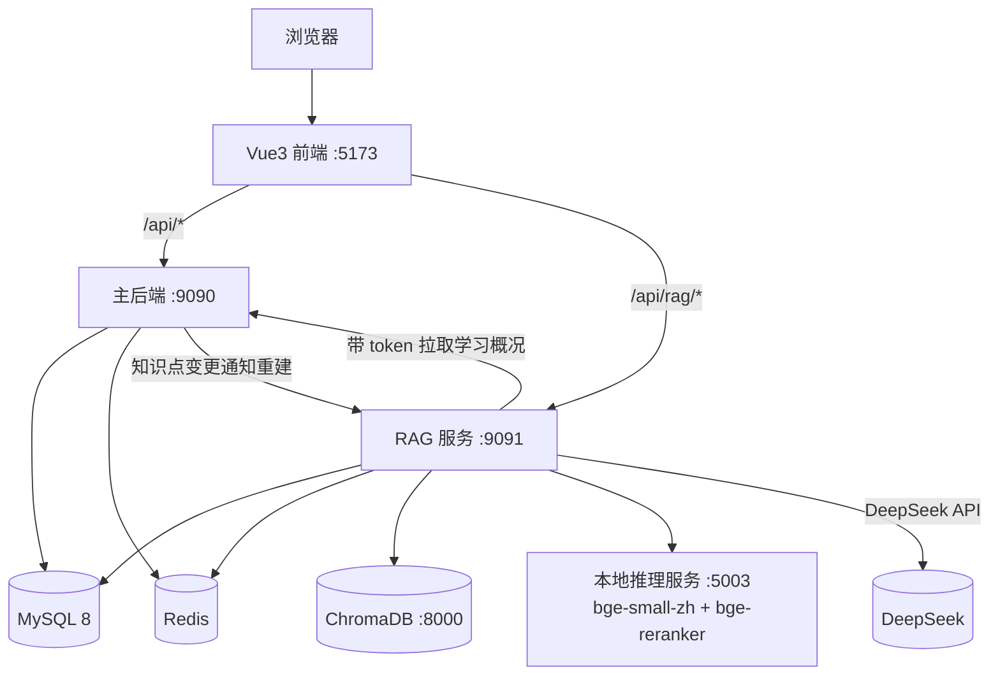
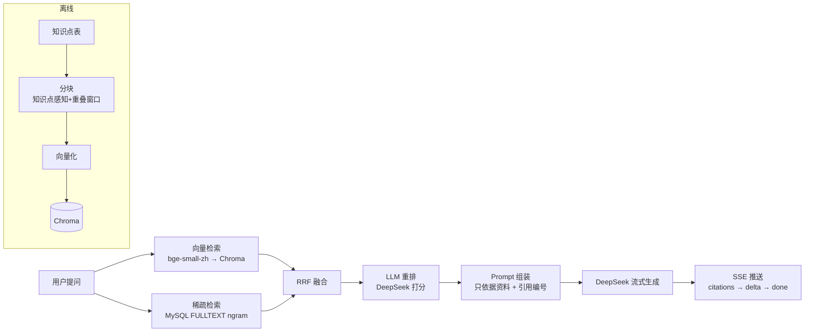

# 智能学习系统 + RAG AI 助教 · 项目完整文档

> 版本：v1.0（2026-08-09）
> 作者：刘佳乐 · 软件工程本科
> 仓库：https://github.com/llAA-LL/smart-learn-stream

---

## 目录

1. [项目总览](#1-项目总览)
2. [系统架构](#2-系统架构)
3. [功能清单](#3-功能清单)
4. [核心设计亮点](#4-核心设计亮点)
5. [数据模型](#5-数据模型)
6. [性能与评测数据](#6-性能与评测数据)
7. [部署与运维](#7-部署与运维)
8. [面试问答（高频）](#8-面试问答高频)
9. [简历要点](#9-简历要点)
10. [已知不足与未来方向](#10-已知不足与未来方向)

---

## 1. 项目总览

**一句话定位**：面向大学生的智能学习平台——学生在平台上学习课程知识点、自测、记录进度，系统基于知识图谱与掌握度生成个性化推荐，并提供一个**基于 RAG 的 AI 助教**，回答全部有据可查、可溯源。

**三个子系统**：

| 子系统 | 技术栈 | 职责 |
|--------|--------|------|
| 主后端（backend） | Spring Boot 3.2 / MyBatis / MySQL / Redis / JWT | 业务系统：认证、课程、知识图谱、学习计划/记录、自测、推荐 |
| RAG 服务（rag-backend） | Spring Boot 3.5 / Spring AI 1.1 / DeepSeek / ChromaDB / MySQL 全文 | AI 助教：混合检索 + 重排 + 流式问答 + 会话记忆 |
| 前端（frontend） | Vue 3 / Vite / Element Plus / Pinia | 学习平台 UI + AI 对话页（SSE 流式） |

**为什么做两个后端**：RAG 服务独立部署、独立扩展（AI 流量与业务流量隔离），同时通过 HTTP 与主后端协作（拉取用户学习数据、知识点变更通知重建索引）。这是真实企业里"AI 服务与业务服务分离"的常见架构。

---

## 2. 系统架构

### 2.1 模块拓扑



### 2.2 RAG 检索链路



### 2.3 数据流（一次 AI 问答）

1. 前端携带 `conversationId + history + question + token` 发起 SSE 请求；
2. RAG 服务先查 Redis **会话记忆**（多轮上下文）与**热问题缓存**（相同独立问题直接返回）；
3. 若带 token，从主后端拉取**用户学习概况**（统计/薄弱点/推荐）注入提示词；
4. 双路检索（向量 + MySQL 全文）→ RRF 融合 → LLM 重排 → 组装 Prompt；
5. DeepSeek 流式返回，前端逐字渲染；回答带引用知识点编号；
6. 回答写回 Redis 会话记忆；无上下文独立问题写入热问题缓存；
7. 用户点赞/点踩写入 `rag_feedback` 表，用于后续评估。

---

## 3. 功能清单

### 3.1 主后端

| 模块 | 功能 | 状态 |
|------|------|------|
| 认证 | 注册（强制 STUDENT 角色）、登录、JWT、登出黑名单、限流 | ✅ |
| 课程 | 列表（分页）、详情、增删改（仅 ADMIN） | ✅ |
| 知识图谱 | 节点 CRUD（仅 ADMIN）、前置依赖、图谱数据 | ✅ |
| 学习计划 | 计划 CRUD、计划项完成切换、测验通过自动完成 | ✅ |
| 学习记录 | 记录学习、统计（今日/本周/累计）、掌握度、热门排行 | ✅ |
| 自测 | 按知识点随机抽 5 题、判分、历史（分页）、防答案泄露 | ✅ |
| 推荐 | 三级优先级 + 前置门控 + 30 分钟缓存 + 点击上报 | ✅ |
| 题目管理 | 题目 CRUD（仅 ADMIN，避免学生直接查答案） | ✅ |
| AI 上下文 | `GET /api/ai/context` 聚合个人学习概况 | ✅ |

### 3.2 RAG 服务

| 能力 | 说明 | 状态 |
|------|------|------|
| 混合检索 | 向量（Chroma）+ 关键词（MySQL 全文 ngram）+ RRF | ✅ |
| 重排 | LLM 重排（默认，hit@1 87.5%）/ 本地 bge-reranker（离线备选） | ✅ |
| 流式问答 | SSE：citations → delta → done | ✅ |
| 引用溯源 | 回答标注 [1][2]，返回引用知识点 | ✅ |
| 会话记忆 | Redis 持久化，最多 10 轮，客户端刷新不丢 | ✅ |
| 热问题缓存 | Redis Cache-Aside，重复问题 17ms | ✅ |
| 限流 | 按 IP 固定窗口（chat 15/min、stream 20/min 等） | ✅ |
| 反馈 | 点赞/点踩落库 | ✅ |
| 个人化问答 | 带 token 注入用户学习概况，不进热缓存防串号 | ✅ |
| 索引联动 | 知识点变更 → 主后端异步通知重建 | ✅ |
| 评测 | 40 题 QA + 对照实验 + 报告 | ✅ |

### 3.3 前端

登录、仪表盘、课程、知识图谱、知识点详情、学习计划、学习记录、自测、推荐、题目管理（仅 ADMIN 可见）、AI 助教（流式 + 引用标签 + 反馈）。全部页面已按角色控制菜单显示。

---

## 4. 核心设计亮点

### 4.1 认证与权限

- **JWT + Redis 黑名单**：登录签发 HMAC-SHA256 令牌；登出把 token 加入 Redis 黑名单（TTL = 剩余有效期），拦截器先查黑名单再验签，实现"主动登出"。
- **BCrypt 密码**：修复了原始无盐 SHA-256；种子用户通过 `ON DUPLICATE KEY UPDATE` 自动迁移。
- **`@RequireRole("ADMIN")` AOP 校验**：与 `@RateLimit` 同一套切面模式；题目接口全部 ADMIN-only（学生无法通过接口查答案），课程/知识点写操作 ADMIN-only。
- **IDOR 修复**：测验记录查看必须归属当前用户（403），防止越权访问他人数据。
- **真实 HTTP 状态码**：业务异常按 code 映射 401/403/404/429，前端 axios 401 拦截恢复正常语义。

### 4.2 Redis 多场景应用

| 场景 | 实现 | 说明 |
|------|------|------|
| 热问题缓存 | Cache-Aside，key=SHA-256(问题)，TTL 24h | 重复问题 17ms 返回，零 LLM 调用 |
| 会话记忆 | List + JSON 序列化，最多 10 轮 | 多轮上下文跨请求/跨刷新 |
| 会话/问题隔离 | 带 token 的请求跳过热缓存 | 防止个人化回答串号 |
| 统计计数 | INCR + TTL（今日/本周/累计） | 避免 DB 行级竞争 |
| 热门排行 | ZSet 增量分数 | 热门课程/知识点实时榜 |
| 分布式锁 | SET NX PX + Lua 原子释放 | 掌握度更新并发安全 |
| 接口限流 | INCR + TTL 固定窗口，按 IP | 防刷 |
| 知识图谱/推荐缓存 | Cache-Aside + 写后失效 | 读多写少场景 |

### 4.3 掌握度与推荐算法

- **掌握度**：学习记录 70% 历史 + 30% 最新；测验 50/50 加权；上限 100，分布式锁保证并发一致性。
- **推荐**：三级优先级（薄弱点复习 > 逻辑下一步 > 全新领域）+ 前置依赖门控（前置必须已掌握）+ 掌握度阈值过滤（≥60 视为掌握），Top10 输出；30 分钟按用户缓存，点击行为上报形成闭环。

### 4.4 RAG 链路设计

- **分块**：知识点天然成块（标题/描述常驻），长内容按段落聚合 + 重叠窗口，块 ID 确定性（`kp-{id}-{i}`），重建幂等。
- **混合检索**：稠密（bge-small-zh 本地推理）+ 稀疏（MySQL FULLTEXT ngram），RRF 融合只看排名不看分数。
- **重排**：LLM 打分重排把 Top-1 命中从 65% 提到 87.5%；本地 bge-reranker 可离线降级（80%）。
- **防幻觉**：系统提示词"只依据资料 + 引用编号"；检索为空直接兜底不调用模型；资料不足时诚实说明。
- **评测**：40 题基于真实知识点构造，检索命中率 + LLM 裁判回答评分 + 引用率。

### 4.5 工程化

- 日志埋点：每次请求记录 retrieve/rerank/generate 三段耗时与缓存命中。
- 测试：主后端 12 个（认证/判分/角色校验）+ RAG 23 个（分块/检索/重排/记忆/缓存/MVC+SSE）。
- Docker：独立 compose + 主系统集成（mysql/redis/backend/agent/chroma/rag-backend/frontend）。
- CI：GitHub Actions（后端测试 + 前端构建）。
- Git：6 个提交全量托管 GitHub，`.env` 密钥排除并扫描确认。

---

## 5. 数据模型

核心表（MySQL `smart_learning`）：

| 表 | 说明 |
|----|------|
| users | 用户（BCrypt 密码，STUDENT/ADMIN 角色） |
| courses | 课程 |
| knowledge_points | 知识点（含 learning_content，RAG 语料源，FULLTEXT 索引） |
| kp_prerequisites | 知识点前置依赖（邻接表） |
| questions / quiz_attempts / quiz_answers | 题库与测验 |
| learning_plans / plan_items | 学习计划 |
| learning_records / user_kp_mastery | 学习记录与掌握度 |
| recommendation_logs | 推荐浏览/点击日志 |
| rag_feedback | AI 回答反馈 |

Redis key 设计：`rag:chat:{conversationId}`（会话）、`rag:cache:q:{sha256}`（热缓存）、`rate_limit:{ip}:{method}`、`cache:rec:{userId}`、`cache:kg:*`、`stat:*`、`lock:*`、`token_blacklist:*`。

---

## 6. 性能与评测数据

### 6.1 RAG 评测（40 题）

| 检索模式 | Hit@1 | Hit@5 |
|---------|------:|------:|
| 仅向量检索 | 55% | 95% |
| 仅关键词检索 | 87.5% | 100% |
| 混合检索（RRF） | 65% | 97.5% |
| 混合 + LLM 重排 | **87.5%** | 97.5% |

- RAG 回答引用率 **100%**，零编造；
- 回答质量：裸模型 8.8 vs RAG 6.82，差距来自 11 题"课程资料未覆盖"（RAG 诚实说明资料不足，属预期行为）；
- 重排收益：混合 Top-1 65% → 重排后 87.5%（+22.5pp），代价约 800ms。

### 6.2 性能（本机实测）

| 场景 | 数据 |
|------|------|
| 本地混合检索（无重排） | 平均 31.8ms，P95 36ms |
| 混合 + LLM 重排 | 约 800ms |
| Chat 总耗时 | 2-3.7s（约 95% 是 DeepSeek 生成） |
| SSE 首字（TTFT） | 约 2.2s |
| 热问题缓存命中 | **17ms**（未命中 4-6s） |
| 检索并发 | 1/5/10/20 并发 QPS 32/15/8/4，瓶颈为本地 CPU Embedding |

### 6.3 优化结论

- Embedding 多 worker 实测收益有限 → 瓶颈是 CPU 推理，真正解法是 GPU/API Embedding；
- 本地 bge-reranker 零依赖可离线，但 hit@1 略低（80% vs 87.5%），默认保留 LLM 重排；
- 热问题缓存是性价比最高的优化（300 倍加速 + 零成本）。

---

## 7. 部署与运维

### 7.1 本地一键启动（RAG 链路）

```powershell
# 前置：MySQL/Redis 已启动；rag-backend/.env 配置 DEEPSEEK_API_KEY
cd rag-backend
powershell -ExecutionPolicy Bypass -File scripts\start-all.ps1
```

服务端口：MySQL 3306 / Redis 6379 / Chroma 8000 / 本地推理 5003 / 主后端 9090 / RAG 9091 / 前端 5173。

### 7.2 Docker

```bash
cd smart-learning-system
docker compose up -d --build   # 全套服务
```

### 7.3 CI

GitHub Actions 自动跑：rag-backend `mvn test`（23 个）+ 前端 `npm run build`。

### 7.4 常见账号

| 账号 | 密码 | 角色 |
|------|------|------|
| admin | admin123 | ADMIN |
| zhangsan / lisi | 123456 | STUDENT |

---

## 8. 面试问答（高频）

### Q1：用 1 分钟介绍你的项目

> 我做了一个面向大学生的智能学习平台，前后端分离。后端是 Spring Boot + MyBatis + MySQL + Redis，实现了课程、知识图谱、学习计划、学习记录、自测、个性化推荐这套学习闭环；推荐引擎基于知识图谱的前置依赖和用户的掌握度评分做三级优先级推荐。第二部分是 AI 助教：用 Spring AI 接入 DeepSeek，构建了完整的 RAG 链路——知识点分块、向量化存 ChromaDB、MySQL 全文检索做双路召回、RRF 融合、LLM 重排、流式回答，回答带引用可溯源。我自建了 40 题评测集，混合检索 Top-5 命中率 97.5%，重排把 Top-1 从 65% 提到 87.5%，并用 Redis 做了会话记忆和热问题缓存，重复问题 17ms 返回。

### Q2：为什么用 RAG 而不是微调？

> 四个原因：1) 知识更新——课程资料改完，RAG 重建索引就能生效，微调要重新训练；2) 可溯源——RAG 回答带引用，能告诉用户依据哪条知识点，微调是黑盒；3) 成本——RAG 只按检索和生成计费，微调要 GPU 训练；4) 幻觉控制——RAG 把答案限定在检索到的资料内，配合提示词约束。我的项目里还有数据支撑：引用率 100%，资料未覆盖时会诚实说"无法回答"而不是编造。

### Q3：分块策略怎么设计的？

> 数据源是知识点表，每个知识点天然是一个语义完整的单元，所以默认按知识点分块，标题和描述常驻每块保证上下文。对超长内容按段落聚合，超过 800 字截断并带 80 字重叠窗口，避免语义断裂。块 ID 用 `kp-{id}-{index}` 的确定性格式，重建索引幂等。

### Q4：为什么混合检索？RRF 的原理？

> 向量检索擅长同义改写和语义相似，比如"怎么避免死锁"能召回"死锁预防"；关键词检索擅长专有名词和精确术语。两者互补，所以双路召回。RRF 不做分数归一化，直接按排名融合：score = Σ 1/(k+rank)，k 取 60，两个检索路各自给候选按名次打分求和，天然免疫两套分数体系不可比的问题。我的评测里关键词单路 Top-5 100%、向量 95%，混合后 97.5% 且更稳。

### Q5：重排值不值？

> 值。数据说话：混合检索 Top-1 只有 65%，因为 RRF 会被强单路稀释；加了 LLM 重排后 Top-1 回到 87.5%，代价是每次约 800ms 和一次 DeepSeek 调用。我还做了本地 bge-reranker 作为离线降级方案，零外部依赖，hit@1 80%，通过配置一键切换。

### Q6：怎么防幻觉？

> 三层：1) 检索为空直接返回兜底文案，不调用模型；2) 系统提示词强约束"只依据参考资料回答、必须标注引用编号、资料不足就说明无法回答"；3) 评测兜底——40 题里 11 题课程资料覆盖不足，模型选择诚实说明而不是编造。回答带 [1][2] 引用，用户能核对来源。

### Q7：Redis 在项目里用了哪些？

> 六个场景：热问题回答缓存（Cache-Aside，17ms 命中）、会话记忆（多轮上下文）、分布式锁（SET NX PX + Lua 释放）保护掌握度并发更新、固定窗口限流（INCR+TTL 按 IP）、统计计数（今日/本周/累计）、ZSet 热门排行、知识图谱/推荐缓存。另外有一个细节：带用户 token 的个人化请求跳过热问题缓存，防止跨用户串数据。

### Q8：权限体系怎么做的？

> JWT 里带 role，拦截器把 userId/role 放到请求属性；写操作接口加 `@RequireRole("ADMIN")` 注解，AOP 切面统一校验，无权限抛 403。这样题目接口对 STUDENT 完全隔离——否则学生能直接查题库答案，自测就没意义了。管理员账号通过 data.sql 幂等初始化。

### Q9：性能优化做了哪些？效果？

> 先用压测脚本量化：本地检索 31.8ms、重排 800ms、生成 3s，定位瓶颈在外部 API 和本地 CPU 推理。然后做热问题缓存（重复问题 4-6s → 17ms，300 倍）；重排支持本地/LLM 切换；Embedding 多 worker 实测收益有限，确认瓶颈是 CPU 推理，结论是生产环境应切 API/GPU Embedding——每一步都有数据支撑。

### Q10：评测是怎么做的？

> 基于数据库里真实的 64 个知识点构造了 40 道 QA，标注期望命中的知识点 ID。对每道题跑四种检索模式（向量/关键词/混合/混合+重排）算 Hit@1/Hit@5；回答质量用 LLM 裁判按统一评分标准打分（公平规则：资料不足时诚实回答不算错误）。产出报告里有逐题明细，方便定位具体问题。

### Q11：遇到的最大的坑？

> 说三个印象深的：1) Spring AI 1.1 的 Chroma 自动配置会把 host:port 拼成无协议头 URL 导致启动失败，且默认走云 API 的租户名，需要手动配 baseUrl 和 default_tenant/default_database；2) PowerShell 5.1 会把 UTF-8 响应按 Latin-1 解码，导致评测数据全变乱码、裁判分数不可信，必须用原始字节流按 UTF-8 解码——数据管线的编码问题；3) 前端解析 SSE 时只认带空格的 `event: xxx`，而 Spring 发的是无空格 `event:xxx`，导致流式内容一直不显示。

### Q12：如果重做，会怎么改进？

> 1) 换更强的 Embedding（bge-m3）并部署到 GPU/API，解决本地 CPU 推理的并发瓶颈；2) 知识点变更做增量索引更新而不是全量重建；3) 会话记忆按用户隔离并加 TTL，支持更细的权限模型（老师/助教中间角色）；4) 引入消息队列解耦 AI 服务与业务服务，避免 HTTP 直连。

---

## 9. 简历要点

- 自建 40 题评测集：混合检索 Top-5 命中率 97.5%，LLM 重排将 Top-1 命中从 65% 提升至 87.5%，回答引用率 100%；
- 热问题缓存 + 会话记忆：重复问题延迟从 4-6s 降至 17ms，多轮上下文服务端持久化；
- Redis 六场景（缓存/分布式锁/限流/计数/排行/记忆）+ JWT 黑名单 + BCrypt + AOP 权限校验；
- 全链路 SSE 流式问答、按知识点感知分块、RRF 混合检索、可切换重排；
- 35 个单元/集成测试 + GitHub Actions CI + Docker Compose 一键部署。

---

## 10. 已知不足与未来方向

- 全量重建索引：知识点变更目前触发全量重建（约 7s），可优化为增量更新；
- Embedding 本地 CPU 推理并发受限：生产应切 API/GPU；
- 无老师/助教中间角色：权限模型只有 STUDENT/ADMIN 两级；
- 评测集 40 题可扩充，可增加 bge-m3 对比、topK 敏感性实验；
- 会话记忆未按用户隔离 + TTL（当前按 conversationId 隔离，前端每次新会话生成新 ID）。
